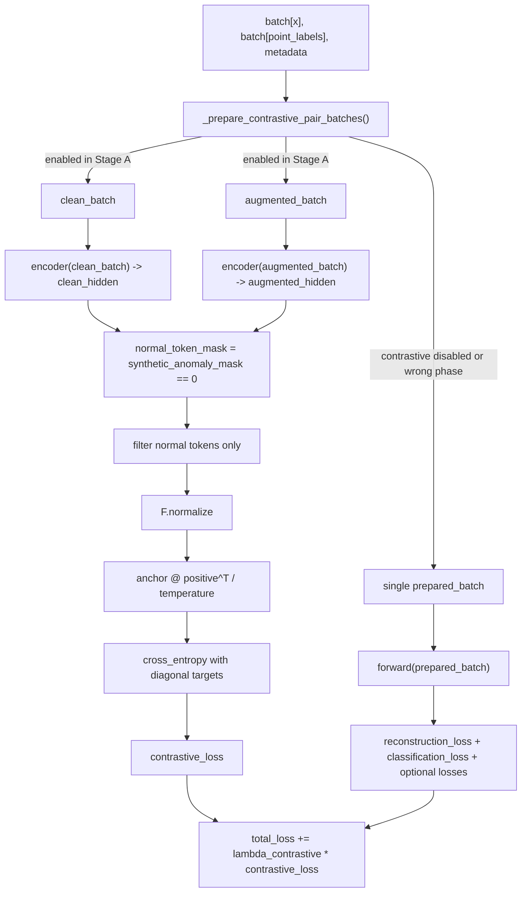

# Research: Rà soát luồng tính toán contrastive loss trong offline-pretraining phase

**Date**: 2026-07-05 19:36:53 +0700  
**Researcher**: TheMetaSetter  
**Git Commit**: 79031c28ad7bfa61e53b366676683d04f5863981  
**Branch**: dev

## Research Question

Rà soát lại codebase theo `prompts/1_research_prompt.md` và mô tả chính xác luồng tính toán contrastive loss trong offline-pretraining phase.

## Summary

Trong codebase hiện tại, contrastive loss là một thành phần của `Stage A` trong offline pre-training hai giai đoạn. Nó chỉ được kích hoạt khi `training_phase = stage_a_multitask_pretraining` và `enable_two_view_contrastive = true`. Luồng thực thi là: lấy cùng một batch, tạo hai view gồm `clean_batch` và `augmented_batch`, mã hóa cả hai qua shared encoder, lọc chỉ các time-step bình thường theo `synthetic_anomaly_mask`, chuẩn hoá vector ẩn, tính ma trận similarity giữa anchor và positive tokens, rồi dùng cross entropy với target đường chéo để tạo contrastive loss. Sau đó loss này được cộng vào total loss của Stage A với hệ số `lambda_contrastive`.

Stage B không dùng contrastive objective. Theo design SSOT, Stage B chỉ train fusion heads và prediction heads, còn encoder và hai memory banks bị freeze.

## Detailed Findings

### Data Preparation

- Input batch chuẩn có dạng `batch["x"]` với shape `[B, L, D]`.
- Nếu batch đã được augment sẵn, model giữ nguyên các trường `classification_labels`, `synthetic_anomaly_mask`, và `augmentation_metadata`.
- Nếu đang ở `train` và `use_synthetic_augmentation = true`, model tự gọi `SyntheticAnomalyInjector.augment_batch(...)`.
- Với batch sạch, model tạo:
  - `classification_labels = 0`
  - `synthetic_anomaly_mask = 0`
  - `augmentation_metadata` kiểu clean

### Modeling and Training

- File model chính: `src/models/thesis_multitask.py`
- Contrastive logic thực tế nằm ở:
  - `src/models/thesis_multitask_routing_mixin.py`
  - `src/models/thesis_multitask_loss_mixin.py`
  - `src/models/thesis_multitask_setup_mixin.py`

Điểm vào chính của luồng loss:

- `_prepare_contrastive_pair_batches(...)` chỉ trả về cặp batch khi:
  - `enable_two_view_contrastive = true`
  - phase đang dùng contrastive objective
  - `stage_name` là `train` hoặc `val_synth`
- Trong `_shared_step(...)`, nếu có contrastive pair:
  - `clean_batch` đi qua `self.forward(clean_batch, stage_name="val")`
  - `augmented_batch` đi qua `self.encoder(prepared_batch)["hidden"]`
  - `clean_outputs["hidden"]` được detach và lưu vào `paired_hidden_for_fusion`
  - `contrastive_loss` được tính riêng

### Contrastive Loss Computation

Trong `src/models/thesis_multitask_routing_mixin.py`:

1. `synthetic_anomaly_mask == 0` tạo `normal_token_mask`.
2. Nếu không còn token bình thường nào, loss trả về 0.
3. `anchor_hidden` và `positive_hidden` được reshape về `[-1, hidden_dim]`.
4. Chỉ giữ các token bình thường ở cả hai view.
5. Hai tập token được chuẩn hoá bằng `F.normalize(..., eps=self.epsilon)`.
6. Similarity logits được tính bằng:

```text
logits = normalized_anchors @ normalized_positives.T / contrastive_temperature
```

7. Target là chỉ số đường chéo `0..N-1`.
8. Loss cuối là `F.cross_entropy(logits, targets)`.

Trong `src/models/thesis_multitask_loss_mixin.py`:

- `reconstruction_loss`
- `classification_loss`
- các optional losses

được cộng thành `total_loss`, rồi contrastive loss được cộng thêm nếu phase đang bật contrastive objective:

```text
total_loss = base_multitask_loss + phase_contrastive_weight * contrastive_loss
```

### Evaluation

- `contrastive_loss` được log trong step output.
- Test hiện có xác nhận loss này:
  - chỉ dùng normal tokens
  - hữu hạn
  - không âm

## Pipeline Documentation



## Historical Context

- `documents/design/offline_pretraining_two_stage_kmeans_memory_design.md:66-118` xác nhận offline pre-training hiện tại là hai stage:
  - Stage A train multitask encoder từ đầu
  - Stage B freeze encoder + memories và chỉ train fusion/prediction heads
- `documents/design/offline_pretraining_two_stage_kmeans_memory_design.md:93-102` xác nhận Stage A dùng ba loss:
  - reconstruction
  - classification
  - contrastive
- `configs/model/thesis_multitask_two_stage_window20.yaml:42-59` cho thấy config active đang bật:
  - `enable_two_view_contrastive: true`
  - `contrastive_temperature: 0.1`
  - `lambda_contrastive: 0.1`
  - `training_phase: stage_a_multitask_pretraining`
- `scripts/run_two_stage_offline_pretraining.py:77-100` xác nhận runner materialize hai stage:
  - `stage_a_multitask_pretraining`
  - `stage_b_fusion_finetuning`
- `src/models/thesis_multitask_setup_mixin.py:197-226` xác nhận:
  - Stage A bật contrastive objective
  - Stage B tắt contrastive objective

## Code References

- `src/models/thesis_multitask_routing_mixin.py:346-369` - công thức contrastive loss
- `src/models/thesis_multitask_routing_mixin.py:454-469` - tạo clean/augmented pair cho contrastive
- `src/models/thesis_multitask_loss_mixin.py:697-741` - chỗ cộng contrastive loss vào total loss
- `src/models/thesis_multitask_setup_mixin.py:197-226` - phase contract cho contrastive weight
- `scripts/run_two_stage_offline_pretraining.py:77-100` - planner cho Stage A / Stage B
- `documents/design/offline_pretraining_two_stage_kmeans_memory_design.md:66-118` - SSOT cho two-stage offline pre-training
- `configs/model/thesis_multitask_two_stage_window20.yaml:42-59` - config active của Stage A
- `tests/test_exp2_two_view_cka.py:46-58` - test xác nhận contrastive loss chỉ dùng normal tokens và cho giá trị hữu hạn

## Open Questions

- Không có điểm mơ hồ lớn trong luồng contrastive loss hiện tại. Điểm cần giữ rõ là Stage B không nên bị diễn giải là có contrastive objective, vì code và SSOT đều tắt phần này.
