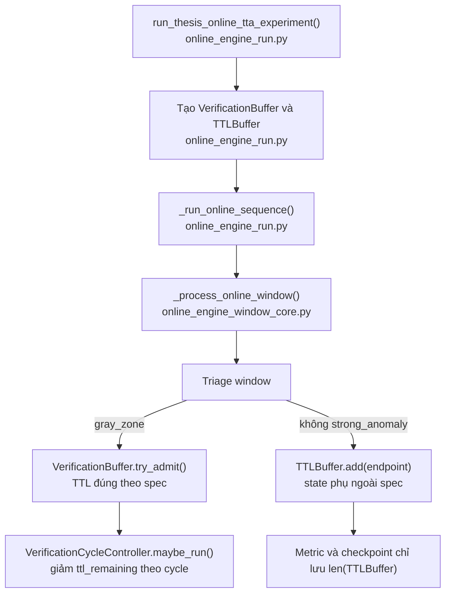

# Research: Loại bỏ endpoint `TTLBuffer` khỏi online TTA

## Summary

Class runtime `TTLBuffer` hiện tại không triển khai TTL của admitted verification
window trong `full-spec-v2.md` hoặc `full-spec-v3.md`. Nó lưu một số nguyên là
endpoint của mọi window không thuộc `strong_anomaly`, nhưng runtime chỉ gọi
`add()`. Runtime không gọi `expire()`, `contains()` hoặc `clear()`. Vì vậy danh
sách này chỉ tăng dần.

`TTLBuffer` không quyết định triage, admission, verification, adaptation hoặc
prediction. Hai giá trị duy nhất đi ra khỏi component này là
`online/ttl_buffer_size` trong metric từng window và `ttl_buffer_size` trong
`extra_state` của checkpoint cuối.

Implementation có một cơ chế TTL đúng với ý tưởng gốc: `VerificationBuffer`
khởi tạo `ttl_remaining=2`; `VerificationCycleController` giảm TTL đúng một lần
sau mỗi verification cycle; adapted entry và unresolved entry hết TTL được
loại bỏ. Quá trình loại bỏ endpoint `TTLBuffer` phải giữ nguyên cơ chế này.

## Research question

Ghi chép lại những đoạn code liên quan đến `TTLBuffer` cần được loại bỏ để giúp
implementation gần hơn với ý tưởng gốc. Chỉ nghiên cứu và lập ranh giới thay
đổi; chưa sửa source code, test, config hoặc specification.

## Version and worktree context

Nghiên cứu dùng branch `dev` tại revision
`1a570cda6eb7976255add3fc5d4f7f385d40dea3`. Worktree đang có thay đổi chưa
commit trong online runtime, gồm debug timing và chọn đoạn stream. Các line
reference trong báo cáo trỏ đến live worktree ngày 30-07-2026, không chỉ trỏ
đến nội dung ở revision trên.

## Terminology mapping across specification versions

Hai tên gần nhau không đại diện cho cùng một runtime object.

| Version hoặc layer | Tên được dùng | Dữ liệu được giữ | TTL giảm khi nào | Runtime owner hiện tại | Semantic status |
| --- | --- | --- | --- | --- | --- |
| `full-spec-v2.md` | `Verification Buffer`; pseudocode gọi biến `ttl_buffer` | Window, absolute interval, trạng thái, `was_adapted`, `ttl_remaining=2` | Sau mỗi verification cycle | `VerificationBuffer` và `VerificationCycleController` | Cùng một ý tưởng; pseudocode dùng tên biến cũ |
| `full-spec-v3.md` | `Verification buffer` | Admitted gray-zone window và `ttl_remaining=2` | Sau mỗi verification cycle | `VerificationBuffer` và `VerificationCycleController` | Tên canonical hiện tại |
| Live source | class `TTLBuffer` | `item=window_end-1`, `expires_at=stream_step+window_size` | Không giảm hoặc expire trong production caller | Không có owner thuộc main decision flow | Object bổ sung ngoài spec; cần loại bỏ |

Spec-v2 định nghĩa verification entry và TTL tại
[Verification Buffer for PNN](../../../../documents/spec/full-spec-v2.md#L1041-L1074).
Pseudocode sau đó dùng tên `ttl_buffer` cho chính object có các method
`try_add`, `should_verify` và `update_after_verification`
[trong online loop](../../../../documents/spec/full-spec-v2.md#L1357-L1373).
Class runtime `TTLBuffer` không có ba method này
[trong API hiện tại](../../../../src/engine/online_tta/ttl_buffer.py#L7-L33).
Vì vậy tên trong pseudocode không phải bằng chứng rằng class hiện tại thuộc ý
tưởng gốc.

Spec-v3 dùng tên canonical `Verification buffer`, quy định schema entry tại
[Section 13.1](../../../../documents/spec/full-spec-v3.md#L832-L851) và quy định
TTL tại [Section 13.4](../../../../documents/spec/full-spec-v3.md#L876-L878).

## System context

Entry point public là `run_thesis_online_tta_experiment()`. Runtime tạo context,
stream từng causal window qua `_run_online_sequence()`, rồi gọi
`_process_online_window()`. Trong flow này, `VerificationBuffer` tham gia
admission và verification. `TTLBuffer` chỉ nhận endpoint rồi cung cấp độ dài
cho telemetry.



## Runtime flow thực tế của `TTLBuffer`

1. `_build_runtime_online_context()` khởi tạo
   `TTLBuffer(ttl_steps=protocol_config["window_size"])`
   [trong runtime context](../../../../src/engine/online_tta/online_engine_run.py#L180-L208).
2. Context truyền object này qua `_run_online_sequence()`
   [tại signature và call](../../../../src/engine/online_tta/online_engine_run.py#L211-L230)
   rồi vào `_process_online_window()`
   [tại mỗi stream step](../../../../src/engine/online_tta/online_engine_run.py#L264-L289).
3. `_process_online_window()` tiếp tục chuyển object đến admission helper và
   output helper
   [trong orchestration](../../../../src/engine/online_tta/online_engine_window_core.py#L54-L110).
4. `_update_online_window_buffers()` gọi `ttl_buffer.add()` nếu triage decision
   không phải `strong_anomaly`
   [tại nhánh ghi state](../../../../src/engine/online_tta/online_engine_window_metrics.py#L195-L227).
5. `item` là `end_index - 1`, tức absolute point index ở cuối window.
   `current_step` là `meta.stream_step`. Class tính
   `expires_at=current_step+ttl_steps`
   [trong class](../../../../src/engine/online_tta/ttl_buffer.py#L7-L24).
6. `_build_online_window_outputs()` chỉ đọc `len(ttl_buffer)` để tạo
   `online/ttl_buffer_size`
   [trong metric](../../../../src/engine/online_tta/online_engine_window_metrics.py#L230-L278).
7. `_finalize_online_execution()` chỉ đọc độ dài lần nữa để ghi
   `ttl_buffer_size` vào checkpoint `extra_state`
   [trong final checkpoint](../../../../src/engine/online_tta/online_engine_run.py#L399-L424).

Production source không gọi `expire()`, `contains()` hoặc `clear()`. Project-wide
search chỉ tìm thấy các method này trong class và unit test riêng của class.
Do đó `expires_at` được tính nhưng không ảnh hưởng runtime.

## Data and decision flow

### Dữ liệu mà endpoint `TTLBuffer` giữ

Mỗi entry có dạng:

```python
{
    "item": int(window_end_index - 1),
    "expires_at": int(stream_step) + int(window_size),
}
```

`item` đại diện cho một point index ở endpoint của window. Nó không đại diện
cho toàn bộ point, verification endpoint, admitted verification window hoặc
verification entry.

### Quyết định mà endpoint `TTLBuffer` không thực hiện

Code không dùng `contains()` để chặn admission hoặc adaptation. Code không gọi
`expire()` trước hay sau stream step. `VerificationCycleController` cũng không
nhận `TTLBuffer`; controller chỉ nhận `VerificationBuffer`
[trong constructor và cycle](../../../../src/engine/online_tta/verification_cycle.py#L12-L36).

Vì vậy endpoint `TTLBuffer` không quyết định:

- window thuộc triage region nào;
- gray-zone window có được admitted hay không;
- verification cycle có chạy hay không;
- verification entry có được adapted hay không;
- model có update hay không;
- prediction cuối là normal hay anomaly.

## TTL semantics phải giữ lại

`VerificationBuffer` mới là runtime owner của TTL theo spec:

- `default_ttl=2` và `_new_since_cycle` nằm trong state của buffer
  [tại khai báo](../../../../src/engine/online_tta/verification_buffer.py#L7-L16);
- `try_admit()` kiểm tra interval không overlap rồi `add()` khởi tạo
  `status`, `ttl_remaining` và `was_adapted`
  [tại admission](../../../../src/engine/online_tta/verification_buffer.py#L18-L48);
- `finish_verification_cycle()` loại adapted entry, giảm TTL của unresolved
  entry đúng một đơn vị và loại entry ở zero
  [tại cycle completion](../../../../src/engine/online_tta/verification_buffer.py#L53-L76);
- `VerificationCycleController.maybe_run()` gọi cycle completion sau khi nhận đủ
  result cho các entry
  [tại orchestration](../../../../src/engine/online_tta/verification_cycle.py#L21-L36);
- test xác nhận một completed cycle giảm TTL từ 2 xuống 1
  [tại test](../../../../tests/online/test_verification_cycle.py#L7-L22).

`OnlineRuntimeState` serialize `verification_entries`
[trong payload](../../../../src/engine/online_tta/runtime_state.py#L70-L89) và
restore chúng vào `VerificationBuffer`
[trong restore path](../../../../src/engine/online_tta/runtime_state.py#L188-L216).
Nó không serialize các entry `item`/`expires_at` của endpoint `TTLBuffer`.

## Code inventory cần loại bỏ

### Nhóm A — component và production wiring bắt buộc loại bỏ

| File và đoạn code | Vai trò hiện tại | Vì sao thuộc removal boundary |
| --- | --- | --- |
| [`src/engine/online_tta/ttl_buffer.py`](../../../../src/engine/online_tta/ttl_buffer.py#L1-L33) | Định nghĩa toàn bộ endpoint `TTLBuffer` | Component ngoài spec; các expiry API không được production caller dùng |
| [`online_engine_run.py` import](../../../../src/engine/online_tta/online_engine_run.py#L36-L44) | Import `TTLBuffer` | File class bị xoá thì import phải biến mất |
| [`online_engine_run.py` context](../../../../src/engine/online_tta/online_engine_run.py#L180-L208) | Khởi tạo `context["ttl_buffer"]` | Đây là root owner của object phụ |
| [`online_engine_run.py` sequence parameter và call](../../../../src/engine/online_tta/online_engine_run.py#L211-L230) | Truyền object xuyên qua sequence API | Parameter không còn trách nhiệm runtime sau khi bỏ object |
| [`online_engine_run.py` per-window forwarding](../../../../src/engine/online_tta/online_engine_run.py#L264-L289) | Truyền object vào `_process_online_window()` | Plumbing chỉ tồn tại để phục vụ component phụ |
| [`online_engine_run.py` multi-sequence forwarding](../../../../src/engine/online_tta/online_engine_run.py#L343-L372) | Truyền `context["ttl_buffer"]` | Plumbing của execution path |
| [`online_engine_run.py` direct-run forwarding](../../../../src/engine/online_tta/online_engine_run.py#L520-L542) | Truyền `context["ttl_buffer"]` | Plumbing của direct experiment path |
| [`online_engine_window_core.py` import và signatures](../../../../src/engine/online_tta/online_engine_window_core.py#L18-L24) | Type/import dependency | Không còn cần sau removal |
| [`_process_online_window()` plumbing](../../../../src/engine/online_tta/online_engine_window_core.py#L54-L110) | Truyền object vào admission và output | Không có logic quyết định riêng |
| [`_build_event_window_outputs()` plumbing](../../../../src/engine/online_tta/online_engine_window_core.py#L125-L142) | Chuyển object đến metric builder | Chỉ phục vụ size telemetry |
| [`_admit_and_verify_online_window()` plumbing](../../../../src/engine/online_tta/online_engine_window_core.py#L201-L230) | Chuyển object đến buffer update helper | `VerificationBuffer` vẫn giữ nguyên |
| [`online_engine_window_metrics.py` import](../../../../src/engine/online_tta/online_engine_window_metrics.py#L16-L30) | Import type | Không còn cần |
| [`_update_online_window_buffers()` endpoint write](../../../../src/engine/online_tta/online_engine_window_metrics.py#L195-L227) | Ghi endpoint cho mọi non-strong window | Side effect ngoài spec; không có consumer |
| [`_build_online_window_outputs()` size metric](../../../../src/engine/online_tta/online_engine_window_metrics.py#L230-L278) | Xuất `online/ttl_buffer_size` | Telemetry duy nhất dựa vào component phụ |
| [`online_engine_run.py` checkpoint field](../../../../src/engine/online_tta/online_engine_run.py#L399-L424) | Xuất `ttl_buffer_size` | Chỉ lưu độ dài; không lưu state để resume |

### Nhóm B — tests và fixtures phải cập nhật cùng production API

| File và đoạn code | Thay đổi cần ghi nhận |
| --- | --- |
| [`test_online_verification_buffer.py`](../../../../tests/online/test_online_verification_buffer.py#L1-L26) | Xoá import và test riêng `test_ttl_buffer_expires_old_items`; giữ test của `VerificationBuffer` |
| [`test_online_engine_max_steps.py`](../../../../tests/online/test_online_engine_max_steps.py#L1-L12) | Xoá import `TTLBuffer` |
| [`test_online_engine_max_steps.py` first call](../../../../tests/online/test_online_engine_max_steps.py#L55-L73) | Xoá test argument `ttl_buffer=...` |
| [`test_online_engine_max_steps.py` second call](../../../../tests/online/test_online_engine_max_steps.py#L112-L131) | Xoá test argument `ttl_buffer=...` |
| [`test_entity_threshold_runtime.py`](../../../../tests/online/test_entity_threshold_runtime.py#L28-L48) | Xoá `context["ttl_buffer"]` fixture field khi production context không còn đọc nó |
| [`test_online_streaming_benchmark_wrapper.py`](../../../../tests/online/test_online_streaming_benchmark_wrapper.py#L80-L91) | Xoá obsolete metric key khỏi fake THESIS result |

### Nhóm C — shared metric/schema cleanup để không giữ ghost terminology

Baseline không tạo `TTLBuffer`, nhưng hiện phát `online/ttl_buffer_size=0` để giữ
shape metric cũ:

- shared record schema nhận `ttl_buffer_size` rồi phát key
  [tại base schema](../../../../src/baselines/online/base.py#L156-L190);
- frozen baseline phát hằng số zero
  [tại metric output](../../../../src/baselines/online/frozen.py#L235-L246);
- adaptive baseline phát hằng số zero
  [tại metric output](../../../../src/baselines/online/adaptive.py#L300-L312).

Nếu mục tiêu là loại bỏ object và tên ngoài ý tưởng gốc khỏi implementation,
ba field này cũng nằm trong removal boundary. Project-wide search không tìm
thấy code đọc giá trị `online/ttl_buffer_size`; chỉ có code tạo nó và một test
fixture.

## Code phải giữ nguyên

Các đoạn sau không thuộc endpoint `TTLBuffer` và không được loại bỏ:

- class `VerificationBuffer`, gồm `default_ttl`, `ttl_remaining`,
  `was_adapted`, admission và cycle cleanup;
- `VerificationCycleController`;
- `verification_buffer` arguments trong online flow;
- `verification_entries` và `verification_history` trong
  `OnlineRuntimeState`;
- metric `online/verification_buffer_size`;
- checkpoint fields `verification_buffer_size` và
  `verification_buffer_entries`;
- tests của verification cycle và runtime state.

## Behavioral impact nếu removal được thực hiện đúng

Main online behavior không đổi vì endpoint `TTLBuffer` không nằm trên đường
quyết định. Scoring, EWMA, triage, VerificationBuffer admission, PNN
verification, adaptation, prediction, records và TTL theo verification cycle
vẫn chạy như cũ.

Các thay đổi quan sát được là:

1. `online_metrics.json` không còn field `online/ttl_buffer_size`;
2. `online_final.pt` không còn flat extra-state field `ttl_buffer_size`;
3. baseline metric dictionaries không còn field zero tương ứng;
4. runtime không còn giữ một list tăng dần theo số non-strong windows;
5. function signatures và test fixtures ngắn hơn.

Chỉ xoá file `ttl_buffer.py` mà không gỡ import và wiring sẽ làm runtime lỗi
import ngay khi load online engine. Removal phải là một thay đổi đồng bộ.

## Evidence classification

| Kết luận | Loại bằng chứng | Dẫn chứng |
| --- | --- | --- |
| Runtime khởi tạo endpoint `TTLBuffer` với TTL bằng window size | Implemented | [`online_engine_run.py`](../../../../src/engine/online_tta/online_engine_run.py#L180-L208) |
| Production chỉ gọi `add()` | Implemented + project-wide search | [`online_engine_window_metrics.py`](../../../../src/engine/online_tta/online_engine_window_metrics.py#L222-L226) |
| `item` là endpoint point index | Implemented | [`online_engine_window_metrics.py`](../../../../src/engine/online_tta/online_engine_window_metrics.py#L222-L225) |
| Object chỉ ảnh hưởng size telemetry | Implemented | [`metric`](../../../../src/engine/online_tta/online_engine_window_metrics.py#L276-L277), [`checkpoint`](../../../../src/engine/online_tta/online_engine_run.py#L418-L420) |
| TTL theo ý tưởng gốc thuộc verification entry | Documented + implemented + tested | [`full-spec-v3.md`](../../../../documents/spec/full-spec-v3.md#L838-L878), [`verification_buffer.py`](../../../../src/engine/online_tta/verification_buffer.py#L30-L76), [`test_verification_cycle.py`](../../../../tests/online/test_verification_cycle.py#L7-L22) |
| Loại bỏ endpoint object không đổi model decision | Inferred từ toàn bộ caller graph | Không có consumer của `item`, `expires_at` hoặc `contains()` trong production |

## Conflicts and uncertainties

### Conflict đã giải quyết

`full-spec-v2.md` liệt kê file `ttl_buffer.py` trong architecture tree
[tại line 280](../../../../documents/spec/full-spec-v2.md#L275-L283), nhưng
spec-v2 cũng định nghĩa TTL là field của verification window và chỉ giảm theo
verification cycle. API pseudocode của biến `ttl_buffer` không khớp class
`TTLBuffer` hiện tại. Bằng chứng về schema, lifecycle và caller cho thấy
`VerificationBuffer` là implementation tương ứng với ý tưởng gốc.

### Uncertainty không chặn kế hoạch

Repository không có consumer nội bộ nào đọc `online/ttl_buffer_size` hoặc
`ttl_buffer_size`. Báo cáo không thể chứng minh rằng notebook hoặc công cụ bên
ngoài repository chưa từng đọc các field này. Removal vì vậy làm thay đổi
schema telemetry của artifact mới, dù không đổi performance behavior.

Worktree đang có thay đổi debug timing chưa commit trong ba online engine file.
Implementation agent phải chỉnh trên live worktree và bảo toàn các thay đổi
này; không được phục hồi file về `HEAD`.

## Open questions

Không còn câu hỏi chặn cho một kế hoạch sơ thảo. Quyết định hợp lý nhất theo
yêu cầu hiện tại là loại bỏ cả component, wiring và hai field telemetry mang
tên của component. Nếu cần duy trì parser ngoài repository phụ thuộc exact
schema cũ, anh cần cung cấp parser đó trước giai đoạn implementation.
