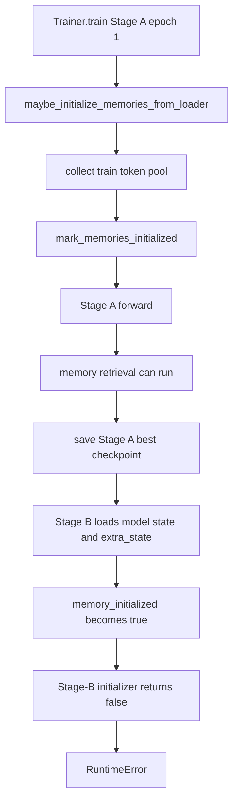

# Research: Các đoạn code liên quan đến lỗi memory lifecycle giữa Stage A và Stage B

## Summary

Code hiện tại gọi memory initializer ở đầu mỗi epoch của `Trainer`, kể cả khi model đang ở `stage_a_multitask_pretraining`. Với config two-stage đang dùng, `bootstrap_encoder_epochs` bằng `0`, nên initializer chạy ngay trước batch đầu tiên của Stage A. Sau đó code đánh dấu memory là đã khởi tạo; các nhánh retrieval có thể sử dụng hai memory bank trong phần còn lại của Stage A.

Stage A checkpoint lưu `memory_initialized: true` trong `extra_state`. Stage-B orchestration tải `extra_state` này rồi mới gọi memory initializer. Initializer thấy flag đã là `true`, trả về `False`, và orchestration ném lỗi `Stage B initialization checkpoint could not initialize memories`.

Đây là hành vi đã được xác nhận từ executable source và active configuration. Nó mâu thuẫn với lifecycle được mô tả trong `full-spec-v3.md`, nơi Stage A phải hoàn tất trước memory initialization.

## Research question

Xác định các đoạn code trong codebase hiện tại liên quan đến lỗi memory lifecycle: Stage A khởi tạo hoặc sử dụng memory quá sớm, Stage A checkpoint lưu lifecycle state, và Stage-B initializer bị chặn sau khi tải checkpoint.

## System context

Luồng two-stage offline của THESIS gồm:

1. `run_two_stage_offline_pretraining.py` tạo cấu hình riêng cho Stage A và Stage B.
2. Mỗi stage được chạy bằng `Trainer.train()`.
3. `Trainer` gọi model hook `maybe_initialize_memories_from_loader()` trước vòng lặp batch của mỗi epoch.
4. Model có hai memory structure chính: `continuous_prototype_bank` và `discrete_codebook`.
5. Stage-A best checkpoint chứa model state và checkpoint `extra_state`.
6. Orchestration tải Stage-A checkpoint vào model Stage B, xây dựng memory initialization checkpoint, rồi mới chạy Stage B.

Spec v3 yêu cầu Stage A không dùng memory retrieval; sau khi Stage A hoàn tất, code phải xây dựng continuous bank và discrete codebook; sau đó Stage B mới train fusion/prediction heads với encoder và memory bị freeze. [Spec lifecycle](../../../spec/full-spec-v3.md#L61-L73) [Stage A contract](../../../spec/full-spec-v3.md#L430-L464) [Stage B contract](../../../spec/full-spec-v3.md#L466-L492)

## Execution path



The diagram summarizes calls found in [Trainer](../../../../src/engine/trainer.py#L565-L586), [memory initializer](../../../../src/models/thesis_multitask_impl/thesis_multitask_state_memory_init_helpers.py#L18-L44), [checkpoint loading](../../../../scripts/experiments/run_two_stage_offline_pretraining.py#L268-L290), and [extra-state restoration](../../../../src/models/thesis_multitask_impl/thesis_multitask_state_serialization_mixin.py#L214-L228).

## Detailed findings

### 1. Active two-stage configuration

**Configured evidence:** The O1 smoke experiment selects the two-stage window-20 model configuration and sets the two-stage budget to two Stage-A epochs and one Stage-B epoch. [O1 experiment config](../../../../configs/experiment/offline_benchmark/thesis/smd__thesis__offline__O1__machine_1_6__w20__seed6__smoke.yaml#L1-L9) [O1 two-stage budget](../../../../configs/experiment/offline_benchmark/thesis/smd__thesis__offline__O1__machine_1_6__w20__seed6__smoke.yaml#L45-L50)

The selected model configuration sets:

```yaml
bootstrap_encoder_epochs: 0
training_phase: stage_a_multitask_pretraining
freeze_memories_after_initialization: true
```

These values appear in [the active two-stage model config](../../../../configs/model/thesis_multitask_two_stage_window20.yaml#L70-L83). The zero bootstrap budget is important because the bootstrap guard does not delay the first memory initialization.

### 2. Model starts a two-stage phase with memory marked as uninitialized

**Implemented evidence:** The setup helper first derives `memory_initialized` from `bootstrap_encoder_epochs`. It then explicitly sets both `memory_initialized` and `memory_training_enabled` to `False` for every two-stage phase, including Stage A. [Model setup state](../../../../src/models/thesis_multitask_impl/thesis_multitask_setup_helpers.py#L147-L159)

**Implemented evidence:** `_phase_uses_prototype_path()` returns `True` for both `stage_a_multitask_pretraining` and `stage_b_fusion_finetuning`. [Prototype-path phase selection](../../../../src/models/thesis_multitask_impl/thesis_multitask_setup_mixin.py#L50-L58)

Therefore the initial Stage-A state is not a permanent memory-free phase. It is a phase that starts with `memory_initialized=False` and is eligible to call the initializer.

### 3. Trainer calls the initializer before Stage-A training batches

**Implemented evidence:** At the start of every epoch, `Trainer.train()` sets epoch context, prepares synthetic training state, and then calls `maybe_initialize_memories_from_loader()` before entering `for train_batch_index, train_batch in enumerate(train_loader, start=1)`. [Trainer epoch order](../../../../src/engine/trainer.py#L565-L596)

The trainer does not check whether the current phase is Stage A before making this call. The model hook is therefore the only guard on this path.

### 4. The initializer accepts Stage A and marks memory initialized

**Implemented evidence:** `maybe_initialize_memories_from_loader()` returns early only when one of these conditions holds:

- `model.memory_initialized` is already `True`;
- bootstrap is active;
- the phase does not use the prototype path.

Otherwise it collects a token pool from the training loader, initializes the memory buffers, marks the memories initialized, and returns `True`. [Initializer conditions and state mutation](../../../../src/models/thesis_multitask_impl/thesis_multitask_state_memory_init_helpers.py#L18-L44)

For the active config, the first condition is false because setup set the flag to `False`, the second condition is false because `bootstrap_encoder_epochs` is `0`, and the third condition is false because Stage A uses the prototype path. This conclusion is an **inference from the configured values and the three executable guards**.

The model public method is a direct wrapper around this helper, so there is no separate Stage-A-specific behavior in the public entry point. [Model initializer wrapper](../../../../src/models/thesis_multitask_impl/thesis_multitask_state_memory_mixin.py#L654-L664)

### 5. Stage A can use retrieval after the early initialization

**Implemented evidence:** The routing forward path enters the prototype path whenever `_phase_uses_prototype_path()` is true, then resolves active continuous and discrete memory structures and calls both prototype lookup functions. [Prototype routing in forward](../../../../src/models/thesis_multitask_impl/thesis_multitask_routing_forward_helpers.py#L125-L156)

**Implemented evidence:** `_should_bypass_memory_for_stage()` bypasses memory only while bootstrap is active or while `memory_initialized` is false. Once the initializer marks memory initialized, the bypass becomes false for Stage A. [Memory bypass condition](../../../../src/models/thesis_multitask_impl/thesis_multitask_state_schedule_mixin.py#L102-L113)

**Implemented evidence:** The continuous lookup performs similarity, softmax, and weighted aggregation when a memory bank exists and bypass is false. [Continuous retrieval operation](../../../../src/models/thesis_multitask_impl/thesis_multitask_routing_mixin.py#L197-L237)

**Important distinction:** `memory_training_enabled` controls whether training updates the memory bank. `_should_update_memory()` checks that flag, but `_should_bypass_memory_for_stage()` does not. Therefore `freeze_memories_after_initialization: true` can stop memory updates without stopping memory retrieval. [Memory update condition](../../../../src/models/thesis_multitask_impl/thesis_multitask_state_schedule_mixin.py#L115-L122)

### 6. Stage-A checkpoint serializes the initialized lifecycle state

**Implemented evidence:** `get_checkpoint_extra_state()` starts from `get_memory_lifecycle_state()`, so the checkpoint extra state contains lifecycle fields such as `memory_initialized`, `memory_training_enabled`, and initialization metadata. [Checkpoint extra-state construction](../../../../src/models/thesis_multitask_impl/thesis_multitask_state_serialization_mixin.py#L77-L87) [Lifecycle fields](../../../../src/models/thesis_multitask_impl/thesis_multitask_state_schedule_mixin.py#L157-L180)

**Implemented evidence:** When the checkpoint monitor improves, `Trainer` obtains `get_checkpoint_extra_state()` and passes it to `save_checkpoint()`. [Best-checkpoint save path](../../../../src/engine/trainer.py#L804-L851)

Thus, if Stage A initialized memory before its first batch, the resulting best checkpoint records the post-initialization state rather than a memory-uninitialized Stage-A state.

### 7. Stage B restores the Stage-A lifecycle flag before initialization

**Implemented evidence:** `_prepare_stage_b_initialization_checkpoint()` creates a Stage-B model, loads the Stage-A model state dictionary, and then calls `load_checkpoint_extra_state()` with the Stage-A extra state. [Stage-A state loading](../../../../scripts/experiments/run_two_stage_offline_pretraining.py#L254-L273)

**Implemented evidence:** `load_checkpoint_extra_state()` assigns `self.memory_initialized` from the checkpoint value when that key is present. It does the same for `memory_training_enabled`, readiness, and initialization epoch. [Lifecycle restoration](../../../../src/models/thesis_multitask_impl/thesis_multitask_state_serialization_mixin.py#L172-L228)

### 8. The restored flag blocks Stage-B initialization and produces the error

**Implemented evidence:** After loading the Stage-A checkpoint, orchestration calls `model.maybe_initialize_memories_from_loader()`. If it returns false, orchestration raises `RuntimeError`. [Stage-B initializer call and error](../../../../scripts/experiments/run_two_stage_offline_pretraining.py#L275-L291)

**Implemented evidence:** The initializer returns `False` immediately when `model.memory_initialized` is true. [Initializer early return](../../../../src/models/thesis_multitask_impl/thesis_multitask_state_memory_init_helpers.py#L18-L25)

The causal chain from early Stage-A initialization to the Stage-B error is therefore supported by direct calls and state assignments. It is not inferred only from the class or method names.

### 9. Existing tests cover pieces, but not the failing cross-stage lifecycle

**Tested evidence:** The memory initialization tests verify that a direct initializer call changes `memory_initialized` to `True`, freezes memory updates according to the model setting, and constructs both banks. [Direct initializer test](../../../../tests/models/test_multitask_memory_initialization.py#L156-L195)

**Tested evidence:** The two-stage orchestration tests verify dry-run stage ordering and module command construction. They do not invoke the real Stage-A checkpoint loading followed by Stage-B memory initialization. [Two-stage dry-run tests](../../../../tests/benchmarks/test_two_stage_orchestration_dry_run.py#L11-L63)

The available tests therefore establish the local behavior of the initializer and the dry-run orchestration, but the inspected tests do not establish that Stage A must skip the initializer or that Stage B can reinitialize after restoring Stage-A `extra_state`.

## Evidence

| Evidence type | File and lines | Finding |
| --- | --- | --- |
| Documented | [full-spec-v3.md](../../../spec/full-spec-v3.md#L430-L464) | Stage A runs before memory initialization and does not use memory retrieval. |
| Configured | [thesis_multitask_two_stage_window20.yaml](../../../../configs/model/thesis_multitask_two_stage_window20.yaml#L70-L83) | Active two-stage model uses `bootstrap_encoder_epochs: 0` and freezes memories after initialization. |
| Implemented | [trainer.py](../../../../src/engine/trainer.py#L565-L596) | Trainer calls the initializer before the first training batch of every epoch. |
| Implemented | [thesis_multitask_state_memory_init_helpers.py](../../../../src/models/thesis_multitask_impl/thesis_multitask_state_memory_init_helpers.py#L18-L44) | Initializer accepts Stage A, collects training tokens, builds banks, and marks them initialized. |
| Implemented | [thesis_multitask_routing_forward_helpers.py](../../../../src/models/thesis_multitask_impl/thesis_multitask_routing_forward_helpers.py#L125-L156) | Stage A enters the prototype retrieval path after initialization. |
| Implemented | [thesis_multitask_state_serialization_mixin.py](../../../../src/models/thesis_multitask_impl/thesis_multitask_state_serialization_mixin.py#L77-L87) | Checkpoint extra state includes memory lifecycle state. |
| Implemented | [run_two_stage_offline_pretraining.py](../../../../scripts/experiments/run_two_stage_offline_pretraining.py#L268-L291) | Stage B restores Stage-A extra state and then fails when initialization returns false. |
| Tested | [test_multitask_memory_initialization.py](../../../../tests/models/test_multitask_memory_initialization.py#L156-L195) | Direct initializer behavior is tested. |
| Tested | [test_two_stage_orchestration_dry_run.py](../../../../tests/benchmarks/test_two_stage_orchestration_dry_run.py#L11-L63) | Dry-run ordering is tested, but not the real checkpoint-to-initializer transition. |

## Configuration observed

| Setting | Active value | Evidence | Scope |
| --- | --- | --- | --- |
| `training_phase` | `stage_a_multitask_pretraining` in the base model config | [model config](../../../../configs/model/thesis_multitask_two_stage_window20.yaml#L77-L77) | Model construction before Stage-specific overrides |
| `bootstrap_encoder_epochs` | `0` | [model config](../../../../configs/model/thesis_multitask_two_stage_window20.yaml#L71-L71) | Memory bypass schedule |
| `memory_initialization_batches` | `16` | [model config](../../../../configs/model/thesis_multitask_two_stage_window20.yaml#L74-L75) | Training-token pool collection |
| `freeze_memories_after_initialization` | `true` | [model config](../../../../configs/model/thesis_multitask_two_stage_window20.yaml#L83-L83) | Memory update behavior after initialization |
| Stage-A epoch budget | `2` | [O1 smoke config](../../../../configs/experiment/offline_benchmark/thesis/smd__thesis__offline__O1__machine_1_6__w20__seed6__smoke.yaml#L45-L48) | Offline smoke run |
| Stage-B epoch budget | `1` | [O1 smoke config](../../../../configs/experiment/offline_benchmark/thesis/smd__thesis__offline__O1__machine_1_6__w20__seed6__smoke.yaml#L45-L48) | Offline smoke run |

## Conflicts and uncertainties

- **Confirmed conflict:** `full-spec-v3.md` requires Stage A to finish before memory initialization, while `Trainer.train()` can initialize memory at the beginning of Stage A.
- **Confirmed conflict:** The Stage-B orchestration expects its initializer to run after loading Stage A, but the restored `memory_initialized` flag makes the initializer return false.
- **Inference:** For the active O1 config, retrieval is used during the remainder of Stage A after the first initialization call. This follows from `bootstrap_encoder_epochs: 0`, the initializer state mutation, the bypass predicate, and the prototype routing path.
- **Not established here:** The exact intended remediation is not determined by this research pass. The evidence identifies the conflicting seams but does not choose how the lifecycle should be changed.

## Open questions

- Should the runtime represent Stage-A memory initialization as an unavailable operation, or should it use a separate Stage-B-only initialization entry point?
- Which parts of Stage-A memory tensors and lifecycle metadata, if any, should remain in the Stage-A checkpoint when Stage B rebuilds the banks?
- Should a regression test exercise the full path from Stage-A best-checkpoint creation through Stage-B initialization rather than testing the initializer and dry-run orchestration separately?
