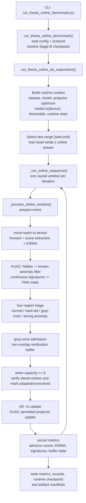

# Research: Truy vết runtime flow của quá trình online test-time adaptation

## Summary

Đường chạy benchmark THESIS hiện tại bắt đầu từ `run_thesis_online_benchmark.py`. Script này đọc experiment config và protocol config, kiểm tra protocol, tìm checkpoint Stage B, rồi gọi `run_thesis_online_tta_experiment()`.

Runtime chuẩn của THESIS gồm hai phần:

1. Chuẩn bị trước khi stream: tải dataset, dựng model và optimizer, chuyển model sang device, tính threshold từ validation sạch, rồi tạo runtime state và verification buffer.
2. Xử lý từng causal window: tạo window theo thứ tự thời gian, chuyển tensor sang device, chạy model để lấy score, tính EWMA, tạo PNN mask cho variant A1/A2, phân loại window, admission gray-zone, chạy verification khi buffer đủ tám entry, thực hiện adaptation được phép, ghi record/metric, cập nhật runtime state và checkpoint.

Điểm cần giữ riêng khi vẽ diagram: repository còn có đường generic `scripts/experiments/run_online_adaptation.py`, dùng `OnlineLoop`. Đường này không gọi `run_thesis_online_tta_experiment()`; không nên gộp nó vào benchmark THESIS nếu diagram mô tả runtime benchmark hiện tại.

## Research question

Truy vết runtime flow của quá trình online test-time adaptation trong codebase này và chuẩn bị các thành phần, thứ tự gọi hàm, dữ liệu vào/ra và state transition cho việc trực quan hoá.

## System context

### Benchmark entry point

CLI benchmark là `scripts/benchmarks/run_thesis_online_benchmark.py`. `main()` nhận `--experiment-config`, `--protocol-config`, `--online-variant` và `--dry-run`, sau đó gọi `run_thesis_online_benchmark()`.

`run_thesis_online_benchmark()` đọc config, đọc protocol YAML, kiểm tra protocol, resolve checkpoint Stage B và ghi đường dẫn checkpoint vào `experiment_config["task"]["reference_checkpoint_path"]`. Sau đó hàm gọi engine THESIS và cuối cùng ghi benchmark report, retention bundle và integrity manifest.

### Engine boundary

`src/engine/online_tta/online_engine.py` là public facade. Facade re-export `run_thesis_online_tta_experiment`, `_run_online_sequence`, `_process_online_window` và các helper từ những module nhỏ hơn.

### Input boundary

Engine dựng dataset bằng `build_dataset()`. Test sequence lấy từ `data_bundle["scaled_sequences"]["test"]`. Nếu config có `absolute_start_index` và `absolute_end_index`, engine cắt test sequence theo đoạn `[start, end)` trước khi tạo stream.

`SMDOnlineStream` giữ thứ tự thời gian, tạo các sliding window stride 1 và gắn metadata gồm `entity_id`, `start_index`, `end_index`, `stream_step` và thông tin sequence. `OnlineWindowBatcher` collate các window; benchmark kiểm tra `batch_size == 1`, vì mỗi step phải là một causal window.

## Execution path

### Top-down runtime flow



The diagram represents implemented benchmark code. The `PNN` block is executed inside `_prepare_online_window_event()` before `_classify_event_window()`. The verification path later recomputes the PNN mask for admitted entries.

### Confirmed call order

For each streamed window, `_process_online_window()` calls four timed sections in this order:

1. `prepare_event`.
2. `buffer_and_verification`.
3. `adaptation_step`.
4. `build_outputs`.

Inside `prepare_event`, the current implementation calls `_score_online_window()`, then `_attach_event_pnn_mask()`, then `_classify_event_window()`. Therefore the current source order is:

```text
move batch to device
-> model forward
-> extract raw/input/latent scores
-> EWMA
-> build current-window PNN mask for A1/A2
-> classify the window
-> admit gray-zone window and maybe verify the buffer
-> run adaptation step
-> build record and metrics
-> update runtime state
```

This order is an implementation fact. It is separate from any intended design order described in prose documents.

## Detailed findings

### 1. Runtime initialization before streaming

The benchmark builds the data bundle, online model and optimizer. It verifies that only projector parameters are trainable, moves the model to the configured device, and calibrates entity-specific thresholds from clean validation sequences. The context then creates `OnlineRuntimeState`, `VerificationBuffer(max_size=64, non_overlap_gap=0)`, `NonOverlapGuard(max_size=1)` and an empty signature history.

The Stage-B checkpoint resolution happens one layer above, in the benchmark wrapper. The model builder receives the resolved path through `reference_checkpoint_path`.

### 2. Calibration data flow

Threshold calibration uses clean validation sequences, not the test stream. It creates a stride-1 online batcher, moves each validation batch to the device, runs a no-gradient forward pass, extracts point/input-window/latent scores, maps point scores to causal endpoints, applies EWMA, and computes threshold quantiles. The resulting threshold artifact is stored in the runtime context and persisted under the online output directory.

### 3. Test stream data flow

The engine selects the configured test range by cloning `x`, labels, mask and timestamps from the original sequence. The selected sequence metadata records both the selected length and the original absolute range. `build_online_stream()` then creates a `SMDOnlineStream` with `window_size`, `stride=1`, `clean_stream_only=True` and `stream_window_mode="sliding_stride_1"`.

Each stream window contains `x` and optional labels/mask/timestamps. Its metadata carries absolute `start_index` and `end_index`, entity identity and stream step. `OnlineWindowBatcher` collates the window and validates the online batch before the model receives it.

### 4. Score and EWMA stage

`_score_online_window()` moves every tensor field in the batch to the configured device. It runs the model under `torch.no_grad()`. A0 uses `forward_source()` when available; A1/A2 use `forward()`. It extracts the last point score, latent-window score and input-window reconstruction score. EWMA combines the current endpoint score with the previous EWMA score using protocol-configured weights.

### 5. Current-window PNN and signature path

For A1/A2, `_build_event_pnn_mask()` reads frozen source hidden states from the scoring output. It loads codebook/radius metadata and the continuous prototype bank from the reference model. It filters known anomalous codeword tokens, builds ordered continuous signatures, creates a `SignatureWindow`, finds recurrent signatures using the previous history plus the current window, appends the current window to `signature_history`, and builds `pnn_mask`.

The mask is attached to `batch["pnn_mask"]`. The current source does not use this mask to decide gray-zone admission. Admission later checks only `triage_decision == "gray_zone"` and stores the original window as a CPU list.

### 6. Triage, admission and verification

`classify_online_window()` uses input-window and latent-window scores to assign one of four decisions: `normal`, `hard_old_normality`, `gray_zone` or `strong_anomaly`. The hard-old decision can be changed to gray zone when `NonOverlapGuard` rejects the interval.

Only a gray-zone event calls `VerificationBuffer.try_admit()`. The stored entry contains the entry id, absolute window bounds, scores, entity id, stream step and CPU-serialized window values. The current event PNN mask is not stored in that entry.

`VerificationCycleController.maybe_run()` starts a cycle only when the buffer has at least eight entries and at least one new entry has arrived since the prior cycle. `verify_buffer_entries()` rebuilds each entry batch on the target device, runs frozen-source inference, computes known-anomaly masks and continuous signatures, finds recurrent signatures across the buffered windows, and builds a PNN mask for each entry.

### 7. Adaptation stage

The adaptation step creates an event optimizer for A1/A2. A0 returns without an update. Strong anomalies return without an update. A1 updates only when the decision is `pnn_verified` and the PNN mask has positive entries. A2 updates for `hard_old_normality`, or for `pnn_verified` with a non-empty PNN mask; other decisions return without an update. The optimizer updates the projector parameter group, while the source encoder and memory/head components remain frozen according to the online model contract.

Verification adaptation uses `triage_decision="pnn_verified"` when it calls `execute_online_tta_step()`. This is a separate adaptation call inside the verification callback, before the ordinary event step for the current stream window.

### 8. Runtime state and outputs

After each event, `_sync_online_runtime_state()` records the previous EWMA score, advances the stream cursor, serializes signature history and recurrent signatures, appends verification history, stores hard-old intervals and copies verification-buffer entries into runtime state.

At the end of the run, the engine writes `online_metrics.json` and `online_records.json`. It saves `online_final.pt` with threshold information, cursor, EWMA, signature history, recurrent signatures, verification-buffer entries, verification history, hard-old intervals and the serialized `online_runtime_state`. The benchmark wrapper then writes a benchmark report and, when the retention policy is `retain_for_eda`, exports metrics, records, threshold artifact and runtime state into the retention bundle.

### 9. Separate generic online entry point

`scripts/experiments/run_online_adaptation.py` exposes another CLI. Its `run_online_adaptation_experiment()` builds a dataset, model, optimizer, `SMDOnlineStream`, `OnlineWindowBatcher` and `OnlineLoop`, then calls `online_loop.run()`. This path writes summary metrics and records directly and does not call the THESIS benchmark wrapper or `run_thesis_online_tta_experiment()`.

## Evidence

- [`run_thesis_online_benchmark.py` CLI and benchmark wrapper](../../../../scripts/benchmarks/run_thesis_online_benchmark.py#L218-L317) — loads configs, resolves Stage-B checkpoint, calls THESIS engine, writes report and retention artifacts.
- [`online_engine.py` public facade](../../../../src/engine/online_tta/online_engine.py#L9-L25) — exposes the runtime entry point and window-loop helpers.
- [`online_engine_run.py` runtime-context construction](../../../../src/engine/online_tta/online_engine_run.py#L123-L206) — builds dataset/model/optimizer, moves model to device, calibrates thresholds and creates runtime objects.
- [`online_engine_run.py` streaming loop](../../../../src/engine/online_tta/online_engine_run.py#L209-L300) — creates the batcher, iterates windows, calls `_process_online_window()` and synchronizes runtime state.
- [`online_engine_run.py` test-range selection and engine call](../../../../src/engine/online_tta/online_engine_run.py#L487-L541) — selects `[absolute_start_index, absolute_end_index)`, runs the sequence and finalizes artifacts.
- [`online_engine_window_core.py` per-window orchestration](../../../../src/engine/online_tta/online_engine_window_core.py#L53-L108) — confirms the four per-window sections and their call order.
- [`online_engine_window_core.py` prepare-event order](../../../../src/engine/online_tta/online_engine_window_core.py#L141-L194) — confirms score, PNN-mask construction, then triage.
- [`online_engine_window_core.py` admission and step calls](../../../../src/engine/online_tta/online_engine_window_core.py#L197-L252) — confirms buffer/verification precede the adaptation step.
- [`online_engine_window_metrics.py` score path](../../../../src/engine/online_tta/online_engine_window_metrics.py#L82-L144) — confirms tensor transfer, forward choice, score extraction and EWMA inputs.
- [`online_engine_window_metrics.py` current-window PNN path](../../../../src/engine/online_tta/online_engine_window_metrics.py#L147-L191) — confirms hidden-state filtering, signature history mutation and mask construction.
- [`online_engine_window_metrics.py` gray-zone admission](../../../../src/engine/online_tta/online_engine_window_metrics.py#L194-L220) — confirms admission condition and serialized entry fields.
- [`online_calibration.py` online stream builder](../../../../src/engine/online_tta/online_calibration.py#L18-L38) — confirms stride-1 stream and batcher settings.
- [`stream.py` stream window construction](../../../../src/data/stream.py#L38-L182) — confirms time order, window bounds and stream metadata.
- [`online_engine_step.py` A1/A2 update gates](../../../../src/engine/online_tta/online_engine_step.py#L108-L184) — confirms variant-specific adaptation conditions and projector update.
- [`online_engine_step.py` event-step control](../../../../src/engine/online_tta/online_engine_step.py#L187-L237) — confirms A0, strong-anomaly and no-loss early returns.
- [`verification_cycle.py` verification trigger](../../../../src/engine/online_tta/verification_cycle.py#L12-L36) — confirms capacity/new-entry gate and cycle completion.
- [`verification_adapter.py` verification data flow](../../../../src/engine/online_tta/verification_adapter.py#L32-L114) — confirms entry reconstruction, frozen-source scoring, filters and PNN mask.
- [`runtime_state.py` serializable runtime state](../../../../src/engine/online_tta/runtime_state.py#L13-L112) — confirms state schema and serialization fields.
- [`runtime_state.py` state synchronization and restore](../../../../src/engine/online_tta/runtime_state.py#L188-L270) — confirms buffer/signature/history restoration from checkpoint state.
- [`stream.py` batch validation boundary](../../../../src/data/stream.py#L200-L260) — confirms batch collation, optional views and validation before model use.
- [`full-spec-v3.md` four-region triage and required event order](../../../../documents/spec/full-spec-v3.md#L809-L828) — documents the protocol order used for comparison.
- [`full-spec-v3.md` verification buffer and PNN contract](../../../../documents/spec/full-spec-v3.md#L832-L878) — documents admission, verification trigger, PNN computation and TTL semantics.
- [`full-spec-v3.md` A0/A1/A2 update contract](../../../../documents/spec/full-spec-v3.md#L882-L924) — documents the permitted update surface and variant gates.
- [`test_online_tta_triage.py` triage tests](../../../../tests/online/test_online_tta_triage.py#L6-L62) — tests all four-region classification behavior through representative cases.
- [`test_verification_cycle.py` cycle/TTL test](../../../../tests/online/test_verification_cycle.py#L7-L22) — tests cycle execution at capacity and one TTL tick.
- [`test_online_runtime_state.py` state tests](../../../../tests/online/test_online_runtime_state.py#L22-L175) — tests identity validation, state restore, obsolete TTL metadata isolation and resume equivalence.
- [`test_online_engine_max_steps.py` stream-loop tests](../../../../tests/online/test_online_engine_max_steps.py#L37-L135) — tests maximum online steps, single-window enforcement and unbounded `None` behavior.
- [`online_adaptation.py` separate generic path](../../../../scripts/experiments/run_online_adaptation.py#L106-L181) — confirms the distinct `OnlineLoop`-based entry point.

## Configuration observed

| Setting | Active value | Evidence | Scope |
| --- | --- | --- | --- |
| `device` | `cuda` in the diagnostic example | [`transfer-timing config`](../../../../configs/experiment/online_diagnostic/thesis/smd__thesis__online__O1_A2__machine_1_6__w20__seed6__transfer_timing_5608_5909.yaml#L1-L5) | Example THESIS diagnostic run |
| `data.batch_size` | `1` | [`transfer-timing config`](../../../../configs/experiment/online_diagnostic/thesis/smd__thesis__online__O1_A2__machine_1_6__w20__seed6__transfer_timing_5608_5909.yaml#L10-L17) | One causal window per benchmark step |
| `task.absolute_start_index` / `absolute_end_index` | `5608` / `5909` in the diagnostic example | [`transfer-timing config`](../../../../configs/experiment/online_diagnostic/thesis/smd__thesis__online__O1_A2__machine_1_6__w20__seed6__transfer_timing_5608_5909.yaml#L30-L42) | Optional entity-global test slice |
| `task.debug_timing` | `true` in the diagnostic example | [`transfer-timing config`](../../../../configs/experiment/online_diagnostic/thesis/smd__thesis__online__O1_A2__machine_1_6__w20__seed6__transfer_timing_5608_5909.yaml#L39-L44) | Runtime timing diagnostics only |
| `online_window_stride` | `1` | [`protocol config`](../../../../configs/protocol/smd_window20_cleanval_q99_ewma09.yaml#L1-L11) | Online calibration and stream protocol |
| `online_ewma_current_weight` / `online_ewma_previous_weight` | `0.9` / `0.1` | [`protocol config`](../../../../configs/protocol/smd_window20_cleanval_q99_ewma09.yaml#L7-L11) | EWMA score update |
| `task.max_online_steps` | `16` in the shared task config; `null` in the diagnostic example | [`task config`](../../../../configs/task/online_adaptation.yaml#L1-L13), [`diagnostic config`](../../../../configs/experiment/online_diagnostic/thesis/smd__thesis__online__O1_A2__machine_1_6__w20__seed6__transfer_timing_5608_5909.yaml#L39-L44) | Stream length cap; resolved to unbounded when `null` |

## Conflicts and uncertainties

1. The code contains a compatibility/generic online path and a THESIS benchmark path. The benchmark path is confirmed by `run_thesis_online_benchmark.py`; the generic path is confirmed separately by `run_online_adaptation.py`. The available source does not prove that both paths are used by the same CLI or experiment matrix.
2. `online_engine_run.py` returns `runtime_protocol_status: "full_spec_v2"` while this research also compares the implementation with `full-spec-v3.md`. This is a source-level naming conflict; the code does not establish that the runtime has been fully migrated to a v3 status label.
3. The current-window PNN mask is built before triage, but the buffer admission function does not consume that mask. The verification adapter recomputes the PNN mask after gray-zone entries are buffered. The code therefore contains two PNN-related computations; the available files do not state whether the first computation is intended as a required event output, a cache, or a redundant precomputation.
4. The source entry schema used by `_update_online_window_buffers()` uses `window_start`, `window_end`, `window` and `stream_step`, while `full-spec-v3.md` names the schema fields `start_index`, `end_index`, `x` and `admitted_at_cursor`. This report records the mismatch but does not infer compatibility from similar meaning.
5. The inspected tests cover triage decisions, stream limits, verification-cycle TTL behavior and runtime-state restore. No inspected test directly asserts the complete call order `score -> triage -> gray admission -> verification -> PNN filtering` or asserts that current-window PNN construction must happen after triage.
6. No runtime command was executed during this research pass. The claims above come from source, configuration, specification and test inspection at the recorded revision.

## Open questions

- Should the visualization show the current-window PNN computation before triage as implemented, or show only the later verification PNN computation as the protocol-level PNN stage?
- Is `scripts/experiments/run_online_adaptation.py` still an supported execution path, or should future diagrams cover only `run_thesis_online_benchmark.py`?
- Should the runtime protocol status remain `full_spec_v2`, or should it be aligned with the active specification version before reporting benchmark compliance?
- Are the implementation entry-field names intentionally different from the v3 schema, or is a schema translation layer expected but not present in the inspected path?
