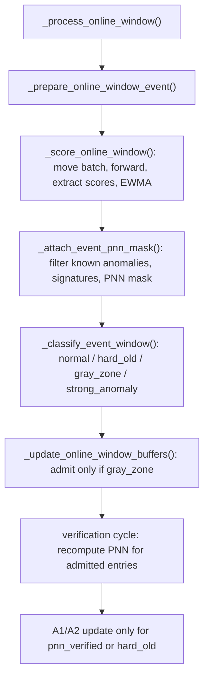

# Research: Kiểm tra thứ tự triage, gray-zone admission và pnn_mask trong prepare_event

## Summary

Code hiện tại không chạy theo thứ tự mà anh mô tả. Trong `_prepare_online_window_event()`, code tạo `pnn_mask` và cập nhật `signature_history` trước khi phân loại window. Sau đó code mới gọi `_classify_event_window()`.

Tuy nhiên, `pnn_mask` được tạo sớm này chưa quyết định việc đưa window vào verification buffer. Việc admission vẫn chỉ xảy ra sau triage và chỉ với `gray_zone`. Khi verification cycle chạy, code lại tính `pnn_mask` lần thứ hai cho các entry đã được admit. Vì vậy, implementation hiện tại có hai bước PNN: một bước sớm trong `prepare_event`, và một bước verification sau gray-zone admission.

## Research question

Kiểm tra xem data-flow diagram trong `documents/notes/thesis_online_tta_prepare_event_runtime_and_data_flow.md`, đặc biệt phần 3, có phản ánh đúng thứ tự đang được lập trình hay không; đồng thời xác định thứ tự thực tế giữa scoring, triage, gray-zone admission, lọc point và xây dựng `pnn_mask`.

## System context

Luồng mỗi causal window bắt đầu trong `_process_online_window()`. Hàm này gọi lần lượt:

1. `_prepare_online_window_event()` để score window, tạo PNN diagnostics và phân loại window.
2. `_admit_and_verify_online_window()` để admit gray-zone window và chạy verification cycle khi đủ điều kiện.
3. `_execute_window_event_step()` để chạy adaptation step nếu triage decision cho phép.

`prepare_event` không tự admit window. Nó trả về event dictionary chứa batch, scores, triage decision, diagnostics và recurrent signatures.

## Execution path

Call chain đã xác nhận:



Đây là flow của implementation hiện tại, không phải flow được suy ra từ ý tưởng mong muốn.

## Detailed findings

### 1. Diagram hiện tại không chính xác về thứ tự

Phần 3 của `documents/notes/thesis_online_tta_prepare_event_runtime_and_data_flow.md` mô tả:

```text
SCORE -> PNN -> TRIAGE -> EVENT
```

Đoạn này thực ra khớp với code hiện tại, nhưng không khớp với thứ tự ý tưởng gốc mà anh nêu: `SCORE -> TRIAGE -> gray-zone selection -> point filtering -> pnn_mask`.

Vì vậy cần phân biệt hai kết luận:

- Nếu câu hỏi là “diagram có mô tả code hiện tại không?”, câu trả lời là có, ở phần thứ tự `PNN` trước `TRIAGE`.
- Nếu câu hỏi là “diagram có mô tả đúng ý tưởng gốc/spec mong muốn không?”, câu trả lời là không.

### 2. Code thực tế tạo PNN trước triage

`_prepare_online_window_event()` gọi `_score_online_window()` trước. Ngay sau đó, code gọi `_attach_event_pnn_mask()` ở bước được đo thời gian là `pnn_mask`. Chỉ sau bước này code mới gọi `_classify_event_window()`.

Evidence:

- `src/engine/online_tta/online_engine_window_core.py:155-176` gọi scoring rồi PNN.
- `src/engine/online_tta/online_engine_window_core.py:178-184` gọi triage sau PNN.

Trong `_attach_event_pnn_mask()`, A1/A2 gọi `_build_event_pnn_mask()` rồi gắn mask vào batch. A0 bỏ qua bước này.

Evidence:

- `src/engine/online_tta/online_engine_window_core.py:260-278`.

### 3. `_build_event_pnn_mask()` lọc và tạo mask trước khi biết window có gray-zone hay không

`_build_event_pnn_mask()` thực hiện các bước sau:

1. Lấy frozen source hidden.
2. Lấy discrete codebook và continuous prototype bank.
3. Gọi `filter_known_anomaly_tokens()` để tạo `known_anomaly` mask.
4. Gọi `ordered_continuous_signature()` trên hidden và prototype bank.
5. Tạo `SignatureWindow` cho window hiện tại.
6. Tìm recurrent signatures từ `signature_history` cộng với window hiện tại.
7. Append window hiện tại vào `signature_history`.
8. Gọi `build_pnn_token_mask()` để tạo PNN mask.

Evidence:

- `src/engine/online_tta/online_engine_window_metrics.py:147-183`.

Ở thời điểm các bước 3-8 chạy, code chưa gọi `_classify_event_window()`. Do đó code chưa biết window là `normal`, `hard_old_normality`, `gray_zone` hay `strong_anomaly`.

### 4. Gray-zone admission xảy ra sau triage và không dùng PNN mask hiện tại

Sau khi `prepare_event` trả về, `_admit_and_verify_online_window()` truyền `event["triage_decision"]` vào `_update_online_window_buffers()`.

`_update_online_window_buffers()` chỉ gọi `verification_buffer.try_admit()` khi `triage_decision == "gray_zone"`. Entry được lưu chứa score, metadata và `window` CPU list; code không đưa `event["batch"]["pnn_mask"]` vào entry.

Evidence:

- `src/engine/online_tta/online_engine_window_core.py:197-223`.
- `src/engine/online_tta/online_engine_window_metrics.py:194-220`.

Điều này cho thấy PNN mask được tạo trước triage không quyết định admission và không được lưu trực tiếp trong verification entry.

### 5. Verification tính lại PNN mask sau gray-zone admission

Khi verification cycle đủ điều kiện, `verify_buffer_entries()` score lại từng entry bằng frozen source path, lọc known anomaly tokens, tạo signatures, tìm recurrent signatures trên các entry, rồi gọi `build_pnn_token_mask()`.

Evidence:

- `src/engine/online_tta/verification_cycle.py:21-36` chỉ chạy callback khi buffer đạt capacity và đủ điều kiện verification.
- `src/engine/online_tta/verification_adapter.py:82-113` tính lại signatures và PNN mask cho các entry đã được buffer.

Sau đó `_verify_and_adapt_entries()` gắn verification result vào batch và gọi adaptation với `triage_decision="pnn_verified"`.

Evidence:

- `src/engine/online_tta/online_engine_window_metrics.py:35-79`.

### 6. PNN mask sớm không làm gray-zone window adapt ngay

`execute_online_tta_step()` không có nhánh adaptation cho `gray_zone`. Với A2, code chỉ chạy masked reconstruction khi decision là `pnn_verified`; nhánh `hard_old_normality` dùng hard-old hinge; các decision khác trả về không update.

Evidence:

- `src/engine/online_tta/online_engine_step.py:136-149`.

Vì vậy, PNN mask được gắn vào batch trong `prepare_event`, nhưng không làm phát sinh update cho chính window đó nếu window chỉ được phân loại là `gray_zone`.

### 7. `signature_history` hiện được cập nhật trước triage cho mọi window A1/A2

`_build_event_pnn_mask()` append `SignatureWindow` hiện tại vào `signature_history` trước khi triage xảy ra. Code không có điều kiện `triage_decision == "gray_zone"` quanh thao tác append, vì decision chưa tồn tại ở thời điểm đó.

Đây là khác biệt quan trọng với ý tưởng “chỉ lấy các window gray zone rồi mới lọc point trong chúng”. Theo implementation hiện tại, signature history có thể nhận signature từ window chưa được triage là gray zone.

Evidence:

- `src/engine/online_tta/online_engine_window_metrics.py:174-183`.
- `src/engine/online_tta/online_engine_window_core.py:178-184`.

## Comparison with `full-spec-v3.md`

`full-spec-v3.md` quy định thứ tự sự kiện ở mức cao:

```text
score -> uncertainty aggregation -> EWMA -> triage
      -> permitted update/admission -> verification if due
```

Evidence:

- `documents/spec/full-spec-v3.md:809-828`.

Spec cũng quy định chỉ gray-zone windows mới được admit vào verification buffer, và verification mới tính các thành phần gồm known anomaly mask, continuous signatures và PNN mask.

Evidence:

- `documents/spec/full-spec-v3.md:832-878`.

Đối chiếu theo hai tầng:

| Nội dung | Spec | Code hiện tại | Kết quả |
| --- | --- | --- | --- |
| Triage dựa trên input và latent scores | Có | `_classify_event_window()` chạy sau score/EWMA | Phù hợp |
| Chỉ gray-zone window được admission | Có | `_update_online_window_buffers()` kiểm tra `gray_zone` | Phù hợp |
| PNN là kết quả của verification trên entry đã admit | Có ở phần verification | Verification adapter thực hiện đúng | Phù hợp ở verification path |
| Tạo PNN trong `prepare_event` trước triage | Không được thể hiện trong event order của spec | `_attach_event_pnn_mask()` chạy trước `_classify_event_window()` | Extra/premature implementation path |
| Chỉ dùng gray-zone windows để xây signature recurrence | Ý tưởng anh mô tả yêu cầu điều này | `signature_history.append(window)` chạy trước triage cho mọi A1/A2 window | Không phù hợp với ý tưởng gốc |

Spec không đủ chi tiết để khẳng định rằng mọi phép tính trung gian của PNN tuyệt đối không được chạy trước triage. Vì vậy, bằng chứng chắc chắn nhất là: code hiện tại có một PNN computation path sớm ngoài event order được spec mô tả, trong khi verification PNN path sau gray-zone admission vẫn tồn tại.

## Evidence

- `src/engine/online_tta/online_engine_window_core.py:141-194` — thứ tự trong `prepare_event`: score, PNN, rồi triage.
- `src/engine/online_tta/online_engine_window_core.py:197-223` — admission và verification chạy sau `prepare_event`.
- `src/engine/online_tta/online_engine_window_core.py:260-278` — A1/A2 attach PNN mask; A0 bỏ qua.
- `src/engine/online_tta/online_engine_window_metrics.py:147-191` — known-anomaly filtering, signature creation, history append và PNN mask construction.
- `src/engine/online_tta/online_engine_window_metrics.py:194-220` — chỉ gray-zone được admit; entry không lưu event PNN mask.
- `src/engine/online_tta/verification_adapter.py:82-113` — verification tính lại PNN mask cho buffered entries.
- `src/engine/online_tta/online_engine_step.py:118-149` — A1/A2 chỉ update với `pnn_verified` hoặc `hard_old_normality`; gray zone không update trực tiếp.
- `documents/spec/full-spec-v3.md:809-828` — normative event order và four-region triage.
- `documents/spec/full-spec-v3.md:832-878` — gray-zone admission và verification PNN semantics.
- `tests/online/test_online_verification_buffer.py:35-67` — test gray-zone admission và từ chối các decision không phải gray zone.
- `tests/online/test_online_tta_variants.py:148-154` — test adaptation được gọi với `pnn_verified`.

## Configuration observed

Không cần configuration để xác định thứ tự này. Thứ tự được quyết định trực tiếp bởi các lời gọi hàm trong runtime code.

## Conflicts and uncertainties

1. `documents/notes/thesis_online_tta_prepare_event_runtime_and_data_flow.md:46-77` mô tả PNN trước triage. Đoạn này phản ánh code hiện tại nhưng không phản ánh ý tưởng gốc mà anh vừa nêu.
2. `full-spec-v3.md` quy định event order và verification semantics, nhưng không nói rõ có cấm hoàn toàn việc tính PNN trung gian trước triage hay không.
3. Các test hiện có kiểm tra gray-zone admission và adaptation với `pnn_verified`, nhưng chưa có integration test kiểm tra rằng `pnn_mask` chỉ được tạo sau triage hoặc `signature_history` chỉ nhận gray-zone windows.

## Open questions

- Có cần xem `pnn_mask` trong `prepare_event` là một computation path dư thừa phải loại bỏ, hay đây là chủ ý precomputation nhưng không dùng để admission?
- `signature_history` theo thiết kế cuối cùng có được phép chứa mọi window A1/A2 hay chỉ các gray-zone window đã được admit?

Nghiên cứu này chưa sửa code hoặc tài liệu.
