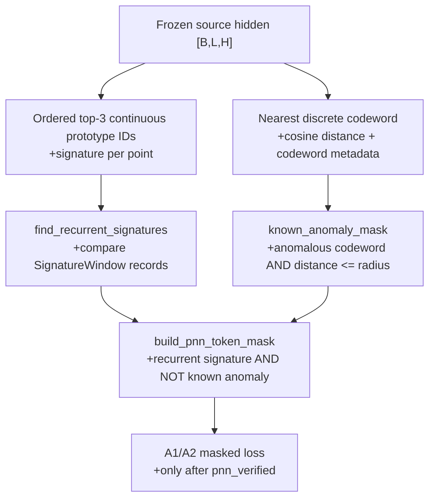
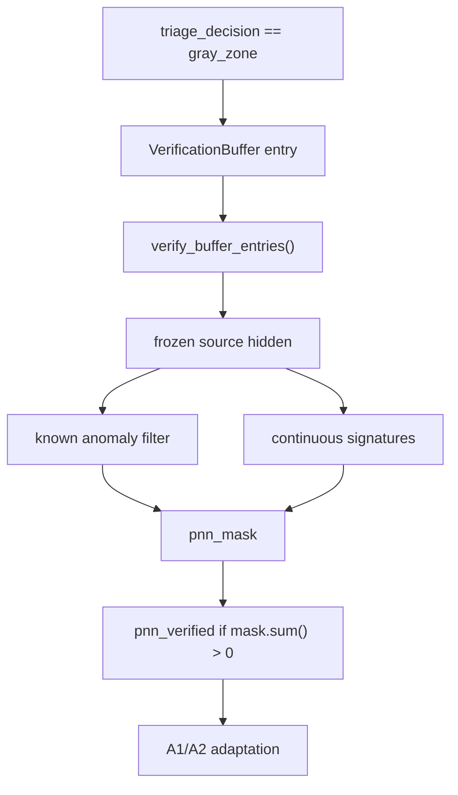

# Research: Cách code hiện tại phát hiện pseudo-new-normality

## Summary

Trong code hiện tại, một point được đánh dấu là pseudo-new-normality khi thỏa đồng thời hai điều kiện:

1. Signature top-3 của point xuất hiện lại trong ít nhất một window khác không chồng lấn.
2. Point đó không nằm trong vùng bán kính của một anomalous discrete codeword đã biết.

Code biểu diễn kết quả bằng `pnn_mask` có shape `[B, L]`. Giá trị `True` nghĩa là point được chọn cho PNN adaptation.

Pipeline thực tế là:

```text
frozen hidden
    -> nearest discrete codeword + distance
    -> known_anomaly_mask
    -> top-3 continuous prototype signature
    -> recurrent signatures across windows
    -> pnn_mask = recurrent_signature_mask AND NOT known_anomaly_mask
```

Có hai nơi chạy pipeline này:

- `_build_event_pnn_mask()` chạy sớm trong `prepare_event` cho A1/A2.
- `verify_buffer_entries()` chạy lại pipeline cho các window đã được admit vào verification buffer.

Theo runtime hiện tại, chỉ kết quả verification sau gray-zone admission mới được dùng để gọi adaptation với decision `pnn_verified`.

## Research question

Xác định chính xác các point pseudo-new-normality được phát hiện thế nào và codebase hiện tại lập trình từng bước ra sao, dựa trên `1_research_prompt.md`.

## System context

Các helper phát hiện PNN nằm trong `src/engine/online_tta/signature_verification.py`. Runtime gọi chúng từ `online_engine_window_metrics.py` và `verification_adapter.py`. `online_engine_step.py` dùng `pnn_mask` để tính loss cho A1/A2.

`full-spec-v3.md` định nghĩa PNN geometry bằng frozen hidden, nearest codeword, known-anomaly mask và continuous signature IDs. Spec yêu cầu signature recurrent phải xuất hiện trong hơn một window không chồng lấn.

## Execution path

### Runtime path trong `prepare_event`



### Runtime path sau gray-zone admission



## Detailed findings

### 1. Input hidden state

`_build_event_pnn_mask()` first reads `reference_hidden` from model outputs. If that field is absent, it falls back to `hidden`. The code requires a tensor and calls `.detach()`, so the PNN detection path uses frozen, non-gradient hidden states.

Evidence: `src/engine/online_tta/online_engine_window_metrics.py:147-160`.

The verification path does the same after rebuilding the stored window batch and calling the frozen-source forward path.

Evidence: `src/engine/online_tta/verification_adapter.py:53-79`.

### 2. Discrete known-anomaly filter

`nearest_discrete_codeword()` computes cosine distance between every hidden token and every discrete codeword:

```python
distances = 1 - normalize(hidden) @ normalize(codebook).T
ids = distances.min(dim=-1)
```

The nearest codeword ID and distance are then used by `filter_known_anomaly_tokens()`. A token is marked known anomaly only when:

```text
anomalous_codeword_mask[nearest_id] is True
AND
nearest_distance <= anomaly_radii[nearest_id]
```

Evidence:

- `src/engine/online_tta/signature_verification.py:116-139`.
- Runtime metadata source: `src/engine/online_tta/signature_verification.py:67-113`.

This filter does not learn or update anything. It returns a boolean tensor with one value per time-point.

### 3. Continuous signature per point

`ordered_continuous_signature()` computes cosine distances between each hidden token and every continuous prototype. It sorts prototype IDs by ascending distance and keeps the first three IDs.

For one point, the result has the form:

```text
(prototype_id_1, prototype_id_2, prototype_id_3)
```

The ordering is deterministic. If distances tie, the lower prototype ID wins because the sort key is `(distance, index)`.

Evidence: `src/engine/online_tta/signature_verification.py:171-189`.

The current implementation computes these signatures for every token before applying `known_anomaly_mask`. It does not skip known-anomaly tokens during signature construction. The final PNN mask removes them later.

This differs slightly from the wording in `full-spec-v3.md`, which says to compute the ordered top-3 signature for tokens not marked known anomaly.

Evidence:

- Code: `src/engine/online_tta/signature_verification.py:171-189`.
- Spec: `documents/spec/full-spec-v3.md:399-408`.

### 4. Recurrent signature detection

`SignatureWindow` stores:

```text
entity_id
start
end
signatures
```

Evidence: `src/engine/online_tta/signature_verification.py:192-198`.

`find_recurrent_signatures()` groups all signature occurrences by signature tuple. It then keeps a signature if one of these conditions is true for a pair of occurrences:

```text
same entity AND left.end <= right.start
OR
different entities
```

For one entity, `left.end <= right.start` means the two windows do not overlap. The boundary is inclusive for adjacency: `[0,20)` and `[20,40)` count as non-overlapping.

Evidence: `src/engine/online_tta/signature_verification.py:230-251`.

The live `prepare_event` path builds the current `SignatureWindow`, searches recurrence in `signature_history + current_window`, then appends the current window to history.

Evidence: `src/engine/online_tta/online_engine_window_metrics.py:174-183`.

The verification path instead constructs windows from the entries passed to `verify_buffer_entries()`, searches recurrence across those entries, and then builds each entry's mask.

Evidence: `src/engine/online_tta/verification_adapter.py:82-103`.

### 5. Final `pnn_mask`

`build_pnn_token_mask()` first creates a boolean mask by checking whether each point's signature tuple belongs to the recurrent-signature set. It then removes known anomalies:

```python
return mask & ~known_anomaly_mask.to(dtype=torch.bool)
```

Therefore:

```text
pnn_mask[batch, time] = True
iff
signature[batch, time] is recurrent
and known_anomaly_mask[batch, time] is False
```

Evidence: `src/engine/online_tta/signature_verification.py:254-277`.

The code checks that the resulting mask has the same `[B,L]` shape as the known-anomaly mask.

### 6. How the mask affects adaptation

For A1, adaptation requires `triage_decision == "pnn_verified"`. If the mask has no `True` value, the update is skipped. Otherwise the code computes masked reconstruction loss.

For A2, the same `pnn_verified` branch computes masked reconstruction loss and adds the token contrastive loss. The mask also restricts contrastive anchors; recurrent signature IDs provide additional positive pairs.

Evidence:

- `src/engine/online_tta/online_engine_step.py:118-168`.
- `src/engine/online_tta/online_losses.py:57-66`.
- `src/engine/online_tta/online_losses.py:105-156`.

The verification adapter labels an entry as adapted candidate only when `int(pnn_mask.sum()) > 0`.

Evidence: `src/engine/online_tta/verification_adapter.py:99-113`.

### 7. Current ordering issue

In `prepare_event`, the code creates the PNN mask before it calls triage. Therefore, the current-event PNN mask is not restricted to windows already known to be gray-zone at the time it is computed.

Evidence: `src/engine/online_tta/online_engine_window_core.py:141-194`.

Also, `_build_event_pnn_mask()` appends the current signature window to `signature_history` before a triage decision exists.

Evidence: `src/engine/online_tta/online_engine_window_metrics.py:174-183`.

However, current PNN output does not directly admit the window. Admission checks only `triage_decision == "gray_zone"`, and the entry stores the window and scores rather than this early PNN mask.

Evidence: `src/engine/online_tta/online_engine_window_metrics.py:194-220`.

The verification adapter recomputes PNN for admitted entries. This recomputed mask is the one used with `triage_decision="pnn_verified"` for adaptation.

Evidence: `src/engine/online_tta/online_engine_window_metrics.py:35-79` and `src/engine/online_tta/verification_adapter.py:82-113`.

## Comparison with `full-spec-v3.md`

| Question | Specification | Current implementation |
| --- | --- | --- |
| What is filtered first? | Tokens inside anomalous codeword radii are excluded. | `known_anomaly_mask` is computed and intersected out of the final mask. |
| How is a signature formed? | Ordered top-3 continuous prototype IDs. | Same, with deterministic cosine-distance ranking and tie-break by ID. |
| When is a signature recurrent? | More than one non-overlapping admitted window. | Same-entity non-overlap is checked by interval; the helper also treats different-entity occurrences as recurrent. |
| What is PNN? | `[N,20]` mask after known-anomaly filtering and recurrence. | Boolean `[B,L]` mask: recurrent signature and not known anomaly. |
| Which PNN reaches adaptation? | Verification result for admitted entries. | Verification recomputes the mask and passes it as `pnn_verified`. |
| Is PNN built after triage? | High-level event order places triage before permitted admission/verification. | An additional PNN computation occurs before triage in `prepare_event`; verification PNN occurs later. |

Evidence for the spec: `documents/spec/full-spec-v3.md:399-408` and `documents/spec/full-spec-v3.md:861-874`.

## Tests and validation

The focused tests pass:

```text
11 passed in 1.23s
```

Command:

```bash
./.venv/bin/python -m pytest -q \
  tests/online/test_online_signature_verification.py \
  tests/online/test_full_spec_online_losses.py
```

The tests establish that:

- top-3 signature ordering is deterministic;
- known-anomaly points are removed from the final mask;
- recurrence requires non-overlapping windows for the same entity;
- verification produces a PNN mask and pseudo-normal point count;
- masked PNN loss accepts `[B,L]` masks.

Evidence: `tests/online/test_online_signature_verification.py:47-121` and `tests/online/test_full_spec_online_losses.py:38-45`.

The tests do not establish that PNN computation happens only after triage, nor that `signature_history` contains only gray-zone windows.

## Conflicts and uncertainties

1. The implementation computes signatures for known-anomaly tokens and filters them only when building the final mask. The spec wording suggests excluding them before signature computation. The final boolean mask is equivalent for the current helper, but the intermediate computation order differs.
2. `find_recurrent_signatures()` treats occurrences from different entities as recurrent. The active online sequence is normally entity-specific, but the helper itself does not enforce same-entity recurrence.
3. The current-event PNN computation occurs before triage, while the PNN used for adaptation is recomputed after gray-zone admission. The project contains both paths.

## Open questions

- Should the canonical PNN definition apply only to admitted gray-zone windows, or may `prepare_event` retain a preliminary PNN computation?
- Should recurrence be allowed across different entities, or must signatures always recur within the same entity?
- Should known-anomaly tokens be excluded before continuous-signature computation, rather than only removed from the final mask?

This report only documents the current code. It does not modify source code, tests, configuration, or specifications.
