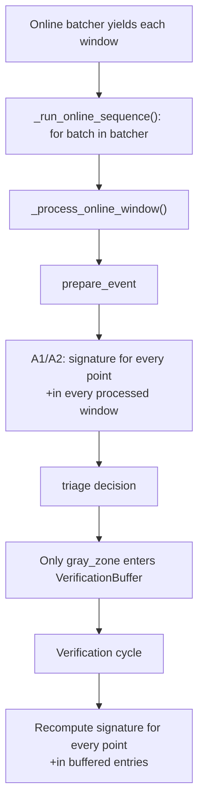

# Research: Phạm vi tính continuous signature: toàn bộ online stream hay verification buffer

## Summary

Code hiện tại tính continuous signature ở **cả hai phạm vi**, nhưng qua hai execution path khác nhau:

1. **Trong toàn bộ các window được stream cho A1/A2:** mỗi batch/window đi qua `_process_online_window()`, sau đó `prepare_event` gọi `_build_event_pnn_mask()`. Vì vậy code tính signature cho tất cả point trong mọi window mà online loop thực sự xử lý, không chỉ các window được admit vào verification buffer.
2. **Trong verification buffer:** khi verification cycle chạy, `verify_buffer_entries()` tính lại signature cho tất cả point trong các entry đang được verification. Các entry này là subset đã được admit, thường là gray-zone windows.

Đối với A0, code bỏ qua PNN/signature computation trong `prepare_event`. Nếu stream bị giới hạn bằng `max_online_steps`, “toàn bộ stream” ở trên có nghĩa là toàn bộ phần stream thực sự được chạy, không phải phần dữ liệu chưa được loop tới.

## Research question

Xác định code hiện tại tính signature cho tất cả point trong verification buffer hay cho tất cả point của toàn bộ online stream, đồng thời phân biệt lần tính sớm trong `prepare_event` với lần tính lại trong verification.

## System context

Online loop nhận từng causal window từ `batcher`. Mỗi window được đưa vào `_process_online_window()`. `prepare_event` score window, tạo PNN diagnostics/signature và triage. Sau đó code mới xét gray-zone admission và verification.

Verification buffer chỉ chứa window được admit khi `triage_decision == "gray_zone"`. Verification cycle không thay thế lần tính trong `prepare_event`; nó tính lại geometry trên các entry đã được buffer.

## Execution path



## Detailed findings

### 1. Online loop invokes PNN/signature logic for each processed window

`_run_online_sequence()` iterates over every batch yielded by `batcher`. For each batch it calls `_process_online_window()` and passes the shared `signature_history`.

Evidence: `src/engine/online_tta/online_engine_run.py:261-285`.

`_process_online_window()` calls `_prepare_online_window_event()` before buffer handling and adaptation. The `prepare_event` call is inside the per-window processing path.

Evidence: `src/engine/online_tta/online_engine_window_core.py:53-108`.

### 2. `prepare_event` computes signatures before knowing buffer admission

Inside `_prepare_online_window_event()`, code executes this order:

```text
_score_online_window()
_attach_event_pnn_mask()
_classify_event_window()
```

Evidence: `src/engine/online_tta/online_engine_window_core.py:155-184`.

For A1/A2, `_attach_event_pnn_mask()` calls `_build_event_pnn_mask()`. Only A0 returns immediately without building the mask.

Evidence: `src/engine/online_tta/online_engine_window_core.py:260-278`.

Therefore, for A1/A2, the current implementation computes signature information for every window that reaches `prepare_event`, whether that window later becomes `normal`, `hard_old_normality`, `gray_zone`, or `strong_anomaly`.

### 3. `_build_event_pnn_mask()` processes every point in the current window

For the current window, `_build_event_pnn_mask()`:

1. reads hidden states with shape `[B,L,H]`;
2. calls `filter_known_anomaly_tokens()`;
3. calls `ordered_continuous_signature(hidden, prototypes, topk=3)`;
4. stores all resulting token signatures in a `SignatureWindow`;
5. searches recurrent signatures;
6. appends the window to `signature_history`;
7. builds the current window's PNN mask.

Evidence: `src/engine/online_tta/online_engine_window_metrics.py:147-191`.

`ordered_continuous_signature()` loops through every batch item and every token in its distance tensor. It does not receive the verification buffer and does not receive a triage decision.

Evidence: `src/engine/online_tta/signature_verification.py:171-189`.

### 4. The current-event signature history is not limited to buffered entries

The online path appends the current `SignatureWindow` directly to the shared `signature_history` during `prepare_event`.

Evidence: `src/engine/online_tta/online_engine_window_metrics.py:174-183`.

The next stream step receives the same history, and `_run_online_sequence()` synchronizes it into runtime state after processing the window.

Evidence:

- `src/engine/online_tta/online_engine_run.py:287-298`.
- `src/engine/online_tta/online_engine_shared.py:68-80`.

This establishes that the primary signature history belongs to the processed online sequence, not only to verification-buffer entries.

### 5. Buffer admission happens after the first signature computation

`_update_online_window_buffers()` checks the already-computed triage decision. It calls `verification_buffer.try_admit()` only when the decision is `gray_zone`.

Evidence: `src/engine/online_tta/online_engine_window_metrics.py:194-220`.

The entry stores the window tensor as a CPU list and its scores/metadata. It does not store the current event's PNN mask or signature list.

Evidence: `src/engine/online_tta/online_engine_window_metrics.py:205-217`.

Therefore the first signature calculation is not restricted to the verification buffer, and its result is not the data object that determines admission.

### 6. Verification recomputes signatures only for buffered entries

`verify_buffer_entries()` receives `entries` as its input. For each entry it calls `_score_verification_entry()`, which rebuilds the entry batch, runs frozen-source inference, filters known anomalies and computes continuous signatures.

Evidence:

- `src/engine/online_tta/verification_adapter.py:53-79`.
- `src/engine/online_tta/verification_adapter.py:82-99`.

The function then finds recurrent signatures across the supplied entries and builds one PNN mask per entry.

Evidence: `src/engine/online_tta/verification_adapter.py:99-113`.

This second computation is limited to entries passed by the verification cycle, not to every online window.

### 7. What “all points” means here

The signature helper processes every time-point token in each `[B,L,H]` hidden tensor. It does not calculate only the final point of the window.

The stream uses one causal window per batch, and the signature result has one signature per token. The final PNN mask has shape `[B,L]`.

Evidence:

- Signature computation: `src/engine/online_tta/signature_verification.py:171-189`.
- PNN mask shape check: `src/engine/online_tta/signature_verification.py:254-277`.
- Spec geometry: `documents/spec/full-spec-v3.md:861-874`.

## Comparison table

| Execution path | Input scope | When signature is computed | Used for |
| --- | --- | --- | --- |
| `prepare_event` for A1/A2 | Every point in every processed online window | Before triage and before admission | Current diagnostics, current `signature_history`, preliminary PNN mask |
| `prepare_event` for A0 | No PNN/signature path | Not computed | A0 inference-only path |
| Verification cycle | Every point in every admitted verification entry | After buffer capacity/verification condition is met | Verification PNN mask and `pnn_verified` adaptation |
| `find_recurrent_signatures` after each stream step | All windows currently in `signature_history` | After the current window is appended | Runtime recurrent-signature state and diagnostics |

## Tests and validation

The relevant signature tests confirm the helper behavior:

- top-3 signatures are generated per token;
- known-anomaly points are removed from the final PNN mask;
- recurrence is recognized for adjacent non-overlapping windows;
- verification produces a PNN mask from buffered entries.

Evidence: `tests/online/test_online_signature_verification.py:47-114`.

These tests do not assert that the first signature computation is restricted to gray-zone windows. The runtime source therefore provides the stronger evidence for scope.

## Conflicts and uncertainties

1. The phrase “toàn bộ stream” must be read as “all windows actually processed by the online loop.” A configured short smoke stream or `max_online_steps` naturally limits the processed subset.
2. The implementation has a preliminary signature/PNN path for every A1/A2 window and a second signature/PNN path for buffered entries. Calling only one of these paths “the signature computation” would be incomplete.
3. The first path can add non-gray-zone windows to `signature_history`; the verification path uses only the entries supplied by the buffer.

## Open questions

- Should signature history be defined over every processed online window, or only over gray-zone windows admitted to verification?
- Should the preliminary `prepare_event` signature computation remain separate from the canonical verification computation?

This report only documents the current implementation. It does not modify source code, tests, configuration, or specifications.
