# THESIS Offline Runtime Flow, Data Flow, and IGCSE Pseudocode

Tài liệu này dùng tên chính thức trong [`offline_pretraining_terminology_ontology.md`](../spec/offline_pretraining_terminology_ontology.md). Hai diagram cố ý có cấu trúc khác nhau:

- runtime flow nối **các computational steps** theo thứ tự thực thi;
- data flow nối **data objects** qua các processing boxes.

Các flow dưới đây mô tả active executable path bắt đầu từ `scripts.run_thesis_offline_benchmark`. Chúng không mô tả workflow three-stage lịch sử.

## 1. Runtime flow diagram


Ý tưởng chính ở đây là runtime có một trục thời gian duy nhất. Stage A hoàn tất trước khi memory initialization bắt đầu. Stage B chỉ bắt đầu sau khi `stage_b_initialization_checkpoint` đã được lưu. Clean validation phải chạy trước test vì nó tạo fixed threshold cho test evaluation.

## 2. Data flow diagram

```mermaid
flowchart LR
    I01["experiment_config + protocol_config"]
    P01["validate configs and materialize manifest"]
    O01["two_stage_run_manifest + generated_stage_configs"]

    I02["train_sequences"]
    P02["fit train scaler and build offline_training_batches"]
    O02["offline_training_batches"]

    P03["stage_a_multitask_pretraining"]
    O03["stage_a_best_checkpoint"]

    P04["stage_b_memory_initialization"]
    O04["continuous_prototype_bank + discrete_codebook + anomaly_verification_metadata"]
    O05["stage_b_initialization_checkpoint"]

    P05["stage_b_fusion_finetuning"]
    O06["stage_b_best_checkpoint"]

    I03["clean_validation_windows"]
    P06["offline model inference and timeline reconstruction"]
    O07["clean_validation_point_score_timeline"]
    P07["clean-validation quantile calibration"]
    O08["offline_point_threshold + online_point_ewma_threshold"]

    I04["test_windows + test_point_labels"]
    P08["offline evaluation with fixed offline_point_threshold"]
    O09["test_point_score_timeline + offline_predictions + offline_metrics"]

    P09["artifact export"]
    O10["threshold_artifact + score_artifacts + metric_artifacts + provenance"]

    I01 --> P01 --> O01
    I02 --> P02 --> O02
    O01 --> P03
    O02 --> P03
    P03 --> O03
    O03 --> P04
    O02 --> P04
    P04 --> O04 --> O05
    O05 --> P05
    O02 --> P05
    P05 --> O06
    O06 --> P06
    I03 --> P06 --> O07 --> P07 --> O08
    O06 --> P08
    I04 --> P08
    O08 --> P08 --> O09
    O01 --> P09
    O06 --> P09
    O08 --> P09
    O09 --> P09 --> O10
```



Trong data flow, một processing box có thể cần nhiều inputs. Ví dụ, `stage_b_memory_initialization` cần cả `stage_a_best_checkpoint` và `offline_training_batches`. Đây là lý do data flow không được viết thành bản sao của runtime flow.

## 3. IGCSE-style pseudocode cho pha offline

Pseudocode dùng capitalized control keywords và assignment arrow `<-`. Mỗi identifier quan trọng đều được định nghĩa trong offline ontology.

```text
PROCEDURE RUN_OFFLINE_PRETRAINING_PHASE(
    experiment_config_path,
    protocol_config_path
)
    experiment_config <- LOAD_EXPERIMENT_CONFIG(experiment_config_path)
    protocol_config <- LOAD_PROTOCOL_CONFIG(protocol_config_path)

    CALL VALIDATE_OFFLINE_PROTOCOL(protocol_config)
    CALL VALIDATE_TWO_STAGE_EPOCH_BUDGET(experiment_config)

    offline_variant <- RESOLVE_OFFLINE_VARIANT(experiment_config)

    two_stage_run_manifest
        <- MATERIALIZE_TWO_STAGE_RUN_MANIFEST(experiment_config)

    stage_a_generated_config
        <- two_stage_run_manifest.training_stages[0].config

    stage_a_best_checkpoint
        <- RUN_TRAINING_STAGE(
               stage_a_generated_config,
               stage_a_multitask_pretraining,
               NO_INITIALIZATION_CHECKPOINT
           )

    stage_b_initialization_checkpoint
        <- RUN_STAGE_B_MEMORY_INITIALIZATION(
               stage_a_best_checkpoint,
               two_stage_run_manifest.training_stages[1].config
           )

    stage_b_generated_config
        <- two_stage_run_manifest.training_stages[1].config

    stage_b_best_checkpoint
        <- RUN_TRAINING_STAGE(
               stage_b_generated_config,
               stage_b_fusion_finetuning,
               stage_b_initialization_checkpoint
           )

    offline_artifact_bundle
        <- RUN_OFFLINE_EVALUATION(
               experiment_config,
               protocol_config,
               offline_variant,
               stage_b_best_checkpoint
           )

    offline_benchmark_report
        <- BUILD_OFFLINE_BENCHMARK_REPORT(
               two_stage_run_manifest,
               stage_a_best_checkpoint,
               stage_b_initialization_checkpoint,
               stage_b_best_checkpoint,
               offline_artifact_bundle
           )

    SAVE offline_benchmark_report
ENDPROCEDURE


FUNCTION RUN_TRAINING_STAGE(
    stage_generated_config,
    stage_name,
    initialization_checkpoint
) RETURNS checkpoint
    CALL SEED_ALL_RANDOM_NUMBER_GENERATORS(stage_generated_config.seed)

    dataset_bundle
        <- BUILD_DATASET_BUNDLE(stage_generated_config.data)

    offline_source_model
        <- BUILD_OFFLINE_SOURCE_MODEL(stage_generated_config)

    IF initialization_checkpoint EXISTS THEN
        LOAD initialization_checkpoint INTO offline_source_model
    ENDIF

    optimizer
        <- BUILD_STAGE_OPTIMIZER(
               offline_source_model,
               stage_generated_config.optimizer
           )

    best_monitor_value <- UNSET
    best_checkpoint <- UNSET

    FOR epoch_index <- 0 TO stage_generated_config.epochs - 1
        SET offline_source_model TO TRAIN MODE
        CALL offline_source_model.SET_EPOCH_CONTEXT(epoch_index)

        FOR EACH offline_batch IN dataset_bundle.train_loader
            offline_batch <- MOVE_TO_DEVICE(offline_batch)

            IF stage_name = stage_a_multitask_pretraining THEN
                step_output
                    <- RUN_STAGE_A_BATCH(
                           offline_source_model,
                           offline_batch,
                           stage_generated_config.offline_variant
                       )
            ELSE
                step_output
                    <- RUN_STAGE_B_BATCH(
                           offline_source_model,
                           offline_batch
                       )
            ENDIF

            CALL optimizer.ZERO_GRADIENTS()
            CALL BACKPROPAGATE(step_output.total_loss)
            CALL CLIP_GRADIENTS(offline_source_model)
            CALL optimizer.STEP()
        NEXT offline_batch

        clean_validation_metrics
            <- RUN_CLEAN_VALIDATION_EPOCH(
                   offline_source_model,
                   dataset_bundle.validation_loader
               )

        synthetic_validation_metrics
            <- RUN_SYNTHETIC_VALIDATION_EPOCH(
                   offline_source_model,
                   dataset_bundle.validation_loader
               )

        monitor_value
            <- GET_CONFIGURED_CHECKPOINT_MONITOR_VALUE(
                   clean_validation_metrics,
                   synthetic_validation_metrics
               )

        IF monitor_value IS BETTER THAN best_monitor_value THEN
            best_checkpoint
                <- SAVE_BEST_CHECKPOINT(
                       offline_source_model,
                       dataset_bundle.scaler_state,
                       stage_generated_config,
                       monitor_value
                   )
            best_monitor_value <- monitor_value
        ENDIF
    NEXT epoch_index

    RETURN best_checkpoint
ENDFUNCTION


FUNCTION RUN_STAGE_A_BATCH(
    offline_source_model,
    offline_batch,
    offline_variant
) RETURNS step_output
    synthetic_training_batch
        <- BUILD_SYNTHETIC_TRAINING_BATCH(offline_batch)

    clean_view, synthetic_view
        <- BUILD_TWO_VIEW_CONTRASTIVE_PAIR(synthetic_training_batch)

    clean_latent_tokens
        <- ENCODE clean_view USING offline_source_model.shared_encoder

    synthetic_latent_tokens
        <- ENCODE synthetic_view USING offline_source_model.shared_encoder

    two_view_contrastive_loss
        <- COMPUTE_TWO_VIEW_CONTRASTIVE_LOSS(
               clean_latent_tokens,
               synthetic_latent_tokens,
               synthetic_view.synthetic_anomaly_mask
           )

    model_outputs
        <- FORWARD synthetic_view THROUGH offline_source_model

    reconstruction_loss
        <- COMPUTE_RECONSTRUCTION_LOSS(
               model_outputs.reconstruction,
               synthetic_view.x,
               synthetic_view.synthetic_anomaly_mask
           )

    classification_loss
        <- COMPUTE_CLASSIFICATION_LOSS(
               model_outputs.classification_logits,
               synthetic_view.classification_labels
           )

    IF offline_variant = O1 THEN
        point_score_loss
            <- COMPUTE_POINT_SCORE_LOSS(
                   model_outputs.window_point_scores,
                   synthetic_view.synthetic_anomaly_mask
               )

        IF point_score_loss EXISTS THEN
            classification_branch_loss
                <- (classification_loss + point_score_loss) / 2
        ELSE
            classification_branch_loss <- classification_loss
        ENDIF
    ELSE
        point_score_loss <- 0
        classification_branch_loss <- classification_loss
    ENDIF

    stage_a_total_loss
        <- lambda_recon * reconstruction_loss
           + lambda_cls * classification_branch_loss
           + lambda_contrastive * two_view_contrastive_loss

    RETURN model_outputs,
           reconstruction_loss,
           classification_loss,
           two_view_contrastive_loss,
           point_score_loss,
           stage_a_total_loss AS total_loss
ENDFUNCTION


FUNCTION RUN_STAGE_B_MEMORY_INITIALIZATION(
    stage_a_best_checkpoint,
    stage_b_generated_config
) RETURNS checkpoint
    offline_source_model
        <- BUILD_OFFLINE_SOURCE_MODEL(stage_b_generated_config)

    LOAD stage_a_best_checkpoint INTO offline_source_model

    deterministic_train_loader
        <- BUILD_TRAIN_LOADER(
               shuffle = FALSE,
               num_workers = 0
           )

    SET offline_source_model TO EVALUATION MODE
    DISABLE GRADIENTS

    continuous_memory_initialization_token_pool <- EMPTY_LIST
    discrete_memory_initialization_token_pools_by_class
        <- EMPTY_MAP_FOR_ALL_CLASS_IDS()

    FOR EACH offline_batch IN FIRST memory_initialization_batches
                              OF deterministic_train_loader
        offline_batch <- MOVE_TO_DEVICE(offline_batch)

        synthetic_training_batch
            <- BUILD_SYNTHETIC_TRAINING_BATCH(offline_batch)

        latent_tokens
            <- ENCODE synthetic_training_batch
               USING offline_source_model.shared_encoder

        normal_window_mask
            <- synthetic_training_batch.classification_labels = 0

        normal_position_mask
            <- synthetic_training_batch.synthetic_anomaly_mask = 0

        ADD latent_tokens[normal_window_mask AND normal_position_mask]
            TO continuous_memory_initialization_token_pool

        FOR EACH class_id IN UNIQUE(
            synthetic_training_batch.classification_labels
        )
            class_window_mask
                <- synthetic_training_batch.classification_labels = class_id

            ADD ALL latent_tokens[class_window_mask]
                TO discrete_memory_initialization_token_pools_by_class[class_id]
        NEXT class_id
    NEXT offline_batch

    continuous_prototype_bank
        <- RUN_KMEANS(
               NORMALIZE(continuous_memory_initialization_token_pool),
               continuous_num_prototypes
           )

    FOR class_id <- 0 TO num_classes - 1
        class_token_pool
            <- discrete_memory_initialization_token_pools_by_class[class_id]

        IF class_token_pool IS EMPTY THEN
            class_token_pool
                <- CONCATENATE_ALL(
                       discrete_memory_initialization_token_pools_by_class
                   )
        ENDIF

        class_codewords
            <- RUN_KMEANS(
                   NORMALIZE(class_token_pool),
                   codewords_required_for_class_id
               )

        APPEND class_codewords TO discrete_codeword_groups
    NEXT class_id

    discrete_codebook <- CONCATENATE(discrete_codeword_groups)

    anomaly_verification_metadata
        <- CALIBRATE_ANOMALY_VERIFICATION_METADATA(
               discrete_codebook,
               discrete_memory_initialization_token_pools_by_class
           )

    stage_b_initialization_checkpoint
        <- SAVE_STAGE_B_INITIALIZATION_CHECKPOINT(
               offline_source_model,
               continuous_prototype_bank,
               discrete_codebook,
               anomaly_verification_metadata,
               stage_b_generated_config
           )

    ENABLE GRADIENTS
    RETURN stage_b_initialization_checkpoint
ENDFUNCTION


FUNCTION RUN_STAGE_B_BATCH(
    offline_source_model,
    offline_batch
) RETURNS step_output
    ASSERT offline_source_model.shared_encoder IS FROZEN
    ASSERT offline_source_model.continuous_prototype_bank IS FROZEN
    ASSERT offline_source_model.discrete_codebook IS FROZEN

    synthetic_training_batch
        <- BUILD_SYNTHETIC_TRAINING_BATCH(offline_batch)

    latent_tokens
        <- ENCODE synthetic_training_batch
           USING offline_source_model.shared_encoder

    continuous_prototype_context
        <- RETRIEVE FROM continuous_prototype_bank USING latent_tokens

    discrete_codeword_context
        <- RETRIEVE FROM discrete_codebook USING latent_tokens

    reconstruction_fused_hidden
        <- reconstruction_fusion_projection(
               latent_tokens,
               continuous_prototype_context,
               discrete_codeword_context
           )

    classification_fused_hidden
        <- classification_fusion_projection(
               latent_tokens,
               continuous_prototype_context,
               discrete_codeword_context
           )

    reconstruction
        <- reconstruction_head(reconstruction_fused_hidden)

    classification_logits
        <- classification_head(classification_fused_hidden)

    reconstruction_loss
        <- COMPUTE_RECONSTRUCTION_LOSS(
               reconstruction,
               synthetic_training_batch.x,
               synthetic_training_batch.synthetic_anomaly_mask
           )

    classification_loss
        <- COMPUTE_CLASSIFICATION_LOSS(
               classification_logits,
               synthetic_training_batch.classification_labels
           )

    stage_b_total_loss
        <- lambda_recon * reconstruction_loss
           + lambda_cls * classification_loss

    RETURN reconstruction,
           classification_logits,
           reconstruction_loss,
           classification_loss,
           stage_b_total_loss AS total_loss
ENDFUNCTION


FUNCTION RUN_OFFLINE_EVALUATION(
    experiment_config,
    protocol_config,
    offline_variant,
    stage_b_best_checkpoint
) RETURNS artifact_bundle
    dataset_bundle <- BUILD_DATASET_BUNDLE(experiment_config.data)
    offline_source_model <- BUILD_OFFLINE_SOURCE_MODEL(experiment_config)
    LOAD stage_b_best_checkpoint INTO offline_source_model
    RESTORE TRAIN_SCALER_STATE FROM stage_b_best_checkpoint

    SET offline_source_model TO EVALUATION MODE
    DISABLE GRADIENTS

    clean_validation_window_outputs
        <- EVALUATE_WINDOWS(
               offline_source_model,
               dataset_bundle.validation_loader
           )

    clean_validation_point_score_timeline
        <- RECONSTRUCT_POINT_SCORE_TIMELINE(
               clean_validation_window_outputs
           )

    offline_point_threshold
        <- QUANTILE(
               clean_validation_point_score_timeline,
               protocol_config.offline_threshold_quantile
           )

    clean_validation_ewma_point_score_timeline
        <- APPLY_EWMA(
               clean_validation_point_score_timeline,
               protocol_config.online_ewma_current_weight,
               protocol_config.online_ewma_previous_weight
           )

    online_point_ewma_threshold
        <- QUANTILE(
               clean_validation_ewma_point_score_timeline,
               protocol_config.online_threshold_quantile
           )

    synthetic_validation_window_outputs
        <- EVALUATE_WINDOWS(
               offline_source_model,
               dataset_bundle.synthetic_validation_loader,
               offline_point_threshold
           )

    test_window_outputs
        <- EVALUATE_WINDOWS(
               offline_source_model,
               dataset_bundle.test_loader,
               offline_point_threshold
           )

    test_point_score_timeline
        <- RECONSTRUCT_POINT_SCORE_TIMELINE(test_window_outputs)

    offline_predictions
        <- test_point_score_timeline > offline_point_threshold

    offline_metrics
        <- COMPUTE_OFFLINE_METRICS(
               test_point_score_timeline,
               test_window_outputs.point_labels,
               offline_predictions
           )

    threshold_artifact
        <- BUILD_THRESHOLD_ARTIFACT(
               offline_variant,
               stage_b_best_checkpoint,
               offline_point_threshold,
               online_point_ewma_threshold,
               protocol_config
           )

    artifact_bundle
        <- EXPORT_OFFLINE_ARTIFACTS(
               clean_validation_point_score_timeline,
               synthetic_validation_window_outputs,
               test_point_score_timeline,
               offline_predictions,
               offline_metrics,
               threshold_artifact
           )

    ENABLE GRADIENTS
    RETURN artifact_bundle
ENDFUNCTION
```

## 4. Runtime caveats

Pseudocode trên mô tả behavior hiện đang chạy, nên discrete pool giữ toàn bộ positions của mỗi class window và có pooled fallback khi class trống. `full-spec-v3` lại yêu cầu class 1–11 chỉ giữ injected anomaly positions và không dùng fallback im lặng. Hai semantics này không tương đương; xem mục “Known semantic conflicts” trong offline ontology.

Tên `stage_a_multitask_pretraining` và `stage_b_fusion_finetuning` là stage identifiers. Source field `training_phase` chỉ là compatibility field đang giữ cùng identifier; pseudocode không dùng field đó như tên một phase.
