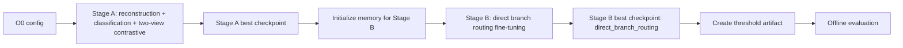
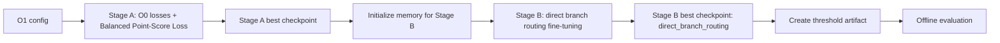
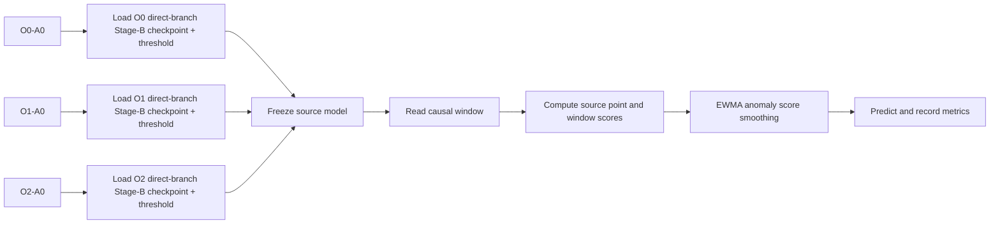
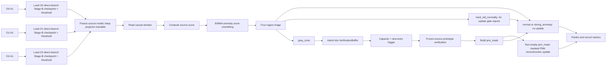

# SMD All-Machines Experiment Matrix

Date: 2026-09-12

Status: planning baseline for the all-machine benchmark.

## Scope

This matrix covers every local SMD entity, including `machine-1-6`, `machine-3-4`, and `machine-3-9` that were used in earlier runs.

The benchmark uses seeds `6`, `8`, and `36` for every entity.

The THESIS offline variants are `O0`, `O1`, and `O2`.

All THESIS offline and online variants use `fusion_mode: direct_branch_routing` by default.

`O0`, `O1`, and `O2` differ by loss components, not by fusion mode.

`O2` uses point-level contrastive loss and does not use Balanced Point-Score Loss.

The window size is `20` and the stride is `1`.

Every online method uses the same entity-specific 2048-point test subsequence selected from ground-truth anomaly labels.

The W&B project is `bachelor-thesis-2026`.

The main metric is `VUS-PR@FPR-budget` at `0.1%`, `0.5%`, and `1%`.

The additional metrics are `VUS-PR`, `Affiliation F1-score`, `VUS-ROC`, and `raw-FPR`.

## SMD entities

| SMD group | Entities | Count |
|---|---|---:|
| Group 1 | `machine-1-1`, `machine-1-2`, `machine-1-3`, `machine-1-4`, `machine-1-5`, `machine-1-6`, `machine-1-7`, `machine-1-8` | 8 |
| Group 2 | `machine-2-1`, `machine-2-2`, `machine-2-3`, `machine-2-4`, `machine-2-5`, `machine-2-6`, `machine-2-7`, `machine-2-8`, `machine-2-9` | 9 |
| Group 3 | `machine-3-1`, `machine-3-2`, `machine-3-3`, `machine-3-4`, `machine-3-5`, `machine-3-6`, `machine-3-7`, `machine-3-8`, `machine-3-9`, `machine-3-10`, `machine-3-11` | 11 |
| **Total** | **All local SMD entities** | **28** |

## Logical run-unit matrix

A logical run unit is one manifest record for one method, phase, variant, entity, and seed.

| Phase | Method family | Variants | Formula | Run units |
|---|---|---|---:|---:|
| Offline | THESIS | `O0`, `O1`, `O2` | `3 × 28 × 3` | 252 |
| Offline | RedLamp | `main` | `1 × 28 × 3` | 84 |
| Offline | Traditional ML | Stumpy Channel AB, KMeansAD, Isolation Forest | `3 × 28 × 3` | 252 |
| **Offline subtotal** |  |  |  | **588** |
| Online | THESIS | `O0/O1/O2 × A0/A1/A2` | `3 × 3 × 28 × 3` | 756 |
| Online | CANDI | `reference_adapter_redlamp_encoder` | `1 × 28 × 3` | 84 |
| Online | M2N2 | `reference_adapter_redlamp_encoder` | `1 × 28 × 3` | 84 |
| Online | Traditional ML | Stumpy, KMeansAD, Isolation Forest with `main` | `3 × 28 × 3` | 252 |
| **Online subtotal** |  |  |  | **1,176** |
| **Total** |  |  |  | **1,764** |

## Complete variant expansion

The following rows show every method and variant family in the matrix.

| Family | Exact entries per entity and seed |
|---|---|
| THESIS offline | `O0`, `O1`, `O2` |
| RedLamp offline | `main` |
| Stumpy offline | `main` |
| KMeansAD offline | `main` |
| Isolation Forest offline | `main` |
| THESIS online | `O0-A0`, `O0-A1`, `O0-A2`, `O1-A0`, `O1-A1`, `O1-A2`, `O2-A0`, `O2-A1`, `O2-A2` |
| CANDI online | `reference_adapter_redlamp_encoder` |
| M2N2 online | `reference_adapter_redlamp_encoder` |
| Stumpy online | `main` |
| KMeansAD online | `main` |
| Isolation Forest online | `main` |

## THESIS component matrix

All THESIS rows use `fusion_mode: direct_branch_routing`.

This invariant applies to THESIS only because `direct_branch_routing` is a THESIS fusion mode.

Baseline methods keep their own method-specific runtime.

Per the current design decision, `O2` uses point-level contrastive loss and does not use Balanced Point-Score Loss.

For combined online variants, the first two component columns describe the inherited offline checkpoint and the remaining columns describe online behavior.

| Variant | Phase | Point-level contrastive loss | Balanced point-score loss | EWMA anomaly score smoothing | Online-to-source contrastive loss | Hard-old-normality adaptation | Pseudo-new-normality adaptation |
|---|---|---:|---:|---:|---:|---:|---:|
| `O0` | Offline | - | - | - | - | - | - |
| `O1` | Offline | - | ✓ | - | - | - | - |
| `O2` | Offline | ✓ | - | - | - | - | - |
| `O0-A0` | Online | - | - | ✓ | - | - | - |
| `O0-A1` | Online | - | - | ✓ | ✓ | ✓ | - |
| `O0-A2` | Online | - | - | ✓ | ✓ | ✓ | ✓ |
| `O1-A0` | Online | - | ✓ | ✓ | - | - | - |
| `O1-A1` | Online | - | ✓ | ✓ | ✓ | ✓ | - |
| `O1-A2` | Online | - | ✓ | ✓ | ✓ | ✓ | ✓ |
| `O2-A0` | Online | ✓ | - | ✓ | - | - | - |
| `O2-A1` | Online | ✓ | - | ✓ | ✓ | ✓ | - |
| `O2-A2` | Online | ✓ | - | ✓ | ✓ | ✓ | ✓ |

`✓` means the component belongs to the variant contract.

`-` means the component is not used by that variant.

`A0` is inference only, `A1` uses EWMA anomaly score smoothing, online-to-source contrastive loss, and hard-old-normality adaptation, and `A2` adds pseudo-new-normality adaptation.

The table treats EWMA anomaly score smoothing as an online component because it operates on the causal online score stream.

The current official ontology and remaining-SMD generator still enumerate only `O0` and `O1`, so adding `O2` requires a separate generator, config, dependency, and preflight update before execution.

The current online runtime enumerates `A0`, `A1`, and `A2`, so the nine combined THESIS rows are the intended cross-product once `O2` is integrated.

This A1/A2 component assignment follows the revised policy in this note and must be reconciled with the current online ontology and runtime before execution.

## THESIS runtime flows

The following diagrams describe the current runtime flow confirmed by the audit report.

The diagrams also mark the requested `direct_branch_routing` default for every THESIS offline checkpoint.

Every path is scoped to one entity and seed.

### Offline `O0`

`O0` does not use point-level contrastive loss or Balanced Point-Score Loss.

### Offline `O1`

`O1` adds Balanced Point-Score Loss in Stage A.

### Offline `O2`

`O2` uses point-level contrastive loss and does not use Balanced Point-Score Loss.

### Online `A0`: inference only

`O0-A0`, `O1-A0`, and `O2-A0` do not update the online projector.

### Online `A1`: verified PNN adaptation

`O0-A1`, `O1-A1`, and `O2-A1` use the same audited online flow after loading different direct-branch checkpoints.

`A1` currently does not use online-to-source contrastive loss and does not update directly on hard-old windows.

### Online `A2`: guarded hard-old or verified PNN adaptation

```mermaid
flowchart LR
    O0A2["O0-A2"] --> O0A2L["Load O0 direct-branch Stage-B checkpoint + threshold"]
    O1A2["O1-A2"] --> O1A2L["Load O1 direct-branch Stage-B checkpoint + threshold"]
    O2A2["O2-A2"] --> O2A2L["Load O2 direct-branch Stage-B checkpoint + threshold"]
    O0A2L --> A2F["Freeze source model; keep projector trainable"]
    O1A2L --> A2F
    O2A2L --> A2F
    A2F --> A2W["Read causal window"]
    A2W --> A2S["Compute source score"]
    A2S --> A2E["EWMA anomaly score smoothing"]
    A2E --> A2T["Four-region triage"]
    A2T --> A2N["normal or strong_anomaly: no update"]
    A2T --> A2H["hard_old_normality"]
    A2H --> A2G["NonOverlapGuard approval"]
    A2G --> A2HL["Hard-old hinge + online-to-source contrastive loss"]
    A2HL --> A2HU["Update online MLP projector and record interval"]
    A2G --> A2N
    A2T --> A2Z["gray_zone"]
    A2Z --> A2B["Admit into VerificationBuffer"]
    A2B --> A2C["Capacity + new-entry trigger"]
    A2C --> A2V["Frozen-source prototype verification"]
    A2V --> A2M["Known-anomaly filtering + recurrent-signature filtering"]
    A2M --> A2P["Build pnn_mask"]
    A2P --> A2PL["Non-empty pnn_mask: PNN reconstruction + online-to-source contrastive loss"]
    A2PL --> A2PU["Update online MLP projector"]
    A2P --> A2N
    A2HU --> A2R["Predict and record metrics"]
    A2PU --> A2R
    A2N --> A2R
```

`O0-A2`, `O1-A2`, and `O2-A2` share this flow after loading different direct-branch checkpoints.

The `A2` hard-old branch bypasses `VerificationBuffer` and uses `NonOverlapGuard`.

The `A2` gray-zone branch uses `VerificationBuffer`, capacity triggering, prototype verification, and `pnn_mask` before its PNN update.

The current code therefore contains verification in every `A2` runtime, but not before every possible `A2` update.

The online result must retain only `VUS-PR@FPR-budget`, `VUS-PR`, `Affiliation F1-score`, `VUS-ROC`, and `raw-FPR`.

The revised component table still differs from the current `A1` runtime because the table assigns direct hard-old adaptation and online-to-source contrastive loss to `A1`.

The current O2 generator, ontology, and checkpoint inventory still need integration before O2 runs can execute.

## Target W&B run matrix

Each THESIS offline logical cell creates separate W&B runs for Stage A, Stage B, and offline evaluation.

Each RedLamp offline cell creates separate W&B runs for training and offline evaluation.

Each traditional offline, online THESIS, CANDI, M2N2, and traditional online cell creates one W&B run.

| W&B job type | Method and variant | Formula | Target W&B runs |
|---|---|---:|---:|
| `stage_a_multitask_pretraining` | THESIS `O0`, `O1`, `O2` | `3 × 28 × 3` | 252 |
| `stage_b_fusion_finetuning` | THESIS `O0`, `O1`, `O2` | `3 × 28 × 3` | 252 |
| `evaluation` | THESIS offline `O0`, `O1`, `O2` | `3 × 28 × 3` | 252 |
| `train` | RedLamp | `1 × 28 × 3` | 84 |
| `evaluation` | RedLamp | `1 × 28 × 3` | 84 |
| `offline_benchmark` | Stumpy Channel AB | `1 × 28 × 3` | 84 |
| `offline_benchmark` | KMeansAD | `1 × 28 × 3` | 84 |
| `offline_benchmark` | Isolation Forest | `1 × 28 × 3` | 84 |
| `online_benchmark` | THESIS `O0/O1/O2 × A0/A1/A2` | `3 × 3 × 28 × 3` | 756 |
| `online_benchmark` | CANDI | `1 × 28 × 3` | 84 |
| `online_benchmark` | M2N2 | `1 × 28 × 3` | 84 |
| `online_benchmark` | Stumpy | `1 × 28 × 3` | 84 |
| `online_benchmark` | KMeansAD | `1 × 28 × 3` | 84 |
| `online_benchmark` | Isolation Forest | `1 × 28 × 3` | 84 |
| **Total** |  |  | **2,352** |

## Human-readable W&B run-name contract

The run name keeps only the fields that identify a result for a human: phase, method or variant, entity, and seed.

Use W&B tags for `mode`, `dataset`, `window_size`, `protocol`, and metric details instead of adding them to the name.

| Run family | Recommended name pattern | Example |
|---|---|---|
| THESIS Stage A | `run-stageA-O{0|1|2}-<entity>-s<seed>` | `run-stageA-O2-machine-3-9-s36` |
| THESIS Stage B | `run-stageB-O{0|1|2}-<entity>-s<seed>` | `run-stageB-O2-machine-3-9-s36` |
| THESIS offline evaluation | `run-eval-O{0|1|2}-<entity>-s<seed>` | `run-eval-O2-machine-3-9-s36` |
| RedLamp training | `run-train-redlamp-<entity>-s<seed>` | `run-train-redlamp-machine-3-9-s36` |
| RedLamp evaluation | `run-eval-redlamp-<entity>-s<seed>` | `run-eval-redlamp-machine-3-9-s36` |
| Traditional offline | `run-offline-<method>-<entity>-s<seed>` | `run-offline-stumpy-machine-3-9-s36` |
| THESIS online | `run-online-A{0|1|2}-O{0|1|2}-<entity>-s<seed>` | `run-online-A2-O1-machine-3-9-s36` |
| CANDI online | `run-online-candi-<entity>-s<seed>` | `run-online-candi-machine-3-9-s36` |
| M2N2 online | `run-online-m2n2-<entity>-s<seed>` | `run-online-m2n2-machine-3-9-s36` |
| Traditional online | `run-online-<method>-<entity>-s<seed>` | `run-online-iforest-machine-3-9-s36` |

The exact name must be generated by one shared naming helper and checked for uniqueness before execution.

The smoke or wet distinction belongs in W&B tags and the output root, not in a new name grammar.

## Dependency and fairness rules

Every THESIS online run uses the Stage-B best checkpoint from the matching offline `O` variant, entity, and seed.

Every THESIS online run uses the matching V4 threshold artifact from the same offline result.

CANDI and M2N2 use the matching RedLamp encoder checkpoint for the same entity and seed.

Stumpy, KMeansAD, and Isolation Forest remain frozen during online evaluation.

All methods use the same protocol configuration and the same entity-specific online range.

The online range must contain ground-truth anomaly events and must be generated once per entity before method execution.

The benchmark must preserve separate output roots for smoke and wet runs.

The all-machine wet matrix must use a new output root or an explicit, verified resume policy so it does not overwrite earlier three-machine outputs.

O2 online runs must use Stage-B checkpoints and threshold artifacts produced by the matching O2 offline run.

## Six-GPU execution plan

The new server should run six GPU worker sessions, one logical CUDA device per session.

Traditional ML methods should use CPU workers because their configured implementations are CPU methods.

The launcher must derive non-overlapping CPU masks from the actual `nproc` and must not reuse the previous four-GPU hard-coded loop.

The workflow must keep an offline barrier before any dependent online run starts.

### Phase 1: Freeze the all-machine contract

Tools: `.venv/bin/python`, `rg`, and the generator module.

Stage 1.1: Validate the 28-entity train, test, and test-label intersection.

Stage 1.2: Validate seeds, window size, online range length, protocol, and metric names.

Stage 1.3: Assert 588 offline logical units, 1,176 online logical units, and 1,764 total logical units.

### Phase 2: Make the generator and W&B identity complete

Tools: Python, YAML, the shared artifact naming helper, and Pytest.

Stage 2.1: Add an explicit all-entities mode that disables the remaining-SMD exclusion for this matrix only.

Stage 2.2: Add O2 configuration fields for `direct_branch_routing`, point-level contrastive loss, and disabled Balanced Point-Score Loss.

Stage 2.3: Generate 28 deterministic data configurations and all method configurations.

Stage 2.4: Validate every config path, checkpoint dependency, threshold dependency, and online range before worker launch.

Stage 2.5: Add W&B logging to the traditional offline runner because its current config contains logging fields but the runner does not instantiate `ExperimentLogger`.

Stage 2.6: Add a preflight check for unique W&B names and expected counts before any wet job starts.

### Phase 3: Validate the six-GPU scheduler

Tools: `nvidia-smi`, `torch.cuda`, `tmux`, `taskset`, and shell tests.

Stage 3.1: Detect six visible GPUs, CUDA availability, CPU count, free disk, W&B connectivity, and occupied devices.

Stage 3.2: Allocate six GPU queues and enough CPU workers without overlapping CPU masks.

Stage 3.3: Run one complete smoke path for THESIS, RedLamp, one traditional method, CANDI, and M2N2.

Stage 3.4: Confirm Stage A to Stage B to offline evaluation to online dependency resolution.

### Phase 4: Execute the wet matrix

Tools: `tmux`, the cloud launcher, `.venv/bin/python`, and W&B.

Stage 4.1: Run all 504 offline logical units.

Stage 4.2: Verify every required Stage-B checkpoint, threshold artifact, and RedLamp checkpoint.

Stage 4.3: Run all 924 online logical units on the fixed 2048-point entity ranges.

Stage 4.4: Resume only failed or missing records after inspecting exact exit markers and tracebacks.

### Phase 5: Collect and audit results

Tools: `collect_remaining_smd_metrics.py`, JSON, Markdown, and W&B filters.

Stage 5.1: Collect only the requested metric fields from every completed logical run.

Stage 5.2: Produce tables grouped by phase, method, variant, entity, seed, and FPR budget.

Stage 5.3: Check that the W&B target count is 2,352 after O2 integration and the traditional offline logger fix.

Stage 5.4: Mark missing or incomplete runs explicitly instead of filling values.

## Current implementation gap

The current remaining-SMD generator excludes three entities by default and therefore cannot produce this all-machine matrix without a new explicit mode or selection policy.

The current cloud launcher was designed around four GPU workers and must be generalized before using a six-GPU server.

The current direct-branch helper is a Stage-B-only path built around older O0/O1 source checkpoints, so its lifecycle must be reconciled with the standard O2 Stage A → Stage B → evaluation contract before the target count is treated as executable.

The current `run_offline_benchmark.py` writes traditional offline reports but does not create a W&B run even when the generated config enables W&B.

Therefore, `2,352` is the target W&B count after O2 integration and the traditional offline logger fix, while the same matrix would expose `2,100` W&B runs if the traditional offline logger remains unchanged.

## Source files

The current method and resource matrix is generated by `scripts/benchmarks/generate_remaining_smd_benchmark_configs.py`.

The current four-GPU orchestration is implemented by `scripts/benchmarks/run_remaining_smd_cloud_tmux.sh`.

The current traditional offline execution path is `scripts/benchmarks/run_offline_benchmark.py`.

The current two-stage W&B lifecycle is implemented by `scripts/experiments/run_two_stage_offline_pretraining.py` and `scripts/cli/evaluate.py`.

The metric collector is `scripts/benchmarks/collect_remaining_smd_metrics.py`.

The local 28-machine inventory is recorded in `documents/notes/smd-28-machine-drift-zoo.md`.
