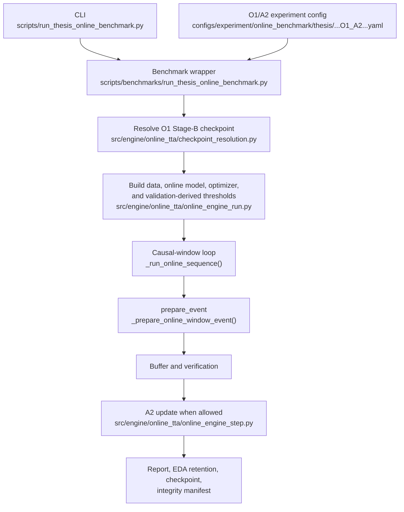
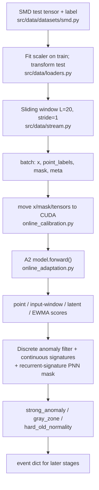
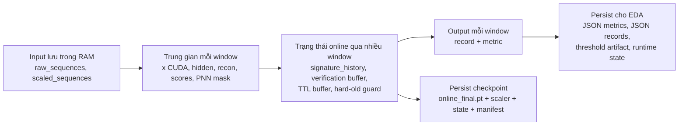

# Phân tích `prepare_event` trong THESIS online TTA

Phạm vi: phân tích tĩnh từ mã nguồn và cấu hình. Tài liệu không suy luận một dependency nếu không có import, call, cấu hình, hoặc runtime wiring hỗ trợ.

`prepare_event` là phần trước adaptation. Với `O1/A2`, nó gồm: chuyển batch sang GPU, forward model, tính score, tạo PNN mask, rồi phân loại cửa sổ. Nó chưa backward hay cập nhật projector.

## 1. Entry point

Luồng chạy thật bắt đầu tại:

1. CLI: `scripts/run_thesis_online_benchmark.py`.
2. Wrapper: `scripts/benchmarks/run_thesis_online_benchmark.py`.
3. Online engine: `run_thesis_online_tta_experiment()` trong `src/engine/online_tta/online_engine_run.py`.
4. Mỗi causal window: `_process_online_window()` trong `src/engine/online_tta/online_engine_window_core.py`.
5. Timed component: `_prepare_online_window_event()`.
6. Hai nhánh chính bên trong: `_score_online_window()` và `_attach_event_pnn_mask()` trong `src/engine/online_tta/online_engine_window_metrics.py`.

Ví dụ cấu hình thật O1/A2 của `machine-1-6`, seed 6: `configs/experiment/online_benchmark/thesis/smd__thesis__online__O1_A2__machine_1_6__w20__seed6__main.yaml`.

## 2. Runtime flow: O1 offline checkpoint đến A2 online TTA

Điểm quan trọng của ví dụ này:

- Wrapper lấy `offline_variant: O1`, entity, seed và `stage_b_fusion_finetuning` từ config để resolve checkpoint Stage B.
- `OnlineAdaptationModel` đọc checkpoint, tạo `reference_encoder` đóng băng, và projector là nhóm tham số duy nhất có thể cập nhật. Xem `src/models/online_impl/online_adaptation.py`.
- A2 chỉ cập nhật khi triage là `hard_old_normality` hoặc `pnn_verified`. `strong_anomaly` và `gray_zone` không tạo update trực tiếp trong `adaptation_step`.

## 3. Data flow của `prepare_event`

`prepare_event` xử lý một window như sau:

- `SMDOnlineStream` cắt `x[start:end]`, label, mask, timestamp và metadata. `OnlineWindowBatcher` collate thành batch có `batch_size=1`.
- `_score_online_window()` chuyển tensor của batch sang device. Metadata không phải tensor nên vẫn nằm ở CPU.
- Vì là A2, code gọi `model.forward(batch_on_device)`, không gọi `forward_source()`.
- `forward()` tạo `reference_hidden` bằng frozen reference encoder. Sau đó projector biến đổi thành `projected_hidden`.
- `score_projected()` tạo `recon`, `logits`, `point_scores`, `window_scores`, và `latent_window_score`.
- Engine lấy:
  - `raw_point_score`: score của time-step cuối cửa sổ.
  - `input_window_score`: MSE giữa `recon` và `x`.
  - `latent_window_score`: score latent từ model.
  - `ewma_point_score`: kết hợp score hiện tại với score EWMA của cửa sổ trước.
- `_attach_event_pnn_mask()` dùng `reference_hidden`, codebook, continuous prototype bank và `signature_history` để tạo `pnn_mask`. Mask này được gắn lại vào `batch` để dùng ở bước adaptation hoặc verification sau đó.
- `_classify_event_window()` dùng `input_window_score`, `latent_window_score`, threshold và `hard_old_guard` để chọn triage decision.

## 4. Vòng đời dữ liệu và nơi lưu

| Nhóm dữ liệu | Nơi tạo và cách dùng | Có lưu sau run? |
| --- | --- | --- |
| Đầu vào gốc | Parser đọc `train`, `test`, `test_label` của SMD. | Dataset nằm ở `data/`; không tạo bản sao raw mới trong output. |
| Đầu vào đã chuẩn hóa | `SequenceStandardScaler` fit trên train rồi transform train/val/test. `scaled_sequences["test"]` là nguồn của online stream. | Scaler state được lưu vào checkpoint. |
| Batch model | `x` có shape `[1, 20, 38]` trong ví dụ config; tensor được đưa lên CUDA trong `prepare_event`. | Không lưu nguyên batch thường quy. |
| Trung gian model | `reference_hidden`, `projected_hidden`, `recon`, score, các loss phụ. | Không được persist trực tiếp bởi `prepare_event`; biến mất sau khi không còn tham chiếu. |
| Trạng thái online | `signature_history`, verification entries, TTL buffer, hard-old intervals. | Được lưu trong `online_final.pt`; retention runtime state được xuất khi chính sách là `retain_for_eda`. |
| Dữ liệu EDA | `online_metrics.json`, `online_records.json`, threshold artifact, retention bundle. | Có. Wrapper cũng tạo benchmark report và integrity manifest. |

Nguồn xử lý dữ liệu chính là `src/data/loaders.py`, `src/data/datasets/smd.py`, `src/data/stream.py`, và `src/engine/online_tta/online_engine_run.py`.
