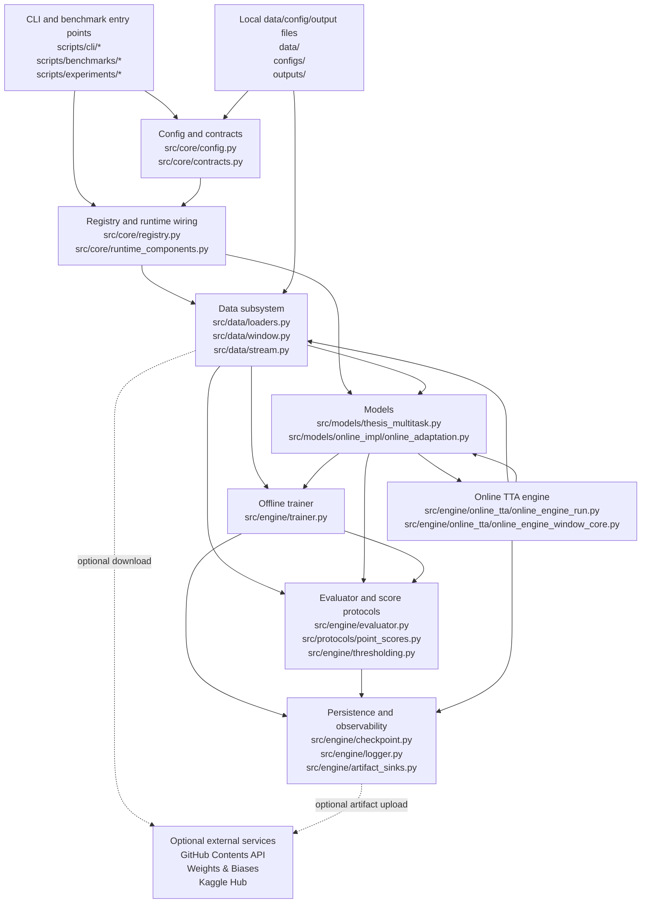
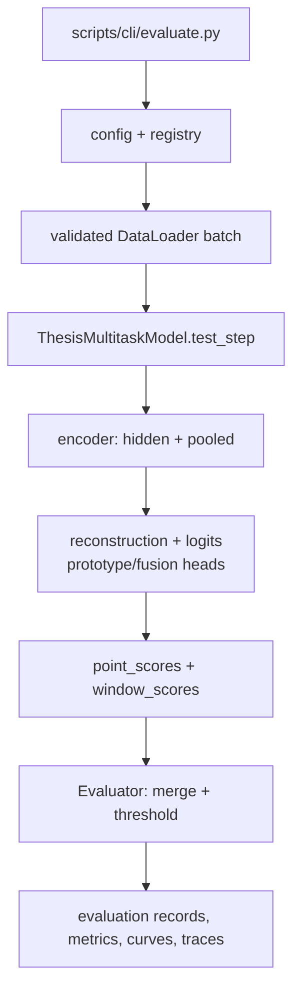
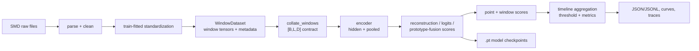
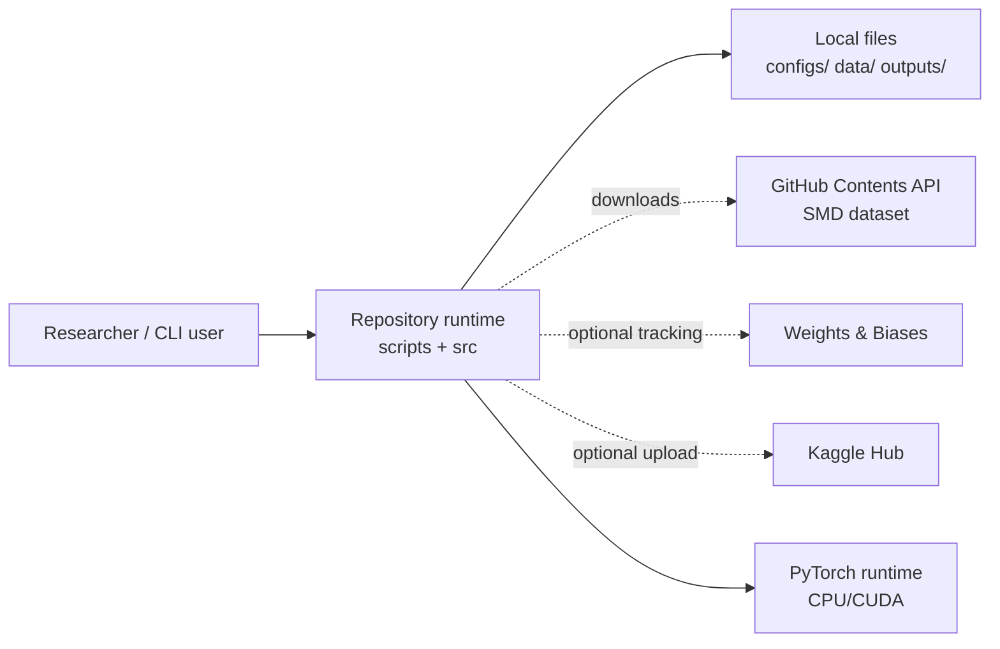
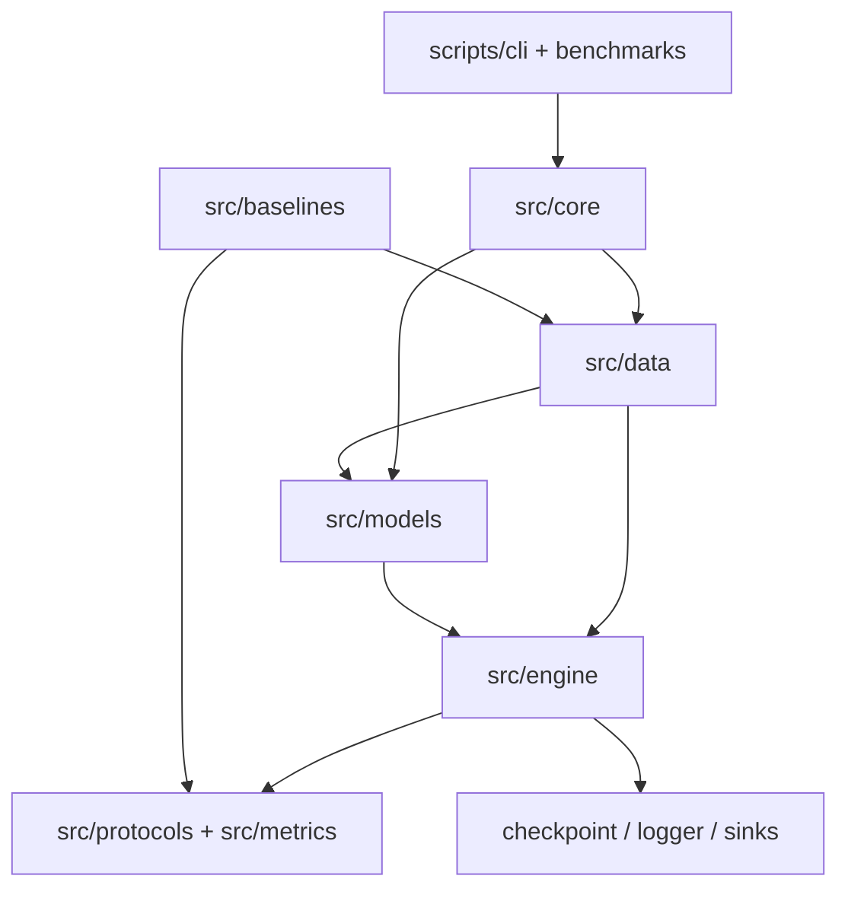
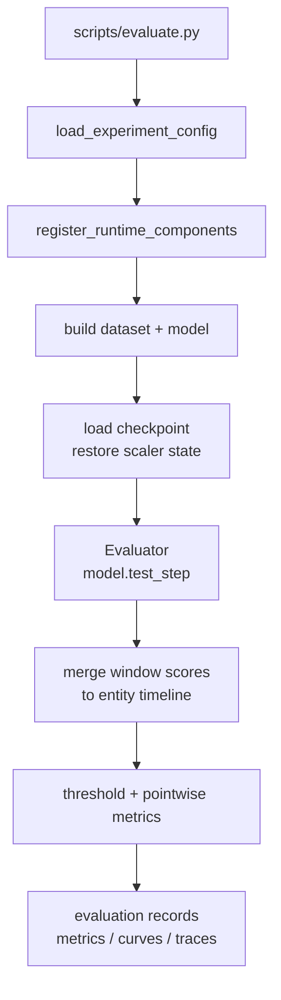
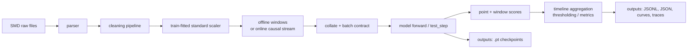

# Repository architecture analysis

## Phạm vi và cách đọc

Đây là phân tích tĩnh dựa trên source code, imports, lời gọi hàm, cấu hình và runtime wiring hiện có. Không suy luận dependency nếu không có bằng chứng trong repository. Phân tích này không sửa file nào khác.

Working tree đã có thay đổi chưa commit trước khi phân tích; các thay đổi đó không thuộc phạm vi tài liệu này.

## Bản đồ codebase

| Khu vực | Trách nhiệm chính | Source anchors |
|---|---|---|
| `src/core` | Load/normalize/validate config; registry; runtime registrations; tensor/data contracts | [config.py](</Users/conquerormikrokosmos/Downloads/LAPTOP MAC/MYUNIVERSITY/ĐẠI HỌC QUỐC GIA TPHCM/ĐH KHOA HỌC TỰ NHIÊN/Khoá luận tốt nghiệp/bachelor-thesis-2026/src/core/config.py:741), [registry.py](</Users/conquerormikrokosmos/Downloads/LAPTOP MAC/MYUNIVERSITY/ĐẠI HỌC QUỐC GIA TPHCM/ĐH KHOA HỌC TỰ NHIÊN/Khoá luận tốt nghiệp/bachelor-thesis-2026/src/core/registry.py:8), [contracts.py](</Users/conquerormikrokosmos/Downloads/LAPTOP MAC/MYUNIVERSITY/ĐẠI HỌC QUỐC GIA TPHCM/ĐH KHOA HỌC TỰ NHIÊN/Khoá luận tốt nghiệp/bachelor-thesis-2026/src/core/contracts.py:39) |
| `src/data` | Parse/clean/scale sequences; windowing; offline datasets/loaders; online stream/batching | [loaders.py](</Users/conquerormikrokosmos/Downloads/LAPTOP MAC/MYUNIVERSITY/ĐẠI HỌC QUỐC GIA TPHCM/ĐH KHOA HỌC TỰ NHIÊN/Khoá luận tốt nghiệp/bachelor-thesis-2026/src/data/loaders.py:77), [window.py](</Users/conquerormikrokosmos/Downloads/LAPTOP MAC/MYUNIVERSITY/ĐẠI HỌC QUỐC GIA TPHCM/ĐH KHOA HỌC TỰ NHIÊN/Khoá luận tốt nghiệp/bachelor-thesis-2026/src/data/window.py:17), [stream.py](</Users/conquerormikrokosmos/Downloads/LAPTOP MAC/MYUNIVERSITY/ĐẠI HỌC QUỐC GIA TPHCM/ĐH KHOA HỌC TỰ NHIÊN/Khoá luận tốt nghiệp/bachelor-thesis-2026/src/data/stream.py:38) |
| `src/models` | Multitask model, online adaptation model, RedLamp baseline; model output contract | [thesis_multitask.py](</Users/conquerormikrokosmos/Downloads/LAPTOP MAC/MYUNIVERSITY/ĐẠI HỌC QUỐC GIA TPHCM/ĐH KHOA HỌC TỰ NHIÊN/Khoá luận tốt nghiệp/bachelor-thesis-2026/src/models/thesis_multitask.py:43), [online_adaptation.py](</Users/conquerormikrokosmos/Downloads/LAPTOP MAC/MYUNIVERSITY/ĐẠI HỌC QUỐC GIA TPHCM/ĐH KHOA HỌC TỰ NHIÊN/Khoá luận tốt nghiệp/bachelor-thesis-2026/src/models/online_adaptation.py:1) |
| `src/engine` | Offline training/evaluation, checkpointing, logging, thresholds, artifact sinks | [trainer.py](</Users/conquerormikrokosmos/Downloads/LAPTOP MAC/MYUNIVERSITY/ĐẠI HỌC QUỐC GIA TPHCM/ĐH KHOA HỌC TỰ NHIÊN/Khoá luận tốt nghiệp/bachelor-thesis-2026/src/engine/trainer.py:534), [evaluator.py](</Users/conquerormikrokosmos/Downloads/LAPTOP MAC/MYUNIVERSITY/ĐẠI HỌC QUỐC GIA TPHCM/ĐH KHOA HỌC TỰ NHIÊN/Khoá luận tốt nghiệp/bachelor-thesis-2026/src/engine/evaluator.py:1) |
| `src/engine/online_tta` | Online TTA context, calibration, causal window processing, triage/verification/adaptation, online metrics | [online_engine_run.py](</Users/conquerormikrokosmos/Downloads/LAPTOP MAC/MYUNIVERSITY/ĐẠI HỌC QUỐC GIA TPHCM/ĐH KHOA HỌC TỰ NHIÊN/Khoá luận tốt nghiệp/bachelor-thesis-2026/src/engine/online_tta/online_engine_run.py:86), [online_engine_window_core.py](</Users/conquerormikrokosmos/Downloads/LAPTOP MAC/MYUNIVERSITY/ĐẠI HỌC QUỐC GIA TPHCM/ĐH KHOA HỌC TỰ NHIÊN/Khoá luận tôt nghiệp/bachelor-thesis-2026/src/engine/online_tta/online_engine_window_core.py:53) |
| `src/protocols` + `src/metrics` | Score aggregation, threshold protocols, pointwise metrics, affiliation metric | [point_scores.py](</Users/conquerormikrokosmos/Downloads/LAPTOP MAC/MYUNIVERSITY/ĐẠI HỌC QUỐC GIA TPHCM/ĐH KHOA HỌC TỰ NHIÊN/Khoá luận tôt nghiệp/bachelor-thesis-2026/src/protocols/point_scores.py:1), [thresholding.py](</Users/conquerormikrokosmos/Downloads/LAPTOP MAC/MYUNIVERSITY/ĐẠI HỌC QUỐC GIA TPHCM/ĐH KHOA HỌC TỰ NHIÊN/Khoá luận tôt nghiệp/bachelor-thesis-2026/src/engine/thresholding.py:37) |
| `scripts` + `demo` | CLI, benchmark orchestration, two-stage execution, report replay | [train.py](</Users/conquerormikrokosmos/Downloads/LAPTOP MAC/MYUNIVERSITY/ĐẠI HỌC QUỐC GIA TPHCM/ĐH KHOA HỌC TỰ NHIÊN/Khoá luận tôt nghiệp/bachelor-thesis-2026/scripts/cli/train.py:181), [evaluate.py](</Users/conquerormikrokosmos/ĐẠI%20HỌC%20QUỐC%20GIA%20TPHCM/ĐH%20KHOA%20HỌC%20TỰ%20NHIÊN/Khoá%20luận%20tốt%20nghiệp/bachelor-thesis-2026/scripts/cli/evaluate.py:127), [app.py](</Users/conquerormikrokosmos/Downloads/LAPTOP%20MAC/MYUNIVERSITY/ĐẠI%20HỌC%20QUỐC%20GIA%20TPHCM/ĐH%20KHOA%20HỌC%20TỰ%20NHIÊN/Khoá%20luận%20tốt%20nghiệp/bachelor-thesis-2026/demo/app.py:21) |

## Mermaid architecture diagram

## 1. Main subsystems and responsibilities

### Configuration, registry, and contracts

`src/core/config.py` loads a root experiment YAML, resolves referenced data/model/task YAML files, applies overrides, normalizes aliases, resolves model window size, and validates the final configuration. `src/core/registry.py` maps names to dataset/model builders. `src/core/runtime_components.py` registers the shared runtime components: `smd`, `thesis_multitask`, and `redlamp_baseline`; online mode additionally registers `online_adaptation`.

`src/core/contracts.py` defines the actual runtime boundaries for raw sequences, windows, batches, online batches, and model outputs. The model output contract requires `hidden`, `pooled`, `recon`, `logits`, `point_scores`, `window_scores`, and `aux`.

### Data

`src/data/loaders.py` parses and cleans sequences, fits a train-only `SequenceStandardScaler`, transforms all splits, builds `WindowDataset` objects, and creates PyTorch `DataLoader` instances. `src/data/window.py` implements offline window slicing. `src/data/stream.py` implements sequential online windows and `OnlineWindowBatcher`, including stream state.

The data path is: parser -> cleaning -> train-fitted scaling -> windowing -> collate -> contract-validated batch. Online mode uses clean-only stream input and preserves `stream_step` plus stream state.

### Models

`src/models/thesis_multitask.py` is the main offline model. It combines encoder, prototype memory, fusion, task heads, losses, and synthetic-anomaly support. Its lifecycle is distributed across `src/models/thesis_multitask_impl/` mixins and helpers.

`src/models/online_impl/online_adaptation.py` loads a `thesis_multitask` checkpoint, creates a frozen reference encoder and an online encoder/projector, and restricts optimization to the projector parameter group. `src/models/online_adaptation.py` is only a module facade that redirects imports to the implementation module. `src/models/redlamp_baseline.py` is likewise a re-export facade for the baseline implementation.

### Offline engine

`src/engine/trainer.py` owns the epoch loop: model step, backward pass, gradient clipping, optimizer update, validation, metric aggregation, logging, and checkpoint selection. `src/engine/evaluator.py` runs `model.test_step`, converts window scores to entity timelines, applies thresholds, and computes pointwise metrics.

`src/engine/checkpoint.py` persists PyTorch checkpoints and metadata. `src/engine/logger.py` writes local JSONL metrics and resolved config, with optional W&B logging. `src/engine/artifact_sinks.py` provides optional W&B and Kaggle artifact sinks.

### Online TTA

`src/engine/online_tta/online_engine_run.py` builds the runtime context, resolves the reference checkpoint, calibrates thresholds on clean validation data, creates the online stream, and runs the sequence. `src/engine/online_tta/online_engine_window_core.py` coordinates one causal window: prepare event -> buffer admission/verification -> online step -> finalize. `src/engine/online_tta/online_engine_window_metrics.py` computes raw, latent, reconstruction, and EWMA scores.

`src/engine/online_tta/online_engine.py` is a public facade that re-exports the implementation split across the online TTA modules. There is also a simpler legacy path in `src/engine/online_loop.py` used by `scripts/experiments/run_online_adaptation.py`.

## 2. Entry points

- Training wrapper: [scripts/train.py](</Users/conquerormikrokosmos/Downloads/LAPTOP MAC/MYUNIVERSITY/ĐẠI HỌC QUỐC GIA TPHCM/ĐH KHOA HỌC TỰ NHIÊN/Khoá luận tốt nghiệp/bachelor-thesis-2026/scripts/train.py:1>) -> `scripts.cli.train.main`.
- Evaluation wrapper: [scripts/evaluate.py](</Users/conquerormikrokosmos/Downloads/LAPTOP MAC/MYUNIVERSITY/ĐẠI HỌC QUỐC GIA TPHCM/ĐH KHOA HỌC TỰ NHIÊN/Khoá luận tốt nghiệp/bachelor-thesis-2026/scripts/evaluate.py:1>) -> `scripts.cli.evaluate.main`.
- Offline benchmark: [run_thesis_offline_benchmark.py](</Users/conquerormikrokosmos/Downloads/LAPTOP MAC/MYUNIVERSITY/ĐẠI HỌC QUỐC GIA TPHCM/ĐH KHOA HỌC TỰ NHIÊN/Khoá luận tốt nghiệp/bachelor-thesis-2026/scripts/benchmarks/run_thesis_offline_benchmark.py:660>).
- Online benchmark: [run_thesis_online_benchmark.py](</Users/conquerormikrokosmos/Downloads/LAPTOP MAC/MYUNIVERSITY/ĐẠI HỌC QUỐC GIA TPHCM/ĐH KHOA HỌC TỰ NHIÊN/Khoá luận tốt nghiệp/bachelor-thesis-2026/scripts/benchmarks/run_thesis_online_benchmark.py:218>).
- Two-stage orchestration: [run_two_stage_offline_pretraining.py](</Users/conquerormikrokosmos/Downloads/LAPTOP MAC/MYUNIVERSITY/ĐẠI HỌC QUỐC GIA TPHCM/ĐH KHOA HỌC TỰ NHIÊN/Khoá luận tốt nghiệp/bachelor-thesis-2026/scripts/experiments/run_two_stage_offline_pretraining.py:340>), which launches training and evaluation subprocesses.
- Demo/report replay: [demo/app.py](</Users/conquerormikrokosmos/Downloads/LAPTOP MAC/MYUNIVERSITY/ĐẠI HỌC QUỐC GIA TPHCM/ĐH KHOA HỌC TỰ NHIÊN/Khoá luận tốt nghiệp/bachelor-thesis-2026/demo/app.py:21>).

## 3. Dependencies between modules

The strongest verified dependency chain is:

`scripts` -> `src.core.config` and `src.core.runtime_components` -> `src.data.loaders` / `src.models.*` -> `src.engine.trainer` or `src.engine.online_tta` -> `src.engine.evaluator`, metrics, checkpoints, and artifacts.

Specific evidence:

- `runtime_components.py` imports and registers dataset/model builders from `src.data.loaders` and `src.models`.
- `loaders.py` imports cleaning, collate, parsers, scaling, and split-protocol modules.
- `trainer.py` imports checkpoint, evaluator, logger, thresholding, and metrics modules.
- `online_engine_run.py` imports registry/runtime wiring, checkpoint handling, calibration, online buffers, signatures, and window-processing modules.
- `online_impl/online_adaptation.py` imports and reconstructs `ThesisMultitaskModel` from checkpoint metadata.

There are also concrete coupling leaks across intended layers: the thesis model imports `src.data.augment`, and the online model imports `src.engine.online_tta.signature_verification`. Traditional baselines are not uniformly behind the registry; benchmark scripts directly construct and run them.

The reference tree `bsc-thesis-ref-codebases/` is not a runtime dependency. `src/metrics/affiliation.py` explicitly contains a local adapted implementation and does not import that tree.

## 4. Main runtime data flows

### Offline training

1. A CLI loads the root experiment config.
2. Runtime components are registered.
3. The dataset builder parses raw SMD data, cleans sequences, fits the scaler on train data, windows each split, and creates loaders.
4. The model consumes validated batches and returns the model output contract.
5. `Trainer` performs training and validation steps, optimizer updates, metric aggregation, logging, and checkpoint writes.

### Offline evaluation

1. The evaluator rebuilds the dataset and model from config.
2. It loads the checkpoint and restores scaler state when available.
3. `model.test_step` produces point/window scores.
4. Overlapping windows are merged into entity timelines.
5. Thresholds and pointwise metrics are computed, then records, metrics, curves, traces, protocol audits, and resolved config are written under `outputs/`.

### Online TTA

1. The online benchmark validates the protocol and resolves the Stage B/reference checkpoint.
2. The online engine builds data/model/optimizer context and asserts projector-only trainability.
3. Clean validation data calibrates the online threshold and produces threshold artifacts.
4. `SMDOnlineStream` emits one causal window at a time.
5. The window core scores the event, updates TTL/verification buffers, performs an eligible adaptation step, and finalizes online records.
6. The engine writes checkpoints, event metrics, threshold artifacts, reports, and integrity metadata.

### Traditional baselines

`scripts/benchmarks/run_offline_benchmark.py` and `run_online_streaming_benchmark.py` directly construct traditional baselines, fit/calibrate/score them, and write benchmark artifacts. This path bypasses the neural model lifecycle and is only partially coupled to the central registry.

## 5. External systems and storage

- Local raw and derived storage: `data/`, `configs/`, `outputs/`, and `documents/`.
- Dataset download: [src/data/download.py](</Users/conquerormikrokosmos/Downloads/LAPTOP MAC/MYUNIVERSITY/ĐẠI HỌC QUỐC GIA TPHCM/ĐH KHOA HỌC TỰ NHIÊN/Khoá luận tốt nghiệp/bachelor-thesis-2026/src/data/download.py:1>) uses `requests` and the GitHub Contents API; `SMD_ROOT_DIR` can override the local root.
- Experiment tracking: [src/engine/logger.py](</Users/conquerormikrokosmos/Downloads/LAPTOP MAC/MYUNIVERSITY/ĐẠI HỌC QUỐC GIA TPHCM/ĐH KHOA HỌC TỰ NHIÊN/Khoá luận tốt nghiệp/bachelor-thesis-2026/src/engine/logger.py:18>) writes local JSONL and optionally uses Weights & Biases.
- Artifact upload: [src/engine/artifact_sinks.py](</Users/conquerormikrokosmos/Downloads/LAPTOP MAC/MYUNIVERSITY/ĐẠI HỌC QUỐC GIA TPHCM/ĐH KHOA HỌC TỰ NHIÊN/Khoá luận tốt nghiệp/bachelor-thesis-2026/src/engine/artifact_sinks.py:75>) optionally uses Kaggle Hub.
- Compute/runtime libraries: PyTorch, NumPy, pandas, SciPy, scikit-learn, STUMPY, and Matplotlib are used by source imports.
- Process orchestration: benchmark/experiment scripts use subprocesses; shell launchers use tmux.

## 6. Architectural boundaries that actually exist

### Boundaries supported by code

- Config boundary: experiment YAML is resolved into one validated runtime config before construction.
- Data contract boundary: raw sequence, window, batch, and online batch validators enforce required fields and shapes.
- Registry boundary: named dataset/model builders are resolved centrally for the main neural flows.
- Model contract boundary: trainer/evaluator consume standardized model outputs rather than internal model components.
- Offline/online boundary: offline loaders use indexed `WindowDataset`; online execution uses `SMDOnlineStream`, causal steps, buffers, and online optimizer state.
- Artifact boundary: checkpoints, logs, threshold JSON, metrics, traces, and manifests are written through dedicated engine/protocol modules.

### Boundaries that are incomplete or porous

- `src/models/thesis_multitask_impl/` is not fully isolated from data because model components import augmentation code.
- Online model code reaches into `src.engine.online_tta` for signature verification.
- Facade modules (`src/models/online_adaptation.py`, `src/models/redlamp_baseline.py`, and `src/engine/online_tta/online_engine.py`) hide implementation location but do not create independent runtime layers.
- Traditional baselines have direct script wiring instead of sharing the full registry/trainer/evaluator path.
- `scripts/experiments/run_online_adaptation.py` and `src/engine/online_loop.py` coexist with the newer `src/engine/online_tta/` path; the repository therefore has two online execution paths.

The actual architecture is therefore a config-driven research pipeline with strong contracts at data/model boundaries, but with several direct cross-layer imports, compatibility facades, and parallel legacy/benchmark paths.

## Representation and scoring: offline multitask models only

### 1. Runtime flow

Supporting files by node:

- `scripts/cli/evaluate.py`: [scripts/cli/evaluate.py](</Users/conquerormikrokosmos/Downloads/LAPTOP MAC/MYUNIVERSITY/ĐẠI HỌC QUỐC GIA TPHCM/ĐH KHOA HỌC TỰ NHIÊN/Khoá luận tốt nghiệp/bachelor-thesis-2026/scripts/cli/evaluate.py:127>)
- `config + registry`: [src/core/config.py](</Users/conquerormikrokosmos/Downloads/LAPTOP MAC/MYUNIVERSITY/ĐẠI HỌC QUỐC GIA TPHCM/ĐH KHOA HỌC TỰ NHIÊN/Khoá luận tốt nghiệp/bachelor-thesis-2026/src/core/config.py:741>), [src/core/registry.py](</Users/conquerormikosmos/Downloads/LAPTOP MAC/MYUNIVERSITY/ĐẠI HỌC QUỐC GIA TPHCM/ĐH KHOA HỌC TỰ NHIÊN/Khoá luận tốt nghiệp/bachelor-thesis-2026/src/core/registry.py:33>)
- `validated DataLoader batch`: [src/data/loaders.py](</Users/conquerormikrokosmos/Downloads/LAPTOP MAC/MYUNIVERSITY/ĐẠI HỌC QUỐC GIA TPHCM/ĐH KHOA HỌC TỰ NHIÊN/Khoá luận tốt nghiệp/bachelor-thesis-2026/src/data/loaders.py:105>), [src/data/collate.py](</Users/conquerormikrokosmos/Downloads/LAPTOP MAC/MYUNIVERSITY/ĐẠI HỌC QUỐC GIA TPHCM/ĐH KHOA HỌC TỰ NHIÊN/Khoá luận tốt nghiệp/bachelor-thesis-2026/src/data/collate.py:11>)
- `ThesisMultitaskModel.test_step`: [src/models/thesis_multitask.py](</Users/conquerormikrokosmos/Downloads/LAPTOP MAC/MYUNIVERSITY/ĐẠI HỌC QUỐC GIA TPHCM/ĐH KHOA HỌC TỰ NHIÊN/Khoá luận tốt nghiệp/bachelor-thesis-2026/src/models/thesis_multitask.py:43>), [src/models/base_model.py](</Users/conquerormikosmos/Downloads/LAPTOP MAC/MYUNIVERSITY/ĐẠI HỌC QUỐC GIA TPHCM/ĐH KHOA HỌC TỰ NHIÊN/Khoá luận tốt nghiệp/bachelor-thesis-2026/src/models/base_model.py:10>)
- `encoder: hidden + pooled`: [src/models/thesis_multitask_impl/thesis_multitask_encoder.py](</Users/conquerormikrokosmos/Downloads/LAPTOP MAC/MYUNIVERSITY/ĐẠI HỌC QUỐC GIA TPHCM/ĐH KHOA HỌC TỰ NHIÊN/Khoá luận tốt nghiệp/bachelor-thesis-2026/src/models/thesis_multitask_impl/thesis_multitask_encoder.py:17>)
- `reconstruction + logits / prototype/fusion heads`: [src/models/thesis_multitask.py](</Users/conquerormikrokosmos/Downloads/LAPTOP MAC/MYUNIVERSITY/ĐẠI HỌC QUỐC GIA TPHCM/ĐH KHOA HỌC TỰ NHIÊN/Khoá luận tốt nghiệp/bachelor-thesis-2026/src/models/thesis_multitask.py:66>), [src/models/thesis_multitask_impl/thesis_multitask_components.py](</Users/conquerormikrokosmos/Downloads/LAPTOP MAC/MYUNIVERSITY/ĐẠI HỌC QUỐC GIA TPHCM/ĐH KHOA HỌC TỰ NHIÊN/Khoá luận tốt nghiệp/bachelor-thesis-2026/src/models/thesis_multitask_impl/thesis_multitask_components.py:1>)
- `point_scores + window_scores`: [src/core/contracts.py](</Users/conquerormikrokosmos/Downloads/LAPTOP MAC/MYUNIVERSITY/ĐẠI HỌC QUỐC GIA TPHCM/ĐH KHOA HỌC TỰ NHIÊN/Khoá luận tốt nghiệp/bachelor-thesis-2026/src/core/contracts.py:113>)
- `Evaluator: merge + threshold`: [src/engine/evaluator.py](</Users/conquerormikrokosmos/Downloads/LAPTOP MAC/MYUNIVERSITY/ĐẠI HỌC QUỐC GIA TPHCM/ĐH KHOA HỌC TỰ NHIÊN/Khoá luận tốt nghiệp/bachelor-thesis-2026/src/engine/evaluator.py:1>), [src/protocols/point_scores.py](</Users/conquerormikosmos/Downloads/LAPTOP MAC/MYUNIVERSITY/ĐẠI HỌC QUỐC GIA TPHCM/ĐH KHOA HỌC TỰ NHIÊN/Khoá luận tốt nghiệp/bachelor-thesis-2026/src/protocols/point_scores.py:1>), [src/engine/thresholding.py](</Users/conquerormikrokosmos/Downloads/LAPTOP MAC/MYUNIVERSITY/ĐẠI HỌC QUỐC GIA TPHCM/ĐH KHOA HỌC TỰ NHIÊN/Khoá luận tốt nghiệp/bachelor-thesis-2026/src/engine/thresholding.py:37>)
- `evaluation records, metrics, curves, traces`: [scripts/cli/evaluate.py](</Users/conquerormikrokosmos/Downloads/LAPTOP MAC/MYUNIVERSITY/ĐẠI HỌC QUỐC GIA TPHCM/ĐH KHOA HỌC TỰ NHIÊN/Khoá luận tốt nghiệp/bachelor-thesis-2026/scripts/cli/evaluate.py:209>)

### 2. Data flow

Supporting files by node:

- `SMD raw files`: [src/data/loaders.py](</Users/conquerormikrokosmos/Downloads/LAPTOP MAC/MYUNIVERSITY/ĐẠI HỌC QUỐC GIA TPHCM/ĐH KHOA HỌC TỰ NHIÊN/Khoá luận tốt nghiệp/bachelor-thesis-2026/src/data/loaders.py:301>)
- `parse + clean`: [src/data/parsers/smd.py](</Users/conquerormikrokosmos/Downloads/LAPTOP MAC/MYUNIVERSITY/ĐẠI HỌC QUỐC GIA TPHCM/ĐH KHOA HỌC TỰ NHIÊN/Khoá luận tốt nghiệp/bachelor-thesis-2026/src/data/parsers/smd.py:1>), [src/data/cleaning.py](</Users/conquerormikrokosmos/Downloads/LAPTOP MAC/MYUNIVERSITY/ĐẠI HỌC QUỐC GIA TPHCM/ĐH KHOA HỌC TỰ NHIÊN/Khoá luận tốt nghiệp/bachelor-thesis-2026/src/data/cleaning.py:1>)
- `train-fitted standardization`: [src/data/scalers.py](</Users/conquerormikrokosmos/Downloads/LAPTOP MAC/MYUNIVERSITY/ĐẠI HỌC QUỐC GIA TPHCM/ĐH KHOA HỌC TỰ NHIÊN/Khoá luận tốt nghiệp/bachelor-thesis-2026/src/data/scalers.py:17>), [src/data/loaders.py](</Users/conquerormikrokosmos/Downloads/LAPTOP MAC/MYUNIVERSITY/ĐẠI HỌC QUỐC GIA TPHCM/ĐH KHOA HỌC TỰ NHIÊN/Khoá luận tốt nghiệp/bachelor-thesis-2026/src/data/loaders.py:150>)
- `WindowDataset`: [src/data/window.py](</Users/conquerormikrokosmos/Downloads/LAPTOP MAC/MYUNIVERSITY/ĐẠI HỌC QUỐC GIA TPHCM/ĐH KHOA HỌC TỰ NHIÊN/Khoá luận tốt nghiệp/bachelor-thesis-2026/src/data/window.py:17>), [src/data/loaders.py](</Users/conquerormikosmos/Downloads/LAPTOP MAC/MYUNIVERSITY/ĐẠI HỌC QUỐC GIA TPHCM/ĐH KHOA HỌC TỰ NHIÊN/Khoá luận tốt nghiệp/bachelor-thesis-2026/src/data/loaders.py:231>)
- `collate_windows / [B,L,D] contract`: [src/data/collate.py](</Users/conquerormikrokosmos/Downloads/LAPTOP MAC/MYUNIVERSITY/ĐẠI HỌC QUỐC GIA TPHCM/ĐH KHOA HỌC TỰ NHIÊN/Khoá luận tốt nghiệp/bachelor-thesis-2026/src/data/collate.py:11>), [src/core/contracts.py](</Users/conquerormikrokosmos/Downloads/LAPTOP MAC/MYUNIVERSITY/ĐẠI HỌC QUỐC GIA TPHCM/ĐH KHOA HỌC TỰ NHIÊN/Khoá luận tốt nghiệp/bachelor-thesis-2026/src/core/contracts.py:90>)
- `encoder / hidden + pooled`: [src/models/thesis_multitask_impl/thesis_multitask_encoder.py](</Users/conquerormikrokosmos/Downloads/LAPTOP MAC/MYUNIVERSITY/ĐẠI HỌC QUỐC GIA TPHCM/ĐH KHOA HỌC TỰ NHIÊN/Khoá luận tốt nghiệp/bachelor-thesis-2026/src/models/thesis_multitask_impl/thesis_multitask_encoder.py:17>)
- `reconstruction / logits / prototype-fusion scores`: [src/models/thesis_multitask.py](</Users/conquerormikrokosmos/Downloads/LAPTOP MAC/MYUNIVERSITY/ĐẠI HỌC QUỐC GIA TPHCM/ĐH KHOA HỌC TỰ NHIÊN/Khoá luận tốt nghiệp/bachelor-thesis-2026/src/models/thesis_multitask.py:66>), [src/models/thesis_multitask_impl](</Users/conquerormikrokosmos/Downloads/LAPTOP MAC/MYUNIVERSITY/ĐẠI HỌC QUỐC GIA TPHCM/ĐH KHOA HỌC TỰ NHIÊN/Khoá luận tốt nghiệp/bachelor-thesis-2026/src/models/thesis_multitask_impl>)
- `point + window scores`: [src/core/contracts.py](</Users/conquerormikrokosmos/Downloads/LAPTOP MAC/MYUNIVERSITY/ĐẠI HỌC QUỐC GIA TPHCM/ĐH KHOA HỌC TỰ NHIÊN/Khoá luận tốt nghiệp/bachelor-thesis-2026/src/core/contracts.py:113>)
- `timeline aggregation / threshold + metrics`: [src/protocols/point_scores.py](</Users/conquerormikrokosmos/Downloads/LAP MAC/MYUNIVERSITY/ĐẠI HỌC QUỐC GIA TPHCM/ĐH KHOA HỌC TỰ NHIÊN/Khoá luận tốt nghiệp/bachelor-thesis-2026/src/protocols/point_scores.py:1>), [src/engine/thresholding.py](</Users/conquerormikrokosmos/Downloads/LAPTOP MAC/MYUNIVERSITY/ĐẠI HỌC TỰ NHIÊN/Khoá luận tốt nghiệp/bachelor-thesis-2026/src/engine/thresholding.py:37>), [src/metrics/pointwise.py](</Users/conquerormikrokosmos/Downloads/LAPTOP MAC/MYUNIVERSITY/ĐẠI HỌC QUỐC GIA TPHCM/ĐH KHOA HỌC TỰ NHIÊN/Khoá luận tốt nghiệp/bachelor-thesis-2026/src/metrics/pointwise.py:1>)
- `JSON/JSONL, curves, traces`: [scripts/cli/evaluate.py](</Users/conquerormikrokosmos/Downloads/LAPTOP MAC/MYUNIVERSITY/ĐẠI HỌC QUỐC GIA TPHCM/ĐH KHOA HỌC TỰ NHIÊN/Khoá luận tốt nghiệp/bachelor-thesis-2026/scripts/cli/evaluate.py:209>), [src/engine/logger.py](</Users/conquerormikosmos/Downloads/LAPTOP MAC/MYUNIVERSITY/ĐẠI HỌC QUỐC GIA TPHCM/ĐH KHOA HỌC TỰ NHIÊN/Khoá luận tốt nghiệp/bachelor-thesis-2026/src/engine/logger.py:142>)
- `.pt model checkpoints`: [src/engine/checkpoint.py](</Users/conquerormikrokosmos/Downloads/LAPTOP MAC/MYUNIVERSITY/ĐẠI HỌC QUỐC GIA TPHCM/ĐH KHOA HỌC TỰ NHIÊN/Khoá luận tốt nghiệp/bachelor-thesis-2026/src/engine/checkpoint.py:273>)

## Four evidence-based Mermaid diagrams

### 1. System context

Supporting source files for each node:

- `Researcher / CLI user`: [scripts/train.py](</Users/conquerormikrokosmos/Downloads/LAPTOP MAC/MYUNIVERSITY/ĐẠI HỌC QUỐC GIA TPHCM/ĐH KHOA HỌC TỰ NHIÊN/Khoá luận tốt nghiệp/bachelor-thesis-2026/scripts/train.py:1>), [scripts/evaluate.py](</Users/conquerormikrokosmos/Downloads/LAPTOP MAC/MYUNIVERSITY/ĐẠI HỌC QUỐC GIA TPHCM/ĐH KHOA HỌC TỰ NHIÊN/Khoá luận tốt nghiệp/bachelor-thesis-2026/scripts/evaluate.py:1>)
- `Repository runtime`: [scripts/cli/train.py](</Users/conquerormikrokosmos/Downloads/LAPTOP MAC/MYUNIVERSITY/ĐẠI HỌC QUỐC GIA TPHCM/ĐH KHOA HỌC TỰ NHIÊN/Khoá luận tốt nghiệp/bachelor-thesis-2026/scripts/cli/train.py:181>), [src/core/runtime_components.py](</Users/conquerormikrokosmos/Downloads/LAPTOP MAC/MYUNIVERSITY/ĐẠI HỌC QUỐC GIA TPHCM/ĐH KHOA HỌC TỰ NHIÊN/Khoá luận tốt nghiệp/bachelor-thesis-2026/src/core/runtime_components.py:10>)
- `Local files`: [src/core/config.py](</Users/conquerormikrokosmos/Downloads/LAPTOP MAC/MYUNIVERSITY/ĐẠI HỌC QUỐC GIA TPHCM/ĐH KHOA HỌC TỰ NHIÊN/Khoá luận tốt nghiệp/bachelor-thesis-2026/src/core/config.py:741>), [src/engine/logger.py](</Users/conquerormikrokosmos/Downloads/LAPTOP MAC/MYUNIVERSITY/ĐẠI HỌC QUỐC GIA TPHCM/ĐH KHOA HỌC TỰ NHIÊN/Khoá luận tốt nghiệp/bachelor-thesis-2026/src/engine/logger.py:18>), [src/engine/checkpoint.py](</Users/conquerormikosmos/Downloads/LAPTOP MAC/MYUNIVERSITY/ĐẠI HỌC QUỐC GIA TPHCM/ĐH KHOA HỌC TỰ NHIÊN/Khoá luận tốt nghiệp/bachelor-thesis-2026/src/engine/checkpoint.py:14>)
- `GitHub Contents API`: [src/data/download.py](</Users/conquerormikrokosmos/Downloads/LAPTOP MAC/MYUNIVERSITY/ĐẠI HỌC QUỐC GIA TPHCM/ĐH KHOA HỌC TỰ NHIÊN/Khoá luận tốt nghiệp/bachelor-thesis-2026/src/data/download.py:1>)
- `Weights & Biases`: [src/engine/logger.py](</Users/conquerormikrokosmos/Downloads/LAPTOP MAC/MYUNIVERSITY/ĐẠI HỌC QUỐC GIA TPHCM/ĐH KHOA HỌC TỰ NHIÊN/Khoá luận tốt nghiệp/bachelor-thesis-2026/src/engine/logger.py:89>)
- `Kaggle Hub`: [src/engine/artifact_sinks.py](</Users/conquerormikrokosmos/Downloads/LAPTOP MAC/MYUNIVERSITY/ĐẠI HỌC QUỐC GIA TPHCM/ĐH KHOA HỌC TỰ NHIÊN/Khoá luận tốt nghiệp/bachelor-thesis-2026/src/engine/artifact_sinks.py:75>)
- `PyTorch runtime`: [src/engine/trainer.py](</Users/conquerormikrokosmos/Downloads/LAPTOP MAC/MYUNIVERSITY/ĐẠI HỌC QUỐC GIA TPHCM/ĐH KHOA HỌC TỰ NHIÊN/Khoá luận tốt nghiệp/bachelor-thesis-2026/src/engine/trainer.py:565>), [src/models/thesis_multitask.py](</Users/conquerormikrokosmos/Downloads/LAPTOP MAC/MYUNIVERSITY/ĐẠI HỌC QUỐC GIA TPHCM/ĐH KHOA HỌC TỰ NHIÊN/Khoá luận tốt nghiệp/bachelor-thesis-2026/src/models/thesis_multitask.py:66>)

### 2. Module structure

Supporting source files for each node:

- `scripts/cli + benchmarks`: [scripts/cli/train.py](</Users/conquerormikrokosmos/Downloads/LAPTOP MAC/MYUNIVERSITY/ĐẠI HỌC QUỐC GIA TPHCM/ĐH KHOA HỌC TỰ NHIÊN/Khoá luận tốt nghiệp/bachelor-thesis-2026/scripts/cli/train.py:23>), [scripts/benchmarks/run_thesis_online_benchmark.py](</Users/conquerormikrokosmos/Downloads/LAPTOP MAC/MYUNIVERSITY/ĐẠI HỌC QUỐC GIA TPHCM/ĐH KHOA HỌC TỰ NHIÊN/Khoá luận tốt nghiệp/bachelor-thesis-2026/scripts/benchmarks/run_thesis_online_benchmark.py:218>)
- `src/core`: [src/core/runtime_components.py](</Users/conquerormikrokosmos/Downloads/LAPTOP MAC/MYUNIVERSITY/ĐẠI HỌC QUỐC GIA TPHCM/ĐH KHOA HỌC TỰ NHIÊN/Khoá luận tốt nghiệp/bachelor-thesis-2026/src/core/runtime_components.py:10>), [src/core/registry.py](</Users/conquerormikrokosmos/Downloads/LAPTOP MAC/MYUNIVERSITY/ĐẠI HỌC QUỐC GIA TPHCM/ĐH KHOA HỌC TỰ NHIÊN/Khoá luận tốt nghiệp/bachelor-thesis-2026/src/core/registry.py:33>)
- `src/data`: [src/data/loaders.py](</Users/conquerormikrokosmos/Downloads/LAPTOP MAC/MYUNIVERSITY/ĐẠI HỌC QUỐC GIA TPHCM/ĐH KHOA HỌC TỰ NHIÊN/Khoá luận tốt nghiệp/bachelor-thesis-2026/src/data/loaders.py:150>), [src/data/stream.py](</Users/conquerormikrokosmos/Downloads/LAPTOP MAC/MYUNIVERSITY/ĐẠI HỌC QUỐC GIA TPHCM/ĐH KHOA HỌC TỰ NHIÊN/Khoá luận tốt nghiệp/bachelor-thesis-2026/src/data/stream.py:157>)
- `src/models`: [src/models/thesis_multitask.py](</Users/conquerormikrokosmos/Downloads/LAPTOP MAC/MYUNIVERSITY/ĐẠI HỌC QUỐC GIA TPHCM/ĐH KHOA HỌC TỰ NHIÊN/Khoá luận tốt nghiệp/bachelor-thesis-2026/src/models/thesis_multitask.py:43>), [src/models/online_impl/online_adaptation.py](</Users/conquerormikrokosmos/Downloads/LAPTOP MAC/MYUNIVERSITY/ĐẠI HỌC QUỐC GIA TPHCM/ĐH KHOA HỌC TỰ NHIÊN/Khoá luận tốt nghiệp/bachelor-thesis-2026/src/models/online_impl/online_adaptation.py:41>)
- `src/engine`: [src/engine/trainer.py](</Users/conquerormikrokosmos/Downloads/LAPTOP MAC/MYUNIVERSITY/ĐẠI HỌC QUỐC GIA TPHCM/ĐH KHOA HỌC TỰ NHIÊN/Khoá luận tốt nghiệp/bachelor-thesis-2026/src/engine/trainer.py:534>), [src/engine/online_tta/online_engine_run.py](</Users/conquerormikrokosmos/Downloads/LAPTOP MAC/MYUNIVERSITY/ĐẠI HỌC QUỐC GIA TPHCM/ĐH KHOA HỌC TỰ NHIÊN/Khoá luận tốt nghiệp/bachelor-thesis-2026/src/engine/online_tta/online_engine_run.py:86>)
- `src/protocols + src/metrics`: [src/protocols/point_scores.py](</Users/conquerormikrokosmos/Downloads/LAPTOP MAC/MYUNIVERSITY/ĐẠI HỌC QUỐC GIA TPHCM/ĐH KHOA HỌC TỰ NHIÊN/Khoá luận tốt nghiệp/bachelor-thesis-2026/src/protocols/point_scores.py:1>), [src/metrics/pointwise.py](</Users/conquerormikrokosmos/Downloads/LAPTOP MAC/MYUNIVERSITY/ĐẠI HỌC QUỐC GIA TPHCM/ĐH KHOA HỌC TỰ NHIÊN/Khoá luận tốt nghiệp/bachelor-thesis-2026/src/metrics/pointwise.py:1>)
- `checkpoint / logger / sinks`: [src/engine/checkpoint.py](</Users/conquerormikrokosmos/Downloads/LAPTOP MAC/MYUNIVERSITY/ĐẠI HỌC QUỐC GIA TPHCM/ĐH KHOA HỌC TỰ NHIÊN/Khoá luận tốt nghiệp/bachelor-thesis-2026/src/engine/checkpoint.py:14>), [src/engine/logger.py](</Users/conquerormikrokosmos/Downloads/LAPTOP MAC/MYUNIVERSITY/ĐẠI HỌC QUỐC GIA TPHCM/ĐH KHOA HỌC TỰ NHIÊN/Khoá luận tốt nghiệp/bachelor-thesis-2026/src/engine/logger.py:18>)
- `src/baselines`: [src/baselines/online](</Users/conquerormikosmos/Downloads/LAPTOP MAC/MYUNIVERSITY/ĐẠI HỌC QUỐC GIA TPHCM/ĐH KHOA HỌC TỰ NHIÊN/Khoá luận tốt nghiệp/bachelor-thesis-2026/src/baselines/online>), [scripts/benchmarks/run_offline_benchmark.py](</Users/conquerormikosmos/Downloads/LAPTOP MAC/MYUNIVERSITY/ĐẠI HỌC QUỐC GIA TPHCM/ĐH KHOA HỌC TỰ NHIÊN/Khoá luận tốt nghiệp/bachelor-thesis-2026/scripts/benchmarks/run_offline_benchmark.py:221>)

### 3. Runtime flow: offline evaluation request

Supporting source files for each node:

- `scripts/evaluate.py`: [scripts/evaluate.py](</Users/conquerormikrokosmos/Downloads/LAPTOP MAC/MYUNIVERSITY/ĐẠI HỌC QUỐC GIA TPHCM/ĐH KHOA HỌC TỰ NHIÊN/Khoá luận tốt nghiệp/bachelor-thesis-2026/scripts/evaluate.py:1>)
- `load_experiment_config`: [src/core/config.py](</Users/conquerormikrokosmos/Downloads/LAPTOP MAC/MYUNIVERSITY/ĐẠI HỌC QUỐC GIA TPHCM/ĐH KHOA HỌC TỰ NHIÊN/Khoá luận tốt nghiệp/bachelor-thesis-2026/src/core/config.py:741>)
- `register_runtime_components`: [src/core/runtime_components.py](</Users/conquerormikosmos/Downloads/LAPTOP MAC/MYUNIVERSITY/ĐẠI HỌC QUỐC GIA TPHCM/ĐH KHOA HỌC TỰ NHIÊN/Khoá luận tốt nghiệp/bachelor-thesis-2026/src/core/runtime_components.py:10>)
- `build dataset + model`: [src/data/loaders.py](</Users/conquerormikosmos/Downloads/LAPTOP MAC/MYUNIVERSITY/ĐẠI HỌC QUỐC GIA TPHCM/ĐH KHOA HỌC TỰ NHIÊN/Khoá luận tốt nghiệp/bachelor-thesis-2026/src/data/loaders.py:373>), [src/core/registry.py](</Users/conquerormikosmos/Downloads/LAPTOP MAC/MYUNIVERSITY/ĐẠI HỌC QUỐC GIA TPHCM/ĐH KHOA HỌC TỰ NHIÊN/Khoá luận tốt nghiệp/bachelor-thesis-2026/src/core/registry.py:33>)
- `load checkpoint / restore scaler`: [src/engine/checkpoint.py](</Users/conquerormikosmos/Downloads/LAPTOP MAC/MYUNIVERSITY/ĐẠI HỌC QUỐC GIA TPHCM/ĐH KHOA HỌC TỰ NHIÊN/Khoá luận tốt nghiệp/bachelor-thesis-2026/src/engine/checkpoint.py:273>), [src/data/loaders.py](</Users/conquerormikosmos/Downloads/LAPTOP MAC/MYUNIVERSITY/ĐẠI HỌC QUỐC GIA TPHCM/ĐH KHOA HỌC TỰ NHIÊN/Khoá luận tốt nghiệp/bachelor-thesis-2026/src/data/loaders.py:196>)
- `Evaluator / model.test_step`: [src/engine/evaluator.py](</Users/conquerormikosmos/Downloads/LAPTOP MAC/MYUNIVERSITY/ĐẠI HỌC QUỐC GIA TPHCM/ĐH KHOA HỌC TỰ NHIÊN/Khoá luận tốt nghiệp/bachelor-thesis-2026/src/engine/evaluator.py:1>), [src/models/base_model.py](</Users/conquerormikosmos/Downloads/LAPTOP MAC/MYUNIVERSITY/ĐẠI HỌC QUỐC GIA TPHCM/ĐH KHOA HỌC TỰ NHIÊN/Khoá luận tốt nghiệp/bachelor-thesis-2026/src/models/base_model.py:10>)
- `merge window scores`: [src/protocols/point_scores.py](</Users/conquerormikosmos/Downloads/LAPTOP MAC/MYUNIVERSITY/ĐẠI HỌC QUỐC GIA TPHCM/ĐH KHOA HỌC TỰ NHIÊN/Khoá luận tốt nghiệp/bachelor-thesis-2026/src/protocols/point_scores.py:1>)
- `threshold + pointwise metrics`: [src/engine/thresholding.py](</Users/conquerormikosmos/Downloads/LAPTOP MAC/MYUNIVERSITY/ĐẠI HỌC QUỐC GIA TPHCM/ĐH KHOA HỌC TỰ NHIÊN/Khoá luận tốt nghiệp/bachelor-thesis-2026/src/engine/thresholding.py:37>), [src/metrics/pointwise.py](</Users/conquerormikosmos/Downloads/LAPTOP MAC/MYUNIVERSITY/ĐẠI HỌC QUỐC GIA TPHCM/ĐH KHOA HỌC TỰ NHIÊN/Khoá luận tốt nghiệp/bachelor-thesis-2026/src/metrics/pointwise.py:1>)
- `evaluation records / metrics / curves / traces`: [scripts/cli/evaluate.py](</Users/conquerormikosmos/Downloads/LAPTOP MAC/MYUNIVERSITY/ĐẠI HỌC QUỐC GIA TPHCM/ĐH KHOA HỌC TỰ NHIÊN/Khoá luận tốt nghiệp/bachelor-thesis-2026/scripts/cli/evaluate.py:209>)

### 4. Data flow

Supporting source files for each node:

- `SMD raw files`: [src/data/loaders.py](</Users/conquerormikrokosmos/Downloads/LAPTOP MAC/MYUNIVERSITY/ĐẠI HỌC QUỐC GIA TPHCM/ĐH KHOA HỌC TỰ NHIÊN/Khoá luận tốt nghiệp/bachelor-thesis-2026/src/data/loaders.py:301>), [src/data/parsers](</Users/conquerormikrokosmos/Downloads/LAPTOP MAC/MYUNIVERSITY/ĐẠI HỌC QUỐC GIA TPHCM/ĐH KHOA HỌC TỰ NHIÊN/Khoá luận tốt nghiệp/bachelor-thesis-2026/src/data/parsers>)
- `parser`: [src/data/loaders.py](</Users/conquerormikosmos/Downloads/LAPTOP MAC/MYUNIVERSITY/ĐẠI HỌC QUỐC GIA TPHCM/ĐH KHOA HỌC TỰ NHIÊN/Khoá luận tốt nghiệp/bachelor-thesis-2026/src/data/loaders.py:301>)
- `cleaning pipeline`: [src/data/cleaning.py](</Users/conquerormikosmos/Downloads/LAPTOP MAC/MYUNIVERSITY/ĐẠI HỌC QUỐC GIA TPHCM/ĐH KHOA HỌC TỰ NHIÊN/Khoá luận tốt nghiệp/bachelor-thesis-2026/src/data/cleaning.py:1>)
- `train-fitted standard scaler`: [src/data/scalers.py](</Users/conquerormikosmos/Downloads/LAPTOP MAC/MYUNIVERSITY/ĐẠI HỌC QUỐC GIA TPHCM/ĐH KHOA HỌC TỰ NHIÊN/Khoá luận tốt nghiệp/bachelor-thesis-2026/src/data/scalers.py:17>)
- `offline windows / online causal stream`: [src/data/window.py](</Users/conquerormikosmos/Downloads/LAPTOP MAC/MYUNIVERSITY/ĐẠI HỌC QUỐC GIA TPHCM/ĐH KHOA HỌC TỰ NHIÊN/Khoá luận tốt nghiệp/bachelor-thesis-2026/src/data/window.py:17>), [src/data/stream.py](</Users/conquerormikosmos/Downloads/LAPTOP MAC/MYUNIVERSITY/ĐẠI HỌC QUỐC GIA TPHCM/ĐH KHOA HỌC TỰ NHIÊN/Khoá luận tốt nghiệp/bachelor-thesis-2026/src/data/stream.py:157>)
- `collate + batch contract`: [src/data/collate.py](</Users/conquerormikosmos/Downloads/LAPTOP MAC/MYUNIVERSITY/ĐẠI HỌC QUỐC GIA TPHCM/ĐH KHOA HỌC TỰ NHIÊN/Khoá luận tốt nghiệp/bachelor-thesis-2026/src/data/collate.py:11>), [src/core/contracts.py](</Users/conquerormikosmos/Downloads/LAPTOP MAC/MYUNIVERSITY/ĐẠI HỌC QUỐC GIA TPHCM/ĐH KHOA HỌC TỰ NHIÊN/Khoá luận tốt nghiệp/bachelor-thesis-2026/src/core/contracts.py:90>)
- `model forward / test_step`: [src/models/thesis_multitask.py](</Users/conquerormikosmos/Downloads/LAPTOP MAC/MYUNIVERSITY/ĐẠI HỌC QUỐC GIA TPHCM/ĐH KHOA HỌC TỰ NHIÊN/Khoá luận tốt nghiệp/bachelor-thesis-2026/src/models/thesis_multitask.py:66>), [src/models/base_model.py](</Users/conquerormikosmos/Downloads/LAPTOP MAC/MYUNIVERSITY/ĐẠI HỌC QUỐC GIA TPHCM/ĐH KHOA HỌC TỰ NHIÊN/Khoá luận tốt nghiệp/bachelor-thesis-2026/src/models/base_model.py:10>)
- `point + window scores`: [src/engine/online_tta/online_engine_window_metrics.py](</Users/conquerormikosmos/Downloads/LAPTOP MAC/MYUNIVERSITY/ĐẠI HỌC QUỐC GIA TPHCM/ĐH KHOA HỌC TỰ NHIÊN/Khoá luận tốt nghiệp/bachelor-thesis-2026/src/engine/online_tta/online_engine_window_metrics.py:82>), [src/core/contracts.py](</Users/conquerormikosmos/Downloads/LAPTOP MAC/MYUNIVERSITY/ĐẠI HỌC QUỐC GIA TPHCM/ĐH KHOA HỌC TỰ NHIÊN/Khoá luận tốt nghiệp/bachelor-thesis-2026/src/core/contracts.py:113>)
- `timeline aggregation / thresholding / metrics`: [src/protocols/point_scores.py](</Users/conquerormikosmos/Downloads/LAPTOP MAC/MYUNIVERSITY/ĐẠI HỌC QUỐC GIA TPHCM/ĐH KHOA HỌC TỰ NHIÊN/Khoá luận tốt nghiệp/bachelor-thesis-2026/src/protocols/point_scores.py:1>), [src/engine/thresholding.py](</Users/conquerormikosmos/Downloads/LAPTOP MAC/MYUNIVERSITY/ĐẠI HỌC QUỐC GIA TPHCM/ĐH KHOA HỌC TỰ NHIÊN/Khoá luận tốt nghiệp/bachelor-thesis-2026/src/engine/thresholding.py:37>)
- `outputs`: [scripts/cli/evaluate.py](</Users/conquerormikosmos/Downloads/LAPTOP MAC/MYUNIVERSITY/ĐẠI HỌC QUỐC GIA TPHCM/ĐH KHOA HỌC TỰ NHIÊN/Khoá luận tốt nghiệp/bachelor-thesis-2026/scripts/cli/evaluate.py:209>), [src/engine/checkpoint.py](</Users/conquerormikosmos/Downloads/LAPTOP MAC/MYUNIVERSITY/ĐẠI HỌC QUỐC GIA TPHCM/ĐH KHOA HỌC TỰ NHIÊN/Khoá luận tốt nghiệp/bachelor-thesis-2026/src/engine/checkpoint.py:273>)
