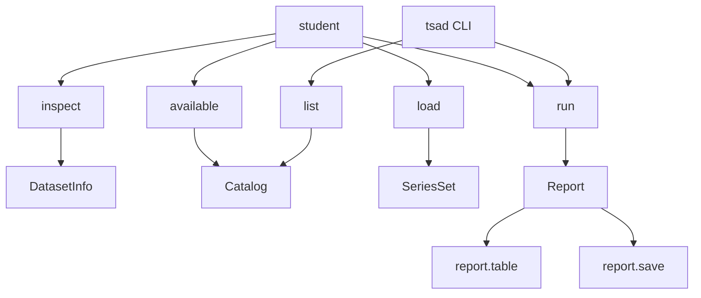
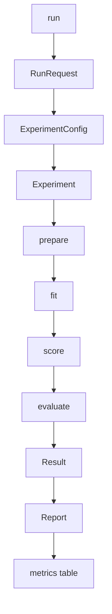
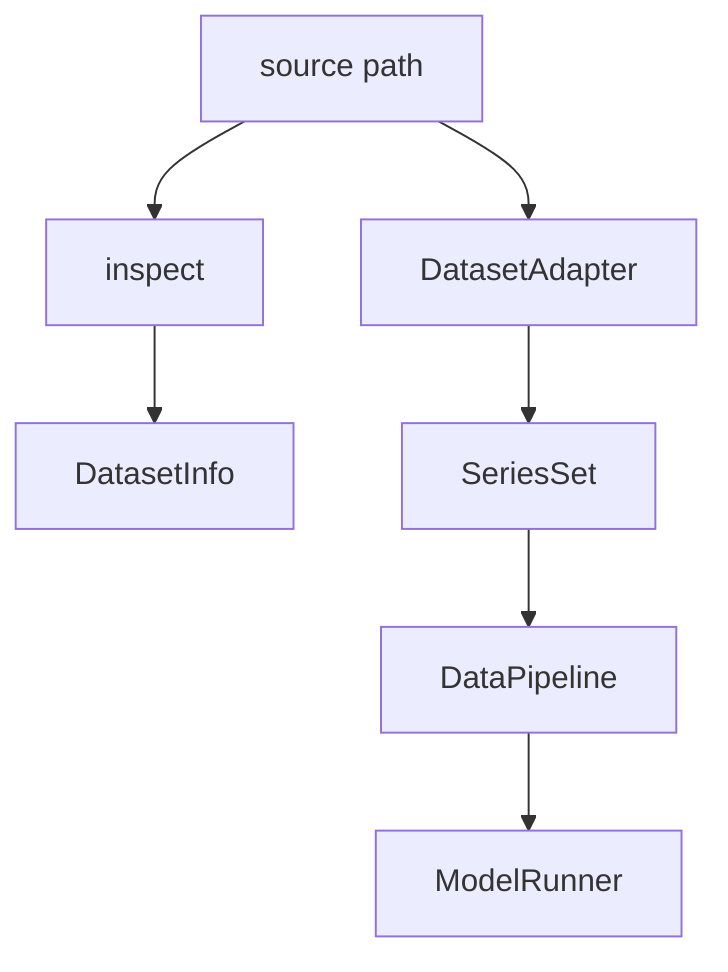
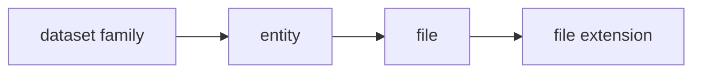
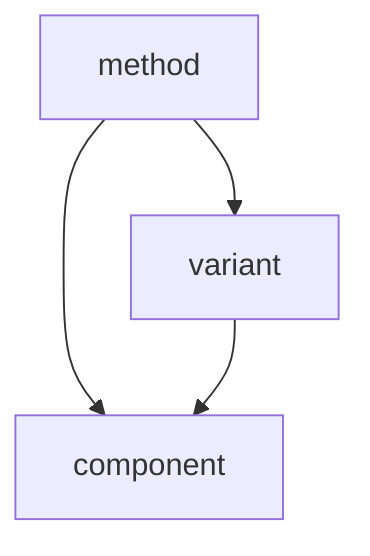
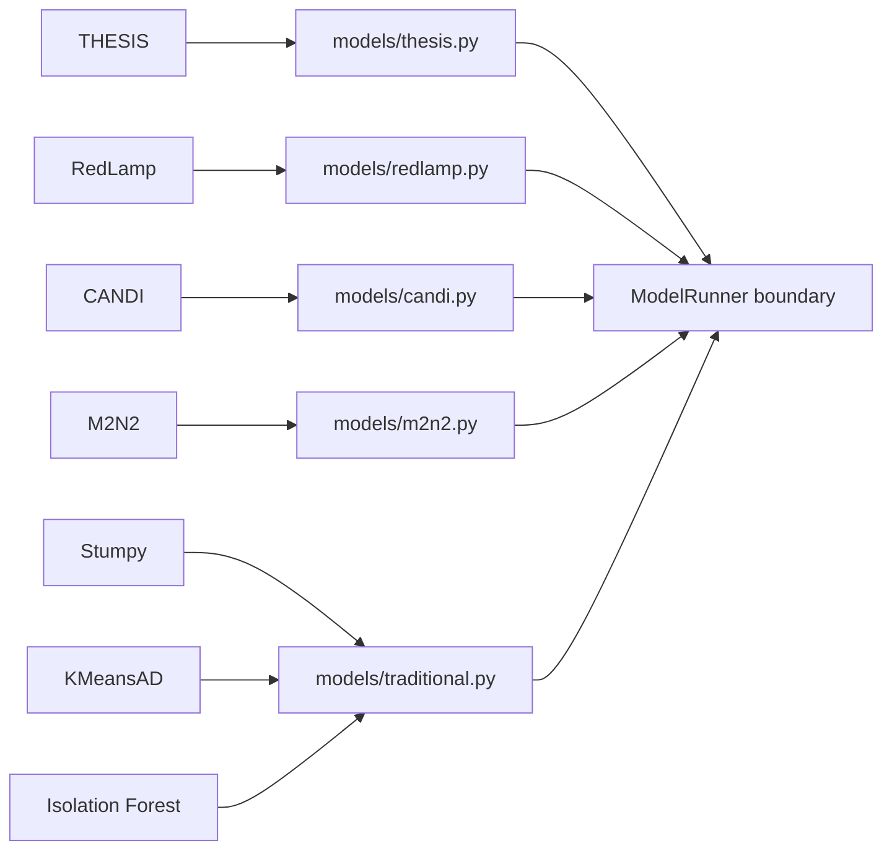
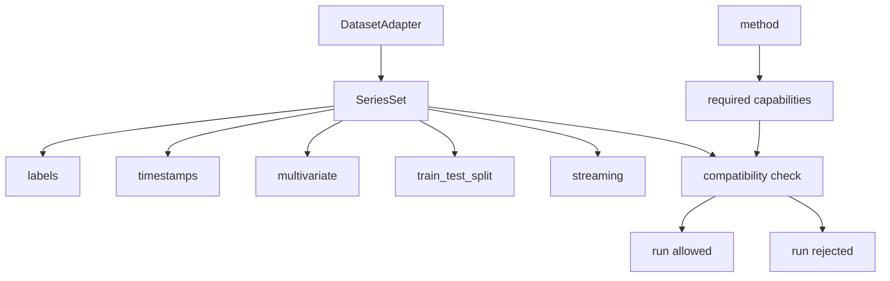
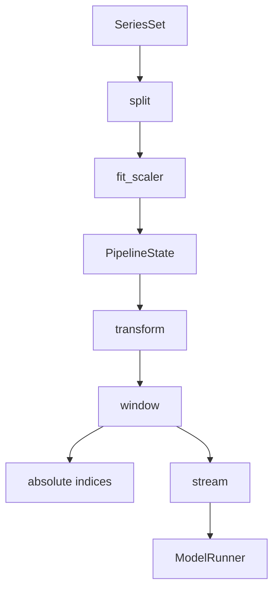
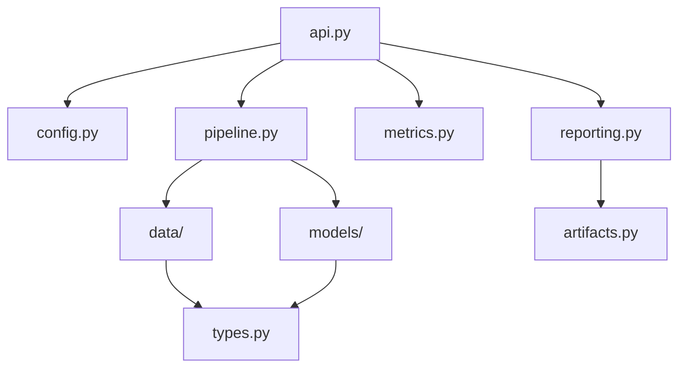
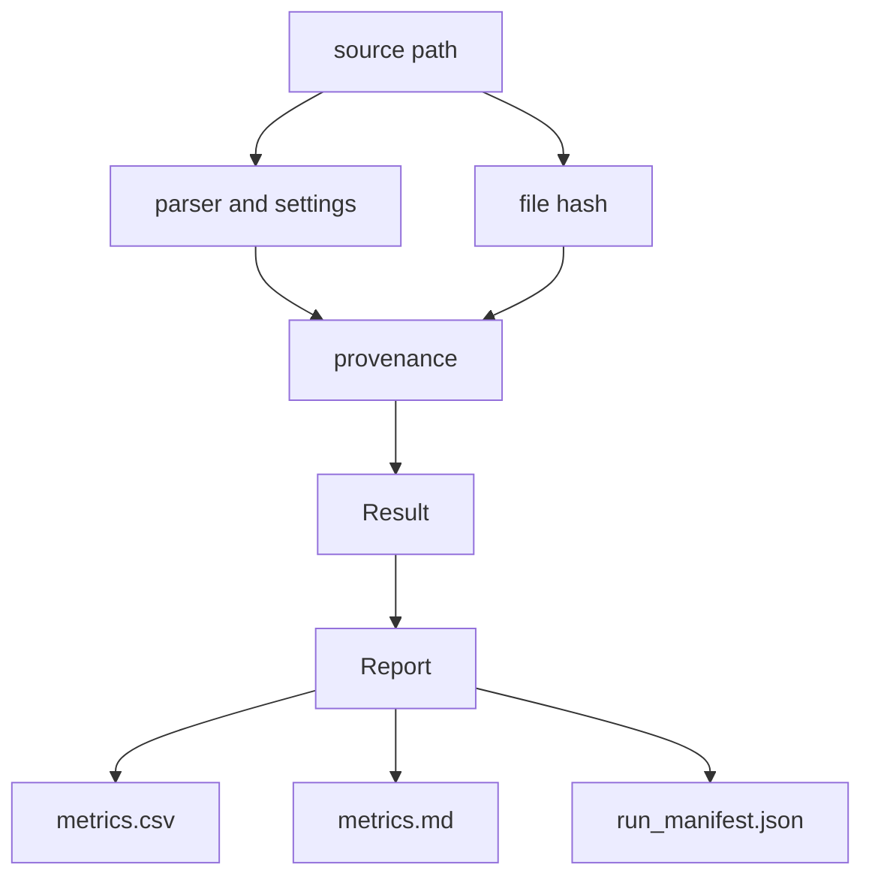

# Directed Graphs of `tsad-lib`

The story starts when a student chooses a dataset and a method.

The request enters `tsad`.
The library finds the data, prepares it, runs the method, computes metrics, and writes a report.

This document turns that story into directed graphs.

The graphs are the chapter map of the library. The student starts the request,
`tsad` carries it through data and method objects, and the report makes the
journey inspectable. Each edge records a dependency or transition. Its status
states whether the proposal names it, implies it, or leaves it unknown.

## Default score rule

Methods report simple MSE with the identity transform by default. The default
score space is raw input when the method supports inverse transformation. A
latent-space MSE is an explicit alternative. Any other score transform, such as
sigmoid scoring, must be named in the method contract and must not become a
hidden library default.

```yaml
default_score_space: raw_input
default_point_score_definition: raw_input_point_mse
default_point_score_transform: identity
```

`A → B` means that the story moves from `A` to `B`.

`explicit` means that `proposal-tsad-lib.md` states the relation.

`inferred` means that the relation follows from the proposal structure but is not named as a formal contract.

`unknown` means that the proposal does not provide enough information.

## 1. Public entry graph

The student first asks what the library can do.
The student then selects names and starts a run.



The public verbs are `inspect`, `available`, `load`, and `run`.
`report.table()` and `report.save()` are report actions.

Status: `explicit`.

## 2. Experiment runtime graph

The `run()` function hides the loop from the student.
Inside the library, one selection becomes one `RunRequest`.



The proposal states that `Experiment.run()` calls the required steps in order.
The report collects the results from all selected combinations.

Status: `explicit`.

## 3. Source and adapter graph

Every physical source tells a different file story.
The adapter translates that story into one common `SeriesSet`.



The dataset-to-adapter edges are:

| Dataset family | Adapter |
| --- | --- |
| `SMD` | `NpyArrayAdapter` |
| `ServerMachineDataset` | `ServerMachineAdapter` |
| `NASA` | `NasaAdapter` |
| `SWaT` | `SwatAdapter` |
| `IOPS` | `IopsAdapter` |
| `AnomalyArchive` | `UcrTextAdapter` |
| `TSB-AD-M` and `TSB-AD-U` | `TsbArchiveAdapter` |
| `IBM Cloud ICCAD` | `IccadAdapter` |
| `Extra industrial data` | `MatAdapter` and `CsvAdapter` |

Each adapter must produce the same data object:

```text
DatasetAdapter → SeriesSet
```

Status: dataset-to-adapter edges are `explicit`.
The source-to-adapter edge is `inferred` from the loading story.

## 4. Dataset hierarchy graph

The dataset graph begins with a logical dataset family.
The family contains entities.
An entity is represented by one or more files.
Each file has a physical extension.



The proposal gives the following physical edges:

| Dataset | Entity evidence | File form | Extension edge |
| --- | --- | --- | --- |
| `SMD` | `machine-1-6` is shown in the notebook | train, test, and label arrays | `file → .npy` |
| `ServerMachineDataset` | machine name | train, test, and label files | `file → .txt` |
| `NASA` | not specified | train/test arrays and label metadata | `file → .npy` and `file → .csv` |
| `SWaT` | not specified | timestamped files | `file → .csv` |
| `IOPS` | not specified | train/test value-label files | `file → .out` |
| `AnomalyArchive` | file identity is mentioned, but entity naming is not formalized | univariate files | `file → .txt` |
| `TSB-AD-M` and `TSB-AD-U` | archive member name | archive with CSV members | `source → .zip`, inner `file → .csv` |
| `IBM Cloud ICCAD` | service or location identifiers are preserved | tables and anomaly-window files | `file → .parquet` and `file → .csv` |
| `Extra industrial data` | MAT variable selection is required for ambiguous files | MAT and CSV sources | `file → .mat` and `file → .csv` |

The dataset hierarchy is only partly formalized in the proposal.
The entity mapping for `NASA`, `SWaT`, `IOPS`, `AnomalyArchive`, and the extra industrial CSV is still `unknown`.

Status: hierarchy shape is `explicit` from the proposal goal and source descriptions.
Several concrete entity edges are `inferred` or `unknown`.

## 5. Method graph

The method graph has three possible levels.
The first level is the selected method.
The second level is an optional variant.
The third level is a component.



The proposal names these methods or model choices:

```text
method → THESIS
method → RedLamp
method → CANDI
method → M2N2
method → Stumpy
method → KMeansAD
method → Isolation Forest
```

The proposal shows one concrete variant selection:

```text
THESIS → O2
```

The proposal also creates one common method boundary:

```text
method → ModelRunner
ModelRunner → fit
ModelRunner → score
ModelRunner → predict
```

The proposal does not list the internal components of any method.
Therefore these edges are not yet supported:

```text
THESIS → component
O2 → component
```

The constraint below is part of the requested graph contract, but the proposal does not define the component sets needed to check it:

```text
num_components(method) ≥ num_components(corresponding_variant)
```

Status: method names and the `ModelRunner` boundary are `explicit`.
The full method-variant-component graph is `partial`.
The component inequality is `unknown` until component lists are written.

## 6. Method implementation graph

The proposal gives a small module map for the method choices.
These edges describe implementation ownership, not scientific components.



`models/traditional.py` contains several traditional method implementations in the proposed tree.
It is not a component graph.

Status: module ownership is `explicit`.

## 7. Metric family and priority graph

The report collects metrics after evaluation.
The proposal gives one required metric and several default metrics.

The following family grouping follows metric names.
The proposal does not declare formal `MetricFamily` classes, so the family edges are `inferred`.

```mermaid
flowchart TD
    vus[VUS metric family]
    affiliation[Affiliation metric family]
    fpr[FPR metric family]

    vus --> vus_pr_budget[VUS-PR@FPR-budget]
    vus --> vus_pr[VUS-PR]
    vus --> vus_roc[VUS-ROC]
    affiliation --> affiliation_f1[Affiliation F1-score]
    fpr --> raw_fpr[raw-FPR]

    vus_pr_budget --> primary[primary required priority]
    vus_pr --> default[default priority]
    affiliation_f1 --> default
    vus_roc --> default
    raw_fpr --> default
```

The priority edges are:

```text
VUS-PR@FPR-budget → primary required
VUS-PR → default
VUS-ROC → default
Affiliation F1-score → default
raw-FPR → default
```

The proposal says that these metrics are available when the dataset has the required labels.
That is an availability condition, not a new metric:

```text
metric → label availability condition
```

The exact names `false alarm rate` and `humility` do not appear in the proposal.
`raw-FPR` must not be silently renamed to `false alarm rate` without an explicit ontology decision.

Status: metric names and required/default priority are `explicit`.
Metric families are `inferred`.

## 8. Capability and compatibility graph

After loading, the `SeriesSet` declares what it can provide.
Each method may require a subset of those capabilities.



The story stops before training when a required capability is missing.
The model does not silently convert an incompatible dataset.

Status: capability nodes and the reject-before-training rule are `explicit`.
The exact required capability set for each method is `unknown`.

## 9. Data preparation graph

The pipeline follows one fixed order.
It learns scaling from train data only.



The safety edges are:

```text
train data → fit_scaler
validation data → transform
test data → transform
test labels -/→ fit_scaler
test labels -/→ model update
```

`-/→` means that the edge is forbidden.

Status: order and safety rules are `explicit`.

## 10. Module dependency graph

The modules also have a direction.
The public API calls the pipeline.
The pipeline uses data and model boundaries.
The lower layers use common types.



The proposal also sets these forbidden dependencies:

```text
data adapters -/→ model modules
model modules -/→ raw file formats
notebook API -/→ parsing rules
```

Status: the main one-way dependency graph is `explicit` in the proposal.
Edges involving `config.py` and `artifacts.py` are `inferred` from the proposed tree and class responsibilities.

## 11. Provenance and report artifact graph

The library must remember where every result came from.
The source path becomes provenance.
The result becomes a report row.
The report becomes three small files.



The report row records at least:

```text
dataset
entity
model
variant
seed
status
warning
metrics
```

An undefined metric remains undefined.
The report does not replace it with zero.

Status: report files and provenance fields are `explicit`.
The exact internal ownership of provenance is `inferred`.

## 12. Master story graph

The smaller graphs join into one complete story.


The main runtime sentence is:

```text
student
→ API or CLI
→ selection
→ RunRequest
→ source
→ adapter
→ SeriesSet
→ pipeline
→ ModelRunner
→ scores and predictions
→ metric evaluation
→ Report
→ report files
```

## 13. Missing edges to define later

The proposal is ready to describe the first architecture, but four graph parts still need explicit contracts:

1. The components owned by each method.
2. The variants owned by each method.
3. The entity naming rule for every dataset family.
4. The formal metric-family and priority objects.

Until these parts are written, they remain `unknown` or `inferred`.
They must not be treated as implemented runtime behavior.
